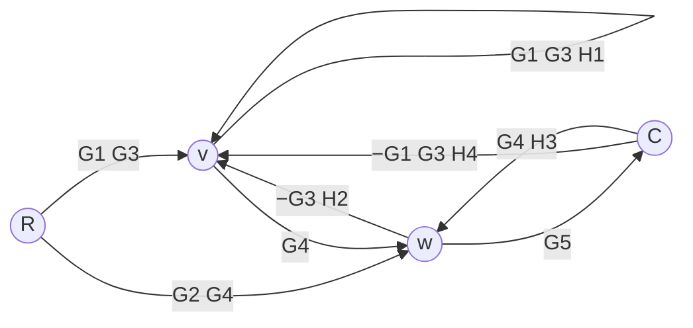
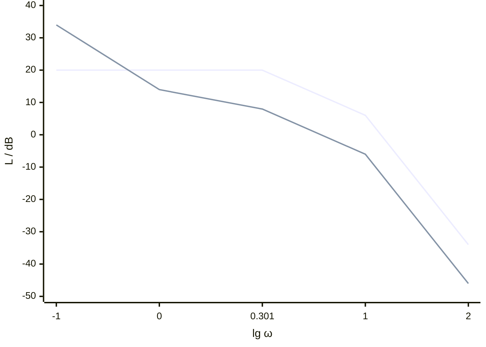

> 返回目录：[[控制理论/自动控制原理/自动控制原理|自动控制原理]]

# 2006年青岛大学825答案与解析

> [!abstract] 答案与解析
> 本年全部题目的完整解析，按题号连续排列。

[[2006年青岛大学825试题|查看试题]]

## 答案速查

| 题号 | 主要结论 |
| :-- | :-- |
| [[#第1题\|第1题]] | $C/R=G_4G_5[G_1G_3+G_2(1-G_1G_3H_1)]/\Delta$，其中 $\Delta=(1-G_1G_3H_1)(1-G_4G_5H_3)+G_3G_4H_2+G_1G_3G_4G_5H_4$。 |
| [[#第2题\|第2题]] | 超调量16.30%，峰值时间1.814 s；2%精确定义调节时间约4.038 s；稳态误差0.75。 |
| [[#第3题\|第3题]] | 稳定范围0<K<12.5；K=12.5时临界振荡频率10 rad/s；全部极点满足Re s<−1的范围为0.38<K<6.21。 |
| [[#第4题\|第4题]] | 根轨迹实轴段为[−2,0]，在−1及−1±j√(3/2)处分支合并；−1−j在轨迹上且K=6，0.5+1.5j不在轨迹上。 |
| [[#第5题\|第5题]] | 校正前后闭环均稳定；准确截止频率分别12.39675、4.55090 rad/s，相角裕度分别48.05655°、65.53020°。 |
| [[#第6题\|第6题]] | Φ(z)=3z²/[(4z−1)(z−e⁻¹)]，闭环稳定；4c[k]−(1+4e⁻¹)c[k−1]+e⁻¹c[k−2]=3r[k]。 |
| [[#第7题\|第7题]] | 奇点(−1,0)为鞍点；(0,0)为顺时针向外发散的不稳定焦点，特征值分别(1±√17)/4和(1±j√15)/4。 |
| [[#第8题\|第8题]] | 按描述函数法，K=10时存在稳定周期运动，频率5 rad/s；严格无自振的范围为0<K<6.25。 |

## 第1题

> [!tip] 答案
> $C/R=G_4G_5[G_1G_3+G_2(1-G_1G_3H_1)]/\Delta$，其中 $\Delta=(1-G_1G_3H_1)(1-G_4G_5H_3)+G_3G_4H_2+G_1G_3G_4G_5H_4$。

#### 1. 信号流图

令 $v$ 为 $G_3$ 的输出，$w$ 为 $G_4$ 的输出。两者不能与相邻相加点合并。下图是合并串联支路、但保留相加位置后的等价信号流图。



#### 2. 梅森公式

两条前向通路及余因子分别为

$$
P_1=G_1G_3G_4G_5,\qquad\Delta_1=1
$$

$$
P_2=G_2G_4G_5,\qquad\Delta_2=1-G_1G_3H_1
$$

第二条通路绕过了 $v$ 节点，故与回路 $G_1G_3H_1$ 不接触。

四个回路增益为

$$
L_1=G_1G_3H_1
$$

$$
L_2=G_4G_5H_3
$$

$$
L_3=-G_3G_4H_2
$$

$$
L_4=-G_1G_3G_4G_5H_4
$$

只有 $L_1,L_2$ 互不接触。因此

$$
\begin{aligned}
\Delta&=1-L_1-L_2-L_3-L_4+L_1L_2\\
&=(1-G_1G_3H_1)(1-G_4G_5H_3)\\
&\quad+G_3G_4H_2+G_1G_3G_4G_5H_4
\end{aligned}
$$

所求传递函数为

$$
\boxed{\frac{C(s)}{R(s)}
=\frac{G_4G_5\left[G_1G_3+G_2(1-G_1G_3H_1)\right]}{\Delta}}
$$

#### 3. 节点方程复核

由结构图直接列式：

$$
v=G_3\left[G_1(R-H_4C+H_1v)-H_2w\right]
$$

$$
w=G_4(v+G_2R+H_3C)
$$

$$
C=G_5w
$$

消去 $v,w$ 即得同一结果，特别是前馈项确实带有 $1-G_1G_3H_1$。

[[2006年青岛大学825试题#第1题|返回本题题目]]

## 第2题

> [!tip] 答案
> 超调量16.30%，峰值时间1.814 s；2%精确定义调节时间约4.038 s；稳态误差0.75。

#### （1）阶跃响应指标

由图得前向通道

$$
G(s)=\frac2s\frac2{s+2}=\frac4{s(s+2)}
$$

扰动为零时，闭环传递函数为

$$
\Phi(s)=\frac4{s^2+2s+4}
$$

与标准二阶形式比较：

$$
\omega_n=2\ \mathrm{rad/s},\qquad\zeta=\frac12
$$

$$
\omega_d=\omega_n\sqrt{1-\zeta^2}=\sqrt3\ \mathrm{rad/s}
$$

所以

$$
\sigma\%=e^{-\pi\zeta/\sqrt{1-\zeta^2}}\times100\%
\approx16.30\%
$$

$$
t_p=\frac\pi{\omega_d}\approx1.814\ \mathrm{s}
$$

单位阶跃响应为

$$
c(t)=1-e^{-t}\left(\cos\sqrt3t+\frac1{\sqrt3}\sin\sqrt3t\right)
$$

按“进入稳态值的 $\pm2\%$ 误差带且此后不再离开”定义，最后一次边界交点满足

$$
e^{-t_s}\left(\cos\sqrt3t_s+\frac1{\sqrt3}\sin\sqrt3t_s\right)=0.02
$$

取最后一个正根，得到

$$
\boxed{t_s\approx4.038\ \mathrm{s}}
$$

若采用包络保证时间，则

$$
t_{s,\mathrm{env}}=
\frac{-\ln(0.02\sqrt{1-\zeta^2})}{\zeta\omega_n}
\approx4.056\ \mathrm{s}
$$

工程近似 $4/(\zeta\omega_n)$ 给出约 $4.0\ \mathrm{s}$；近似值不应与精确定义混用。

#### （2）输入与扰动同时作用的稳态误差

由 $C=G_2(G_1E+N)$、$E=R-C$，得

$$
E(s)=\frac{s(s+2)}{s^2+2s+4}R(s)
-\frac{2s}{s^2+2s+4}N(s)
$$

输入的拉氏变换为

$$
R(s)=\frac2s+\frac1{s^2}
$$

$$
N(s)=-\frac{0.5}{s^2}
$$

闭环极点为 $-1\pm j\sqrt3$，可以应用终值定理。

$$
e_{ss,r}=\lim_{s\to0}s\frac{s(s+2)}{s^2+2s+4}
\left(\frac2s+\frac1{s^2}\right)=\frac12
$$

$$
e_{ss,n}=\lim_{s\to0}s\left(-\frac{2s}{s^2+2s+4}\right)
\left(-\frac{0.5}{s^2}\right)=\frac14
$$

$$
\boxed{e_{ss}=\frac34=0.75}
$$

> [!note]- 题面整理说明
> - 整理采用调节时间“进入误差带且此后不再离开”的严格定义，同时列出包络保证时间与工程近似供教材口径对照。

[[2006年青岛大学825试题#第2题|返回本题题目]]

## 第3题

> [!tip] 答案
> 稳定范围0<K<12.5；K=12.5时临界振荡频率10 rad/s；全部极点满足Re s<−1的范围为0.38<K<6.21。

闭环特征多项式为

$$
D(s)=0.02s^3+0.5s^2+2s+4K
$$

#### （1）闭环稳定范围

Routh 表为

| 幂次 | 第一列 | 第二列 |
|---|---|---|
| $s^3$ | $0.02$ | $2$ |
| $s^2$ | $0.5$ | $4K$ |
| $s^1$ | $2-0.16K$ | $0$ |
| $s^0$ | $4K$ | $0$ |

首列严格同号得到

$$
\boxed{0<K<12.5}
$$

#### （2）临界等幅振荡

令 $s=j\omega$，分别令实部和虚部为零：

$$
4K-0.5\omega^2=0
$$

$$
\omega(2-0.02\omega^2)=0
$$

非零振荡频率为

$$
\boxed{\omega=10\ \mathrm{rad/s},\qquad K=12.5}
$$

此时

$$
D(s)=0.02(s+25)(s^2+100)
$$

闭环极点为 $-25,\pm j10$，因此存在临界等幅振荡，周期为

$$
T=\frac{2\pi}{10}=\frac\pi5\ \mathrm{s}
$$

这里的“振荡”指临界等幅振荡；稳定区内出现复极点时，暂态也可能呈衰减振荡，但不属于持续自振。

#### （3）全部极点位于 $\operatorname{Re}s<-1$

令 $s=p-1$。要求等价于 $D(p-1)$ 的所有根都在 $p$ 平面左半平面。

$$
D(p-1)=0.02p^3+0.44p^2+1.06p+(4K-1.52)
$$

三阶 Routh 条件给出

$$
4K-1.52>0
$$

$$
0.44\times1.06>0.02(4K-1.52)
$$

化简得

$$
\boxed{0.38<K<6.21}
$$

两端均为边界，不能取等号。

> [!note]- 题面整理说明
> - 整理将第（2）问的“出现振荡”按稳定边界上的非零等幅振荡解释，并在解析中区分衰减振荡。

[[2006年青岛大学825试题#第3题|返回本题题目]]

## 第4题

> [!tip] 答案
> 根轨迹实轴段为[−2,0]，在−1及−1±j√(3/2)处分支合并；−1−j在轨迹上且K=6，0.5+1.5j不在轨迹上。

#### （1）根轨迹

特征方程为

$$
s(s+2)(s^2+2s+5)+K=0
$$

开环无有限零点，极点为

$$
0,\quad-2,\quad-1+2j,\quad-1-2j
$$

实轴根轨迹为 $[-2,0]$。四条渐近线交于

$$
\sigma_a=\frac{0-2-1-1}{4}=-1
$$

角度为

$$
45^\circ,\ 135^\circ,\ 225^\circ,\ 315^\circ
$$

为完整描述四条分支，令 $u=s+1$，特征方程化为

$$
u^4+3u^2+K-4=0
$$

因此全部闭环极点可直接表示为

$$
\boxed{s=-1\pm\sqrt{\frac{-3\pm\sqrt{25-4K}}2}}
$$

两个内外正负号独立组合。由此分段绘图：

- $0\le K\le4$：两个实极点从 $0,-2$ 沿实轴相向移动，在 $s=-1$ 合并；另两个极点沿 $\operatorname{Re}s=-1$ 从虚部 $\pm2$ 向内移动。
- $4<K<25/4$：四个极点都在直线 $\operatorname{Re}s=-1$ 上，两对分别相向移动。
- $K=25/4$：在以下两点分别发生二重根。

$$
s=-1\pm j\sqrt{\frac32}
$$

- $K>25/4$：分支分别向左上、右上、左下、右下离开，并趋向四条渐近线。

关键点如下，可据此作关于实轴对称的完整图：

| $K$ | 特征位置 |
|---|---|
| $0$ | $0,-2,-1\pm2j$ |
| $4$ | $-1$ 为二重根，另有 $-1\pm j\sqrt3$ |
| $25/4$ | $-1\pm j\sqrt{3/2}$ 各为二重根 |
| $65/4$ | 穿过虚轴 $s=\pm j\sqrt{5/2}$ |

上半平面两分支的概略走向为：

```text
                      ×  -1+2j
                      ↓
          ↖          ●          ↗
                 -1+j√(3/2)
                      ↑
 -2  × ───────→      -1      ←─────── ×  0
```

下半平面为其镜像；$-1$ 处合并后分别沿竖直方向运动。

虚轴交点由 $s=j\omega$ 得

$$
\omega(10-4\omega^2)=0
$$

$$
K+\omega^4-9\omega^2=0
$$

非零交点为

$$
\omega=\sqrt{\frac52},\qquad K=\frac{65}{4}=16.25
$$

因此正增益闭环稳定范围为 $0<K<16.25$。

#### （2）检验给定点

直接使用增益条件比累计相角更简洁：

$$
K=-s(s+2)(s^2+2s+5)
$$

给定点在正增益根轨迹上的充要条件是该式为非负实数。

当 $s=-1-j$ 时，$u=-j$，故

$$
K=-(u^4+3u^2-4)=6
$$

所以该点在根轨迹上，对应

$$
\boxed{K=6}
$$

当 $s=0.5+1.5j$ 时，$u=1.5+1.5j$，有

$$
u^2=4.5j
$$

$$
K=24.25-13.5j
$$

增益不是实数，因此该点不在所求根轨迹上。

> [!note]- 题面整理说明
> - 整理采用单位负反馈、非负实增益K的常规根轨迹设定；将复平面点坐标规范为复数s。

[[2006年青岛大学825试题#第4题|返回本题题目]]

## 第5题

> [!tip] 答案
> 校正前后闭环均稳定；准确截止频率分别12.39675、4.55090 rad/s，相角裕度分别48.05655°、65.53020°。

#### （1）奈奎斯特稳定性判断

校正前

$$
G(j\omega)=\frac{10}{(1+0.1j\omega)(1+0.5j\omega)}
$$

实部和虚部分别为

$$
\operatorname{Re}G=\frac{10-0.5\omega^2}{(1+0.01\omega^2)(1+0.25\omega^2)}
$$

$$
\operatorname{Im}G=\frac{-6\omega}{(1+0.01\omega^2)(1+0.25\omega^2)}
$$

正频支从实轴点 $10$ 出发，位于下半平面；在 $\omega=\sqrt{20}$ 穿过虚轴的点为

$$
G(j\sqrt{20})=-j\frac{5\sqrt5}{3}\approx-3.727j
$$

曲线以 $-180^\circ$ 方向趋于原点，不穿越负实轴。完整奈氏曲线不包围 $-1$。开环右半平面极点数 $P=0$，故闭环稳定。

校正后

$$
G_1(j\omega)=\frac5{j\omega(1+0.1j\omega)}
$$

$$
\operatorname{Re}G_1=-\frac{0.5}{1+0.01\omega^2}
$$

$$
\operatorname{Im}G_1=-\frac5{\omega(1+0.01\omega^2)}
$$

正频支从 $-0.5-j\infty$ 出发趋向原点。对原点开环极点作右侧小半圆绕行后，完整像曲线仍不包围 $-1$，故校正后闭环也稳定。其闭环特征多项式 $0.1s^2+s+5$ 亦为 Hurwitz 多项式。

#### （2）同一坐标中的对数幅频渐近线

校正前转折频率为 $2,10\ \mathrm{rad/s}$：

$$
L_{\mathrm{asy}}(\omega)=
\begin{cases}
20,&0<\omega\le2\\
20-20\lg(\omega/2),&2<\omega\le10\\
6.0206-40\lg(\omega/10),&\omega>10
\end{cases}
$$

校正后在低频已有一个积分环节，转折频率为 $10\ \mathrm{rad/s}$：

$$
L_{1,\mathrm{asy}}(\omega)=
\begin{cases}
13.9794-20\lg\omega,&0<\omega\le10\\
-6.0206-40\lg(\omega/10),&\omega>10
\end{cases}
$$

横轴取 $\lg\omega$，下列两条折线依次为校正前、校正后：



#### （3）准确的截止频率和相角裕度

截止频率按准确幅值 $|G(j\omega_c)|=1$ 求解，而不是直接把渐近线交点当成准确交点。

校正前令 $x=\omega_c^2$，得到

$$
(1+0.01x)(1+0.25x)=100
$$

$$
0.0025x^2+0.26x-99=0
$$

取正根：

$$
\boxed{\omega_c\approx12.39675\ \mathrm{rad/s}}
$$

$$
\gamma=180^\circ-\arctan(0.1\omega_c)-\arctan(0.5\omega_c)
\approx48.05655^\circ
$$

校正后

$$
\omega_c^2(1+0.01\omega_c^2)=25
$$

$$
\omega_c^2=50(\sqrt2-1)
$$

$$
\boxed{\omega_{c1}\approx4.55090\ \mathrm{rad/s}}
$$

$$
\gamma_1=90^\circ-\arctan(0.1\omega_{c1})
\approx65.53020^\circ
$$

因此校正后带宽降低、相对稳定裕度增大。若仅从渐近线估计，两个交点分别约为 $14.14$ 和 $5.00\ \mathrm{rad/s}$，这是近似读图值。

[[2006年青岛大学825试题#第5题|返回本题题目]]

## 第6题

> [!tip] 答案
> Φ(z)=3z²/[(4z−1)(z−e⁻¹)]，闭环稳定；4c[k]−(1+4e⁻¹)c[k−1]+e⁻¹c[k−2]=3r[k]。

#### （1）闭环脉冲传递函数

记

$$
G_a(s)=\frac3s,\qquad G_b(s)=\frac1{s+2},\qquad H(s)=s+2
$$

由于两个前向环节之间存在采样器，前向通路的脉冲传递函数是各段脉冲传递函数的乘积；反馈段则须先对连续串联乘积取脉冲传递函数。

令 $a=e^{-2T}=e^{-1}$，则

$$
G_a(z)=\frac{3z}{z-1}
$$

$$
G_b(z)=\frac{z}{z-a}
$$

$$
Z[G_b(s)H(s)]=Z[1]=1
$$

故

$$
\Phi(z)=\frac{G_a(z)G_b(z)}{1+G_a(z)Z[G_b(s)H(s)]}
$$

$$
\boxed{\Phi(z)=\frac{3z^2}{(4z-1)(z-a)},\qquad a=e^{-1}}
$$

这里不能把 $H(s)$ 单独取 $Z$ 变换后，任意按连续系统形式相乘。

#### （2）稳定性

闭环极点为

$$
z_1=\frac14,\qquad z_2=e^{-1}\approx0.367879
$$

二者都严格位于单位圆内，因此离散闭环系统渐近稳定。

#### （3）后向差分方程

分子分母同除 $z^2$：

$$
\frac{C(z)}{R(z)}=
\frac3{4-(1+4a)z^{-1}+az^{-2}}
$$

以 $c[k]=c(kT)$、$r[k]=r(kT)$ 表示采样序列，则

$$
\boxed{4c[k]-(1+4e^{-1})c[k-1]+e^{-1}c[k-2]=3r[k]}
$$

数值形式为

$$
4c[k]-2.471517765c[k-1]+0.367879441c[k-2]=3r[k]
$$

独立检查：令第二个采样器输出序列为 $x[k]$。反馈中的连续串联 $G_bH=1$，因此

$$
x[k]-x[k-1]=3(r[k]-x[k])
$$

$$
c[k]-ac[k-1]=x[k]
$$

消去 $x[k]$，恰好得到上述差分方程。

> [!note]- 题面整理说明
> - 整理采用图示理想同步采样器及教材脉冲传递函数约定，不额外添加零阶保持器。

[[2006年青岛大学825试题#第6题|返回本题题目]]

## 第7题

> [!tip] 答案
> 奇点(−1,0)为鞍点；(0,0)为顺时针向外发散的不稳定焦点，特征值分别(1±√17)/4和(1±j√15)/4。

令相变量 $y=\dot x$，得到自治系统

$$
\dot x=y
$$

$$
\dot y=-3y^2+\frac12y-x-x^2
$$

#### （1）奇点及类型

奇点须同时满足

$$
y=0,\qquad x(1+x)=0
$$

因此仅有

$$
P_0=(0,0),\qquad P_1=(-1,0)
$$

雅可比矩阵为

$$
J(x,y)=\begin{bmatrix}0&1\\-1-2x&\frac12-6y\end{bmatrix}
$$

在 $P_1=(-1,0)$ 处

$$
J_1=\begin{bmatrix}0&1\\1&\frac12\end{bmatrix}
$$

$$
\lambda_{1,2}=\frac{1\pm\sqrt{17}}4
\approx1.280776,-0.780776
$$

两根一正一负，故 $P_1$ 是不稳定鞍点。

在 $P_0=(0,0)$ 处

$$
J_0=\begin{bmatrix}0&1\\-1&\frac12\end{bmatrix}
$$

$$
\lambda_{1,2}=\frac{1\pm j\sqrt{15}}4
=0.25\pm0.968246j
$$

两根实部为正，故 $P_0$ 是不稳定焦点。两奇点都是双曲型，线性化类型可用于判断非线性系统的局部相图。

#### （2）局部相轨迹

鞍点附近令 $X=x+1$、$Y=y$。稳定与不稳定流形的切线分别为

$$
Y=\frac{1-\sqrt{17}}4X
\quad\text{（稳定方向，箭头指向奇点）}
$$

$$
Y=\frac{1+\sqrt{17}}4X
\quad\text{（不稳定方向，箭头背离奇点）}
$$

两条负斜率半支流向鞍点，两条正斜率半支离开鞍点；其他轨迹在其间呈鞍形弯曲。这两条直线是局部切线，不是将非线性分离轨道强行当成全局直线。

原点附近线性化方程为

$$
\ddot x-\frac12\dot x+x=0
$$

其解可写成

$$
x(t)=e^{t/4}\left(a\cos\frac{\sqrt{15}t}4+b\sin\frac{\sqrt{15}t}4\right)
$$

$$
y(t)=\dot x(t)
$$

所以局部轨迹绕原点向外螺旋。在 $x>0,y=0$ 处有 $\dot y=-x-x^2<0$，由此确定旋转方向为顺时针。

概略图的构造要点为：

```text
  (-1,0)：鞍点                    (0,0)：不稳定焦点
  负斜率两支 → 奇点                顺时针 ↻
  正斜率两支 ← 奇点                半径随时间总体增大，轨迹向外
```

[[2006年青岛大学825试题#第7题|返回本题题目]]

## 第8题

> [!tip] 答案
> 按描述函数法，K=10时存在稳定周期运动，频率5 rad/s；严格无自振的范围为0<K<6.25。

描述函数法采用基波近似。在线性区 $0\le A\le1$，$N(A)=2$；在饱和区 $A>1$，

$$
N(A)=\frac4\pi\left[\arcsin\frac1A+\frac1A\sqrt{1-\frac1{A^2}}\right]
$$

它从 $2$ 单调下降到 $0$，故 $-1/N(A)$ 从 $-1/2$ 沿负实轴趋向 $-\infty$。

#### （1）$K=10$ 时的周期运动

线性频率响应为

$$
G(j\omega)=\frac{K}{-0.5\omega^2+j\omega(1-0.04\omega^2)}
$$

令非零频率处虚部为零，得

$$
\omega_0=\frac1{\sqrt{0.4\times0.1}}=5\ \mathrm{rad/s}
$$

该频率处

$$
G(j5)=-0.08K
$$

当 $K=10$ 时，$G(j5)=-0.8$。谐波平衡条件为

$$
1+G(j\omega_0)N(A)=0
$$

即

$$
N(A)=1.25
$$

由于 $N(A)$ 严格递减且值域为 $(0,2]$，该方程有唯一的饱和区解，约为

$$
A\approx1.943316\quad\text{误差信号的基波振幅}
$$

振幅应由 $N(A)=1.25$ 数值求解，题目所求振荡频率为

$$
\boxed{\omega_0=5\ \mathrm{rad/s}}
$$

为判断周期运动稳定性，将 $N(A)$ 暂作等效增益，闭环特征方程为

$$
0.04s^3+0.5s^2+s+KN(A)=0
$$

其稳定条件为

$$
KN(A)<12.5
$$

平衡振幅上升时 $N(A)$ 下降，等效系统进入衰减侧；振幅下降时则进入增长侧，所以描述函数法预测该周期运动稳定。

#### （2）不发生自振的增益范围

要避免负实轴交点落入 $-1/N(A)$ 的轨迹，应有

$$
-0.08K>-\frac12
$$

因此

$$
\boxed{0<K<6.25}
$$

边界 $K=6.25$ 使小信号系统具有 $\pm j5$ 极点，是临界情形，不能并入严格无自振且渐近稳定的范围。对 $K>6.25$，描述函数法给出一个饱和区周期运动候选，其振幅满足 $KN(A)=12.5$。

[[2006年青岛大学825试题#第8题|返回本题题目]]

