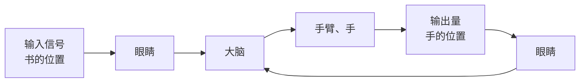
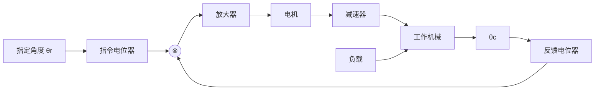
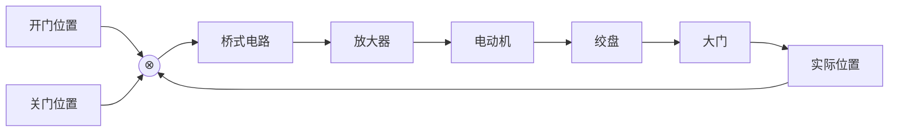
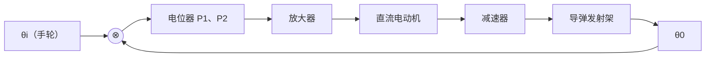

> 返回：[[777习题集目录]] ｜ 题目：[[基础300题 第1章 自动控制的一般概念（题目）]]

# 基础300题 第1章 自动控制的一般概念（答案与解析）

> [!abstract] 答案与解析
> 本章 30 题的答案与解析，按题号连续排列；原书答案册的**考点**与**难度星级**一并保留。原书是概念简答式的答案，下文在其基础上补足了推理与易错点。

## 答案速查

| 题号   | 答案            | 题号   | 答案                           |
| :--- | :------------ | :--- | :--------------------------- |
| 1-1  | AC            | 1-16 | 相同                           |
| 1-2  | C             | 1-17 | 反馈控制、前馈控制                    |
| 1-3  | C ⚠️          | 1-18 | 稳定性、快速性、准确性；稳定性              |
| 1-4  | D             | 1-19 | 无关；有关                        |
| 1-5  | A             | 1-20 | 错误                           |
| 1-6  | B             | 1-21 | 开环、反馈、复合三种                   |
| 1-7  | C             | 1-22 | 电饭煲（开环）／空调（闭环）               |
| 1-8  | A             | 1-23 | 结构复杂、难稳定；见解析                 |
| 1-9  | B             | 1-24 | 恒值／随动／程序                     |
| 1-10 | B             | 1-25 | 线性时变／非线性时变／非线性定常／非线性定常／非线性时变 |
| 1-11 | A             | 1-26 | 见方框图                         |
| 1-12 | 单输入单输出的线性定常系统 | 1-27 | 型别过低，加积分环节                   |
| 1-13 | 速度；电动机        | 1-28 | 见方框图与元件表                     |
| 1-14 | 执行元件          | 1-29 | 电桥偏差→伺服电机→绞盘                 |
| 1-15 | 给定量；扰动量       | 1-30 | 电位器误差电压→电机→发射架               |

## 【知识点一】概念、组成与控制方式

**1-1　答案 AC**（考点：基本控制方式）

开环控制没有反馈，只按**输入**或按**扰动**来安排控制作用，于是分成两支：

- 按**给定量**控制：控制作用只由给定信号决定。例：定时洗衣机、数控机床的进给。
- 按**扰动**控制（按扰动补偿）：测量扰动本身，在它影响输出之前先加以补偿。例：用环境温度补偿器改善恒温箱。

**1-2　答案 C**（考点：闭环控制的定义）

闭环的定义就是「把输出量经测量元件**反馈到输入端**，与给定信号比较得偏差，再用偏差去控制」。

**1-3　答案 C（反馈元件）⚠️ 原书答案册此处置 D，与题面不符**

题面说的是「**通过测量输出量**、产生一个与输出信号成确定函数比例关系的元件」——这是**反馈元件（测量元件）**的定义，选 C。

原书答案册在 1-3 位给出的答案是 D「放大元件」，附带解释「放大元件将比较元件给出的偏差信号放大，用来推动执行元件去控制被控对象」——这段解释描述的确实是**放大元件**，但答的不是本题的题面，属于**答案册与题目册错位**。以题目册题面为准。

**1-4　答案 D**（考点：控制系统的组成）

校正元件（补偿器）用来**改善或提高系统性能**（稳定裕度、快速性、稳态误差），常用串联或反馈方式接入。

**1-5　答案 A**（考点：控制系统的组成）

一个自动控制系统必然包含**被控对象**和**控制装置**两大部分。

**1-6　答案 B**（考点：控制系统的性能要求）

随动系统的给定量按**预先未知**的规律随时间变化，要求被控量能快速、准确地跟随，所以对**快速性**要求较高。答题时点明「快」这一条即可。

**1-7　答案 C**（考点：线性系统的定义）

线性与非线性的**根本区别**在于是否满足**叠加原理**（齐次性 $a\,u\to a\,y$ 与可加性 $u_1+u_2\to y_1+y_2$）。

**1-8　答案 A**（考点：定常系统的定义）

定常（时不变）指所建立的微分方程**各项系数不随时间变化**。

- B 说的是「线性」（各阶导数的幂为一次），不是定常；
- C、D 均为错误说法。

**1-9　答案 B**（考点：线性系统的性质）

线性系统满足叠加原理：齐次性给 $a_1u_1\to a_1y_1$、$a_2u_2\to a_2y_2$，可加性再把两者相加，故 $a_1u_1+a_2u_2\to a_1y_1+a_2y_2$。

**1-10　答案 B**（考点：线性定常系统的判别）

方程 $\ddot x_o+\dot x_o+x_o=\cos x_1$ 的左端是线性的，但**右端含 $\cos x_1$**——自变量 $x_1$ 的余弦是**非线性**项。判非线性要看整条方程，不能只看左端。系数为常数，所以不是时变系统。

**1-11（东华大学 2025）　答案 A**（考点：线性定常系统的判别）

$\dot c+6c$ 与输入 $r$ 之间的**增益随 $c$ 的取值分段变化**（$c<2$ 时为 9，$c\ge2$ 时为 2），等效为变增益环节，故为**非线性系统**。方程中没有显含时间 $t$ 的系数，所以不是时变系统。

**1-12　答案** 单输入单输出的**线性定常系统**。

**1-13　答案** 被控量是**速度**，被控对象是**电动机**。

**1-14　答案** **执行元件**。它直接驱动被控物体，使被控量发生变化。

**1-15　答案** **给定量**（参考输入）表征被控量的期望值或受控对象的期望状态；**扰动量**是妨碍系统按期望状态运行的量。

**1-16　答案 相同**（考点：控制系统的组成）

对**单位**负反馈系统，$e=r-b=r-c$，偏差信号与（输入端的）误差信号是同一个量。

⚠️ 但要与前向通道增益不为 1 时的「输出端误差」区分：非单位反馈下，输入端偏差 $E=R-HC$ 与跟踪误差 $R-C$ 是两回事。

**1-17　答案** **反馈控制**与**前馈（顺馈）控制**相结合。

**1-18　答案** **稳定性、快速性、准确性**（稳、快、准）；其中**稳定性**是保证控制系统正常工作的**先决条件**。

**1-19　答案** 稳定性与外界因素**无关**（由系统结构与参数决定）；稳态误差与外界因素**有关**（受系统结构、外作用形式以及摩擦、间隙等非线性因素影响）。

**1-20　答案 错误**（考点：控制系统的分类）

恒值系统里「恒值」说的是**给定值**恒定，但被控量受扰动影响仍会偏离。正因如此才需要（闭环或复合）控制作用去克服扰动，所以恒值系统同样要采用闭环控制。

**1-21　简答**（考点：基本控制方式）

- **开环控制**：控制装置与被控对象之间只有**正向作用**、没有反向联系；系统的输出量不影响控制作用。结构简单、调整方便、成本低，但**控制精度低**，对扰动没有控制能力。
- **反馈控制（闭环）**：把输出量引回输入端与输入量比较，用所得的**偏差信号**去调节，达到减小或消除偏差的目的。抗内外部扰动强、精度高；但使用元件多、结构复杂，性能分析与设计也比较复杂，并且引入稳定性问题。
- **复合控制**：反馈控制与**前馈控制**结合。前馈使系统及时感受输入信号，在偏差**即将产生之前**就纠正，可有效提高控制精度；缺点是结构更复杂，补偿器参数要有较高的稳定性。

**本题总结**：考的是三种基本控制方式的原理与典型特性（作用与优缺点），要求理解性记忆。

**1-22　简答**（考点：开环与闭环控制的原理及特性）

- **开环系统：电饭煲煮饭。** 用户放米加水、按下「煮饭」，锅内加热元件开始持续加热，到预设时间自动停止。全程按预设程序运行，**不检测米饭的实际温度或状态**。优点：控制方式简单、成本低；缺点：不够灵活，受元件和干扰影响大——米量或水量不同，效果就差。
- **闭环系统：空调控温。** 设定目标温度（期望值）后，传感器**实时测量室内温度（反馈信号）**，控制器比较目标与实际温度的偏差：实际偏高就制冷，偏低就停机或转制热。通过反馈机制实时调整制冷／制热功率，保持室温稳定。优点：控制精度高、稳定性好、适应性强；缺点：系统复杂、成本较高。

**本题总结**：开放式问题，能就两种控制方式的原理与特性各举一例并说清优缺点即可。

**1-23　简答**（考点：反馈控制的特性）

- **引入反馈的缺点**：使用的元件多、结构复杂，特别是系统的**性能分析和设计更复杂**（闭环还要额外处理稳定性）。
- **正反馈的优点**：快速响应、信号增强、可实现高精度控制。
- **正反馈的缺点**：容易造成系统**不稳定**，对初始条件敏感，会**放大误差**。

**本题总结**：负反馈是课程主线，正反馈考查较少，同样要求了解其特点。

**1-24　简答**（考点：控制系统的分类）

按**给定量变化规律**分三类：

- **恒值系统**：给定量恒定不变，要求被控量也保持常值。例：温度控制系统、压力控制系统、液位控制系统。
- **随动系统**：给定量按**预先未知**的时间函数变化，要求被控量以尽可能小的误差跟随。例：雷达跟踪系统。
- **程序控制系统**：给定量按**预先规定**的时间函数变化，要求被控量迅速准确地复现。例：数字程序控制机床。

**1-25（南开大学 2024）　答案**（考点：线性定常系统的判别）

| 小题 | 方程 | 判定 | 理由 |
| :-- | :-- | :-- | :-- |
| （1） | $c'(t)=tr(t)$ | 线性**时变** | $r(t)$ 的系数 $t$ 随时间变化 |
| （2） | $t\dfrac{\mathrm dc}{\mathrm dt}=c^2(t)+\dfrac{\mathrm dr}{\mathrm dt}$ | **非线性时变** | $t\dfrac{\mathrm dc}{\mathrm dt}$ 的系数 $t$ 时变；$c^2(t)$ 非线性 |
| （3） | $\dfrac{\mathrm d^2c}{\mathrm dt^2}+\left|\dfrac{\mathrm dc}{\mathrm dt}\right|+c=r$ | 非线性**定常** | $\left|\dfrac{\mathrm dc}{\mathrm dt}\right|$ 非线性 |
| （4） | $\dfrac{\mathrm dc}{\mathrm dt}+c=r^2(t)$ | 非线性**定常** | $r^2(t)$ 非线性 |
| （5） | $c(t)=r(t)\sin\alpha t+1$ | **非线性时变** | $\sin\alpha t$ 时变；常数项 $1$ 使叠加原理不成立 |

**判别口诀**：**先看系数里有没有 $t$（时变），再看有没有绝对值、平方、三角函数这类非一次项（非线性）。** 两关都过才是线性定常系统。

## 【知识点二】实际控制系统的分析

**1-26　解**（考点：实际系统的结构图绘制与原理分析）

以「眼睛」为检测元件、「大脑」为比较与决策环节、「手臂与手」为执行环节：

- 给定量：**书的位置**；
- 被控量：**手的位置**；
- 被控对象：**手**；
- 控制装置：**眼睛、大脑、手臂**。

**本题总结**：题目没给具体结构名称，要自己按功能把人取书这个过程的各个环节抽象成控制系统模块。

> [!warning] ⚠️ 出处标注存疑
> 答案册把本题标为 **（苏州大学 2025）**，而题目册在 1-26 处未标院校、把「苏州大学 2025」标在 **1-27**（数据机床工作台）上。两册题号与内容是对齐的，只有院校标注错位，以题目册为准。

**1-27（苏州大学 2025）　解**（考点：实际系统的结构图绘制与原理分析）

（1）方框图：

（2）元件对照：

| 角色 | 对应元件 |
| :-- | :-- |
| 控制器 | 比较器、放大器、伺服电机、检测装置 |
| 执行器 | 伺服电机（直接推动被控对象使输出量变化） |
| 传感器 | 检测装置 |
| 被控对象 | 工作台 |
| 被控量 | 移动量 |

（3）**始终存在稳态误差**的原因最可能是**系统型别过低**：前向通道里没有积分环节，对位置（阶跃）输入是 **0 型系统**，稳态误差为 $1/(1+K_p)$——只靠加大放大器增益 $K_p$ 只能把误差**缩小**，永远消不到零。

改进策略（答案不唯一）：**提高系统型别**，例如引入**积分控制器**（在前向通道串入 $1/s$），使系统对阶跃输入成为 Ⅰ 型，稳态误差降为零；也可改用复合控制加入前馈补偿。

**1-28（中国计量大学 2025）　解**（考点：实际系统的结构图绘制与原理分析）

（1）**系统原理**：输入一个指定位置的角度 $\theta_r$，指令电位器将其转换为对应的电压信号 $u_r$；它与反馈电位器反馈的当前位置信号 $\theta_c$ 对应的电压 $u_c$ 比较，得到**偏差信号** $\Delta u$；经放大器放大后驱动电机，再经**减速器**带动负载的工作机械，使其达到指定位置。

（2）**系统结构原理图**：

（3）被控对象：**工作机械**；执行元件：**电机、减速器**；被控量：**旋转角度 $\theta_c$**；扰动量：**负载导致的角度偏差**。

**1-29　解**（考点：实际系统的结构图绘制与原理分析）

**工作原理**：合上**开门开关**时，电桥测量出「开门位置」与「大门实际位置」之间的**偏差电压**；偏差电压经放大器放大后，驱动伺服电动机带动绞盘转动，把大门向上提起。与此同时，与大门连在一起的电刷向上移动，直到桥式测量电路重新**达到平衡**，电动机停转，大门停在开启位置。合上**关门开关**时，电动机带动绞盘反转，使大门关闭——这就是大门的远距离开／闭自动控制。

**1-30　解**（考点：实际系统的结构图绘制与原理分析）

**工作原理**：当发射架方位角 $\theta_0$ 与输入轴方位角 $\theta_i$ 一致时，系统处于**相对静止**状态。

当操纵手轮使电位器 $P_1$ 的滑臂转过一个输入角 $\theta_i$ 的瞬间，输出轴的转角 $\theta_0\ne\theta_i$，于是出现**误差角**

$$
\theta_e=\theta_i-\theta_0
$$

该误差角通过电位器 $P_1$、$P_2$ 转换成**偏差电压**

$$
u_e=u_i-u_0
$$

$u_e$ 经放大后驱动电动机转动；在驱动导弹发射架转动的同时，通过输出轴带动电位器 $P_2$ 的滑臂转过相应角度，直到 $\theta_0=\theta_i$、$u_i=u_0$、偏差电压 $u_e=0$，电动机才停止转动，发射架停在相应的方位角上。

可见只要 $\theta_i\ne\theta_0$，偏差就会产生调节作用，控制的结果是**消除偏差 $\theta_e$**，使输出量 $\theta_0$ 严格地跟随输入量 $\theta_i$ 变化。

- 被控对象：**导弹发射架**；
- 被控量：**发射架方位角 $\theta_0$**；
- 给定量：**手轮输入的角度 $\theta_i$**。

**本题总结**：这类题的步骤固定——先读懂各装置的功能，再在原理图上**理出工作时信号的完整传递过程**，最后把控制过程和对应装置画成方框图，并据此判出被控对象与控制装置。
