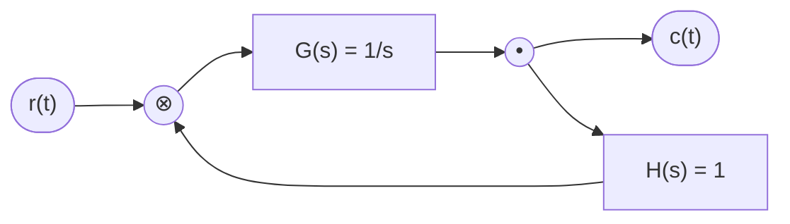
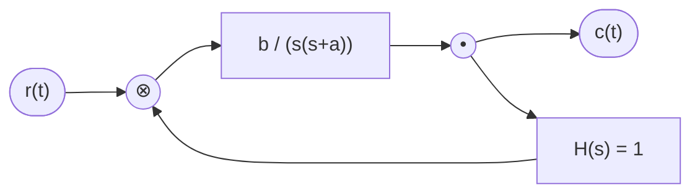
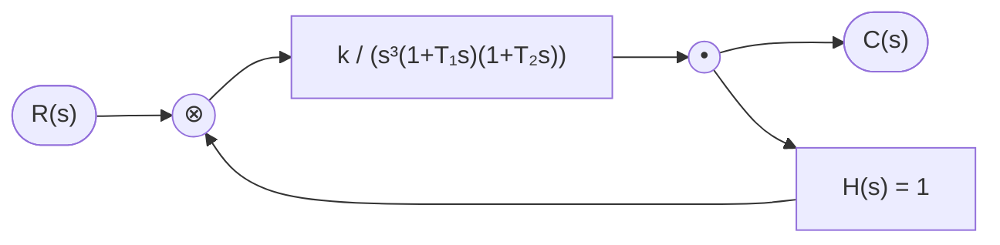
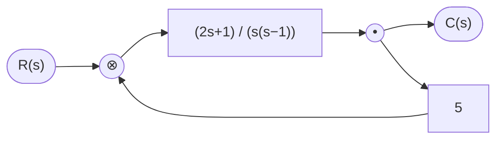
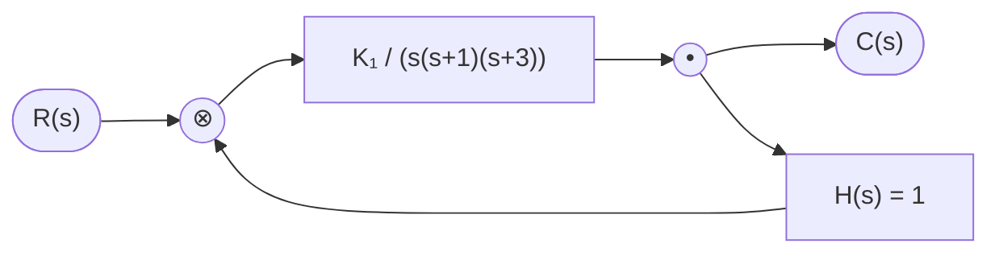
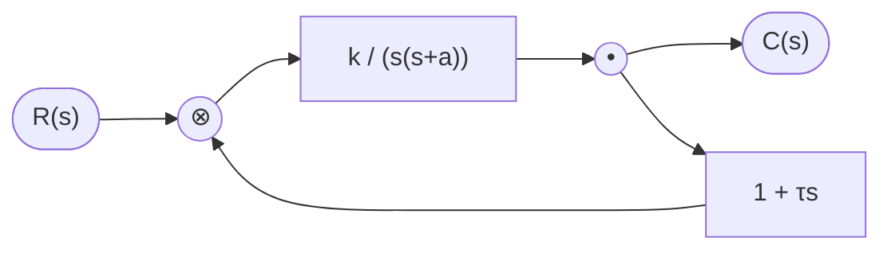

> 返回：[[777习题集目录]] ｜ 答案：[[基础300题 第5章 线性系统的频域分析法（答案与解析）]] ｜ 勘误：[[777习题集官方勘误摘录]]

# 基础300题 第5章 线性系统的频域分析法（题目）

> [!abstract] 本章定位
> 共 **40 题**，按五个知识点编排：**频率特性和频率响应**（5-1—5-5）、**Nyquist 曲线和奈氏判据**（5-6—5-17）、**Bode 图的绘制和分析**（5-18—5-25）、**稳定裕度**（5-26—5-35）、**频率特性与系统性能的关系**（5-36—5-40）。
>
> 本章是本册题量最大的一章，也是本库第 5 章笔记（[[控制理论/自动控制原理/05 第5章 线性系统的频域分析法]]）的**题源**；已被收入笔记的题在答案页标注笔记落点。
>
> ⚠️ **题号是本册自己的一套**（5-1—5-40），与教材第 5 章习题（5-1—5-29）不是同一套，引用一律带院校年份。

## 【知识点一】频率特性和频率响应

**5-1（南开大学 2017）** 简答：请简述频率特性的定义，并写出表示频率特性的两种几何表示法。

**5-2（江南大学 2017）** 已知单位负反馈系统的开环传递函数为 $G(s)=\dfrac{10}{s+1}$，当系统作用以下输入信号 $x_{\mathrm r}(t)=\sin(t+30^\circ)$ 时，试求系统的稳态输出。

> [!note] 本题参考数值
> $\arctan 11=84.8^\circ$。

**5-3（厦门大学 2012）** 已知系统如图所示，输入信号为 $r(t)=220\sin(2t+30^\circ)$，求系统的稳态输出 $c(t)$ 和稳态误差 $e_{\mathrm{ss}}(t)$。

> [!note] 本题参考数值
> $\arctan 2=63.4^\circ$。

**5-4（广州大学 2024）** 已知 $\Phi(s)=\dfrac{\omega_n^2}{s^2+2\zeta\omega_n s+\omega_n^2}$，当输入 $r(t)=2\sin t$ 时，输出为 $c(t)=4\sin(t-45^\circ)$，求 $\zeta$、$\omega_n$。

**5-5（电子科技大学 2022）** 系统结构如图所示。

（1）当 $r(t)=2\sin t$ 时，$c(t)=2\sin(t-45^\circ)$，求此时 $a$，$b$ 的值；

（2）当 $a=3$，$b=2$，$r(t)=1(t)$，求此时的系统响应。

## 【知识点二】Nyquist 曲线和 Nyquist 稳定判据

**5-6（天津大学 2020）** 简答：请简述奈奎斯特稳定判据。

**5-7（南京航空航天大学 2016）** $G(s)$ 由两个典型环节组成，其幅相曲线是个半圆，如图所示。试确定 $G(s)$。

![[附件/777-5-7-奈氏半圆.png|430]]

**5-8（南京航空航天大学 2017）** 某单位负反馈系统为最小相角系统，其开环频率特性如图所示，其中 $B(-3,-\mathrm j\sqrt3)$ 点对应的频率为 $\omega=\dfrac{\sqrt3}{2}$，求系统的开环传递函数。

> [!warning] 答案册出处存疑
> 答案册此题标注为「北京理工大学 2017」，以题目册为准。

![[附件/777-5-8-奈氏曲线B点.png|430]]

**5-9（北京理工大学 2017）** 已知系统开环传递函数为

$$
G(s)=\frac{4s+1}{s^2(s+1)(2s+1)}
$$

请用 Nyquist 判据，判断系统稳定性。

**5-10（电子科技大学 2021）** 反馈系统框图如图所示，其中 $k>0$，$T_1>0$，$T_2>0$。

（1）绘制系统开环频率特性极坐标图；

（2）根据 Nyquist 稳定判据判断系统稳定性。

**5-11（中国计量大学 2024）** 系统结构图如下。

（1）绘制 Nyquist 曲线；

（2）用 Nyquist 判据判断系统的稳定性。

**5-12（大连理工大学 2021）** 已知单位负反馈开环传递函数为

$$
G(s)=\frac{k(s+1)(s+2)}{s^3}
$$

绘制极坐标图及补线，并用奈氏判据确定稳定时 $k$ 的范围。

**5-13** 已知系统开环传递函数为

$$
G(s)H(s)=\frac{K}{(10s+1)(2s+1)(0.2s+1)}
$$

（1）$K=20$ 时，分析系统稳定性；

（2）$K=100$ 时，分析系统稳定性；

（3）分析开环放大倍数 $K$ 的变化对系统稳定性的影响。

**5-14（哈尔滨工业大学 2024）** 负反馈系统开环传递函数

$$
G(s)H(s)=\frac{k(s+3)}{s(s-5)},\quad k>0
$$

画出开环奈氏图，并判断 $k=10$ 和 $k=1$ 时闭环系统的稳定性，若不稳定，写出正实部闭环极点个数。

**5-15（北京理工大学 2021）** 给定负反馈开环传递函数为

$$
G(s)=\frac{k}{(s-2)(s+4)}
$$

绘制 $G(\mathrm j\omega)$ 的 Nyquist 图，并指出使得系统稳定的 $K$ 的取值范围。

**5-16** 单位负反馈系统的开环传递函数为

$$
G(s)=\frac{k(s^2+1)}{s(s+5)}
$$

用奈奎斯特判据确定使闭环系统稳定的条件。

> [!note] 本题参考数值
> $\arctan 0.2=11.3^\circ$。

**5-17（哈尔滨工业大学 2017）** 已知系统开环传递函数为

$$
G(s)=\frac{25}{s(s^2+16)}
$$

（1）分别用劳斯判据和 Nyquist 判据判断稳定性；

（2）若不稳定，给出闭环右半平面极点数。

## 【知识点三】Bode 图的绘制和分析

**5-18（北京理工大学 2017）** 已知最小相位系统的开环传递函数为

$$
G(s)=\frac{4s+1}{s^2(s+1)(2s+1)}
$$

画出系统开环对数频率特性曲线。

> [!note] 本题参考数值
> $\lg 4=0.602$。

**5-19（北京理工大学 2015）** 已知单位反馈最小相位系统的开环传递函数

$$
G(s)=\frac{100\left(\dfrac s2+1\right)}{s\left(\dfrac s{10}+1\right)\left(\dfrac s{20}+1\right)(s+1)}
$$

画出开环对数频率特性曲线。

**5-20（燕山大学 2015）** 已知系统的开环传递函数为

$$
G(s)H(s)=\frac{K(5s+1)(6s+1)(0.2s+10)}{s^2(s^2+s+4)(s+1)(3s+1)(4s+1)}
$$

当 $\omega=0.3$ 时，系统开环对数幅频渐近线特性 $L(0.3)=10\ \mathrm{dB}$，试确定系统参数 $K$。

> [!note] 本题参考数值
> $\lg12=1.079$，$\lg13=1.114$，$\lg1.2=0.0792$，$\lg250=2.398$。

**5-21（浙江工业大学 2024）** 最小相位系统的开环传递函数为

$$
W(s)=\frac{K}{s(Ts+1)(s+1)}\quad(K,T>0)
$$

（1）$T=2$ 时，试根据奈氏判据确定系统闭环稳定的条件；

（2）$T=0.25$，$K=5$ 时，绘制系统的伯德图。

> [!warning] 答案册出处存疑
> 答案册此题标注为「燕山大学 2019」，以题目册为准。

**5-22** 已知最小相位系统的开环渐近对数幅频特性曲线如图所示，试分别求开环传递函数。

![[附件/777-5-22-三张伯德渐近线.png|520]]

**5-23（北京理工大学 2020）** 已知系统的开环对数幅频特性曲线如下所示。试：

（1）求开环传递函数及截止频率 $\omega_c$；

（2）画 Nyquist 图并判断系统稳定性。

![[附件/777-5-23-对数幅频特性.png|430]]

**5-24（哈尔滨工业大学 2020）** 二阶线性最小相位单位负反馈系统的开环奈奎斯特图如下，根据图中信息确定闭环传递函数，并绘制开环渐近对数幅频特性图。

![[附件/777-5-24-奈氏曲线.png|430]]

**5-25（燕山大学 2021）** 某二阶单位负反馈系统开环 Nyquist 曲线如图所示，且测得输入 $r(t)=5t$ 时，闭环系统的稳态误差为 $0.2$。

（1）求系统的开环传递函数 $G(s)$；

（2）绘制开环系统 Bode 图，并求相角裕度。

> [!note] 本题参考数值
> $\arctan 10=84.3^\circ$。

![[附件/777-5-25-奈氏曲线.png|430]]

## 【知识点四】稳定裕度

**5-26（北京理工大学 2017）** 已知开环传递函数为

$$
G(s)=\frac{4s+1}{s^2(s+1)(2s+1)}
$$

求系统的相角裕度。

**5-27（北京理工大学 2021）** 给定单位负反馈系统开环传递函数为

$$
G(s)=\frac{Ks+1}{s^3}
$$

请确定相位裕量为 $30^\circ$ 时参数 $K$ 的值，并计算相应的增益裕量。

**5-28（北京理工大学 2015）** 已知单位反馈最小相位系统开环传递函数

$$
G(s)=\frac{100\left(\dfrac s2+1\right)}{s\left(\dfrac s{10}+1\right)(s+1)}
$$

试求系统的相角裕度和幅值裕度。

**5-29（燕山大学 2016）** 若要求在输入信号 $r(t)=t$ 作用下，系统稳态误差为 $0.5$，求此时系统的增益裕度。

**5-30（天津大学 2020）** 最小相位系统开环对数幅频特性曲线如图，写出系统开环传递函数，并计算相角裕度和幅值裕度。

![[附件/777-5-30-伯德渐近特性.png|430]]

**5-31（燕山大学 2018）** 若最小相位系统奈氏图如图所示，且已知开环增益 $K=5$。

（1）求系统幅值裕度，相角裕度。

（2）求系统稳定时开环增益 $K$ 的取值范围。

![[附件/777-5-31-奈氏图.png|430]]

**5-32（南京航空航天大学 2018）** 已知某单位反馈三阶系统，系统开环幅相曲线如图所示，试分析：若穿越频率 $\omega=1$，求系统的相角裕度，并绘制开环对数幅频渐近曲线。

![[附件/777-5-32-奈氏幅相曲线.png|430]]

> [!warning] 官方勘误
> 图中 $\mathrm j$ 应标在纵轴上，见 [[777习题集官方勘误摘录]]。

**5-33（南京航空航天大学 2017）** 已知某最小相位系统的开环对数幅频渐近线如图所示，用奈氏判据判断系统稳定性，并求系统的相角裕度。

![[附件/777-5-33-对数幅频渐近线.png|520]]

**5-34（天津大学 2016）** 已知某单位反馈系统，开环传递函数 $G(s)$ 为无零点的三阶系统，幅相特性曲线如图所示，当 $\omega=\sqrt2$ 时，相角 $\varphi(\omega)=-135^\circ$，当 $\omega=2$ 时，$G(\mathrm j\omega)=-0.6$。

（1）求开环传递函数；

（2）求系统的幅值裕度 $h$；

（3）判断闭环系统的稳定性。

![[附件/777-5-34-幅相特性曲线.png|430]]

**5-35（哈尔滨工程大学 2019）** 单位负反馈系统的开环传递函数为

$$
G(s)=\frac{k(2s+1)}{s^2(s+1)}
$$

试确定当相角裕度最大时的 $k$ 值。

## 【知识点五】频率特性与系统性能的关系

**5-36（天津大学 2019）** 简答：带宽频率 $\omega_b$ 是如何定义的？说明带宽频率 $\omega_b$ 的大小对系统性能的影响。

**5-37（浙江工业大学 2024）** 最小相位系统开环对数幅频特性曲线如下图，试

（1）写出该系统开环传递函数 $G(s)$；

（2）判断系统稳定性，并说明理由。

![[附件/777-5-37-对数幅频特性曲线.png|430]]

> [!note] 本题参考数值 ⚠️ 官方勘误
> $10^{1/12}=1.212$；$10^{3/8}=2.37$（原书印成 $10^{4/12}=2.37$，应为 $10^{3/8}$）；$\arctan 28.74=88^\circ$，$\arctan 2.874=70.8^\circ$，$\arctan 1.21=50.46^\circ$。

**5-38（天津大学 2018）** 单位反馈系统开环传递函数

$$
G(s)=\frac{K}{s(s+2)}
$$

（1）保证单位斜坡信号输入下的稳态误差 $e_{\mathrm{ss}}<0.4$ 的 $K$ 值范围；

（2）$K=10$ 时，绘制开环幅相曲线，计算待校正系统截止频率 $\omega_c$ 和相角裕度。

> [!note] 本题参考数值
> $\tan 54.74^\circ=\sqrt2$。

> [!warning] 答案册出处存疑
> 答案册此题标注为「浙江工业大学 2024」，以题目册为准。

**5-39（中国科学院大学 2024）** 已知某单位反馈最小相位系统的对数幅频如下图所示。

（1）求开环传递函数。

（2）求系统的相角裕度，并判断系统稳定性。

（3）将对数幅频曲线向右平移 10 倍频程，对系统稳定性能有何影响？

> [!note] 本题参考数值
> $\arctan 10=84.29^\circ$，$\arctan 40=88.57^\circ$。

![[附件/777-5-39-对数幅频图.png|430]]

**5-40（哈尔滨工程大学 2024）** 控制系统结构图如图所示。

（1）当 $k=10$，$a=-1$ 时，试用奈奎斯特稳定判据确定系统稳定、不稳定及临界稳定时 $\tau$ 的取值范围；

（2）设 $\tau=0$，当 $r(t)=3\cos 3t$ 时，从示波器观测到输入和输出的振幅相等，输出在相位上落后于输入 $90^\circ$，试确定参数 $k$、$a$ 的值，并确定 $\omega$ 为何值时输出振幅最大，并计算最大振幅。

> [!note] 本题参考数值
> $\sqrt{0.75}=0.866$。

> 相关：[[777习题集目录]] · [[基础300题 第5章 线性系统的频域分析法（答案与解析）|答案与解析]] · [[777习题集官方勘误摘录]]
