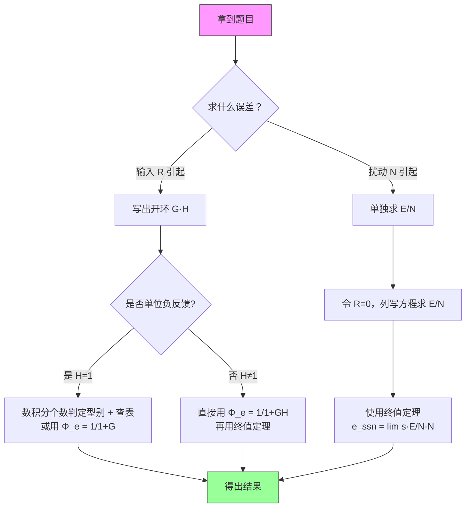

> 返回：[[03 第3章 线性系统的时域分析法]] | 返回目录：[[自动控制原理]]

# 第 3 章（五）稳态误差

> [!abstract] 本讲定位
> 稳态误差（§3.6）：误差的定义（3.6.1）、输入作用下的稳态误差（3.6.2，一般方法/终值定理）、静态误差系数法（3.6.3）、扰动作用下的稳态误差（3.6.4）、减小稳态误差的措施（3.6.5，前馈补偿）。选型与判定流程见文首「方法选择决策树」；Matlab 提示见 §3.7。

## 3.6 稳态误差

$$
\boxed{e_{ss} = \lim_{s\to0}sE(s)}
$$

**方法总览与选择决策树**

稳态误差计算有三条路线，做题先判场景再选方法：

> [!tip] **方法选择决策树（做题第一步）**
> - **给定**前馈 $G_c(s)$ 或有扰动 $N(s)$ ⟶ 都**不能用查表法**，用**一般方法**（写含 $G_c$ 的 $\Phi_e$，或求 $\Phi_{en}$ 再叠加）；
> - **无**扰动、无前馈：输入为**幂函数** ⟶ **查表法**；输入为**非幂函数**（正弦等）⟶ **一般方法**（或频率响应法，见 §3.6.2 末）；
> - **要求消除/减小稳态误差**（设计 $G_c$）⟶ **前馈补偿设计**（见 §3.6.5）：写含 $G_c$ 的 $\Phi_e$ → 令 $e_{ss}=0$ 反解。

### 3.6.1 误差的定义与两种表述

（教材 §3-6.1，常考）

- **输入端误差**（偏差，可量测）：$E(s)=R(s)-H(s)C(s)$——本节的 $e_{ss}=\lim\limits_{s\to0}sE(s)$ 与静态误差系数均基于此定义；
- **输出端误差**（希望输出与实际输出之差，一般不可量测）：$E'(s)=R'(s)-C(s)$，其中 $R'(s)=R(s)/H(s)$ 为输出量的**希望值**。

**两者关系**（教材式 3-70）：

$$
\begin{aligned}
E'(s)&=\frac{E(s)}{H(s)}\\[4pt]
&\Rightarrow\ \boxed{e'_{ss}=\frac{e_{ss}}{K_h}},\qquad K_h=H(0)\ \text{（反馈通道直流增益）}
\end{aligned}
$$

推导（终值定理）：$e'_{ss}=\lim\limits_{s\to0}sE'/\text{=}\lim s\cdot E/H=e_{ss}/H(0)$。单位反馈 $H=1$ 时两种定义一致。

> [!example] **例（教材例 3-13）**
> $G(s)=\dfrac{10}{s+1}$，$H(s)=K_h$，$r(t)=1(t)$
>
> **① 开环与型别**：$G(s)H(s)=\dfrac{10K_h}{s+1}$ → 0 型，$K_p=10K_h$
>
> **② 输入端**：$e_{ss}=\dfrac{1}{1+10K_h}$
>
> **③ 输出端**：$e'_{ss}=\dfrac{e_{ss}}{K_h}=\dfrac{1}{K_h(1+10K_h)}$
>
> **④ 数值验证**（$K_h=0.1$）：$e_{ss}=0.5$，$e'_{ss}=5$；直接验算 $\Phi=\dfrac{10}{s+2}$，$c_{ss}=5$，$R'=R/K_h=10$，$e'_{ss}=10-5=5$ ✓

### 3.6.2 输入作用下的稳态误差

**一般方法：终值定理法**

误差按输入端定义：

$$
E(s)=R(s)-H(s)C(s)
$$

**步骤**：① 判稳定性（不稳定→终值定理无效）→ ② 求 $\Phi_{er}$、$\Phi_{en}$（扰动通道常带负号）→ ③ 各分量 $e_{ssi}=\lim s\,\Phi_{ei}\,R_i$ → ④ 叠加。

![[ctrl-disturbance-block.png|520]]

> [!example] **一般方法完整示例（输入 + 扰动叠加）**
> 单位反馈：$G_1(s)=\dfrac{4}{2s+1}$（扰动作用点**之前**）、$G_2(s)=\dfrac{2}{s(s+3)}$（扰动作用点**之后**），输入 $r(t)=1(t)+2t$（组合），阶跃扰动 $n(t)=1(t)$。
>
> **① 稳定性**：特征方程 $1+G_1G_2=0$ ⟹ $s(s+3)(2s+1)+8=2s^3+7s^2+3s+8=0$
>
> 劳斯第一列 $2,\ 7,\ \dfrac57,\ 8$ 全为正 ⟹ **稳定** ✓，终值定理可用。
>
> **② 误差传递函数**（无前馈、单位反馈）：

$$
\Phi_{er}(s)=\frac{1}{1+G_1G_2},\qquad
\Phi_{en}(s)=-\frac{G_2}{1+G_1G_2}
$$

> **③ 各分量终值**：
> - $r_1=1(t)$：$e_{ss1}=0$（Ⅰ 型）
> - $r_2=2t$：$e_{ss2}=2\cdot\dfrac{3}{8}=\dfrac34$
> - $n=1(t)$：$e_{ssn}=-\dfrac{1}{4}=-\dfrac14$
>
> **④ 叠加**：

$$
e_{ss}=e_{ss1}+e_{ss2}+e_{ssn}=0+\frac34-\frac14=\frac12
$$

> **验算**：查表法 $K_v=\lim\limits_{s\to0}sG_1G_2=\dfrac83$，Ⅰ 型斜坡 $e_{ss}=\dfrac{2}{8/3}=\dfrac34$ ✓。

**动态误差系数**：$\Phi_e(s)$ 在 $s=0$ 处展开为幂级数 $\Phi_e(s)=C_0+C_1s+C_2s^2+\cdots$，则 $e_{ss}(t)=C_0r(t)+C_1\dot r(t)+C_2\ddot r(t)+\cdots$。适用于**缓变任意输入**下稳态误差随时间的变化（终值定理只能求一个稳态值）。

> [!example] **例**：单位反馈 $G(s)=\dfrac{10}{s(s+1)}$ → $\Phi_e=\dfrac{s+s^2}{10+s+s^2}$ → 升幂长除得 $C_0=0,\ C_1=\dfrac{1}{10},\ C_2=\dfrac{9}{100}$。斜坡 $r=t$ ⟹ $e_{ss}=C_1=0.1=\dfrac{1}{K_v}$ ✓。

> [!warning] **正弦输入不能用终值定理**（教材 §3-6.1，常考陷阱）
> $r(t)=\sin\omega t$ 时 $R(s)=\dfrac{\omega}{s^2+\omega^2}$，$sE(s)=s\Phi_e(s)R(s)$ 在虚轴 $\pm\mathrm j\omega$ 处有极点、**不解析**，不满足终值定理条件，
> **不能直接用 $e_{ss}=\lim\limits_{s\to0}sE(s)$**——否则会错误地得出 $e_{ss}=0$（教材例：$G(s)=\dfrac{100}{s(0.1s+1)}$、$r(t)=\sin5t$ 时 $e_{ss}(t)$ 最大幅值约 $0.057$，而终值定理给出 $0$）。
> 正确做法：**频率响应法**——输入 $A\sin(\omega t+\varphi_0)$ 时 $e_{ss}(t)=A\lvert\Phi_e(\mathrm j\omega)\rvert\sin(\omega t+\varphi_0+\angle\Phi_e(\mathrm j\omega))$；
> 或**动态误差系数法**（$e_{ss}(t)=\sum C_i r^{(i)}(t)$）。终值定理适用条件：$sE(s)$ 在右半平面及虚轴上解析。

### 3.6.3 静态误差系数法

> [!warning] **查表前三条**：① 系统稳定；② 输入端定义误差 $E=R-HC$；③ 无前馈支路——有 $G_c$ 则不能直接查表。

静态误差系数（$G$ 为开环传递函数）：

$$
\begin{aligned}
&\boxed{K_p=\lim_{s\to0}G(s)},\qquad\\[4pt]
&\boxed{K_v=\lim_{s\to0}sG(s)},\qquad\\[4pt]
&\boxed{K_a=\lim_{s\to0}s^2G(s)}
\end{aligned}
$$

| 系统型别 |  阶跃$R\cdot1(t)$  |     斜坡$Rt$     |  加速度$Rt^2/2$  |
| :------: | :------------------: | :----------------: | :----------------: |
|   0 型   | $\dfrac{R}{1+K_p}$ |     $\infty$     |     $\infty$     |
|  Ⅰ 型  |        $0$        | $\dfrac{R}{K_v}$ |     $\infty$     |
|  Ⅱ 型  |        $0$        |       $0$       | $\dfrac{R}{K_a}$ |

> [!example] **例：$G(s)=\dfrac{10}{s(s+2)(s+3)}$ 求三类典型输入的稳态误差**
> MATLAB：`num=[10]; den=conv([1 0],conv([1 2],[1 3])); sys = tf(num, den)`
>
> **① 化时间常数形式**：

$$
G(s)=\frac{10}{s\cdot2\!\left(\frac{s}{2}+1\right)\cdot3\!\left(\frac{s}{3}+1\right)}
=\frac{5/3}{s\!\left(\frac{s}{2}+1\right)\!\left(\frac{s}{3}+1\right)}
$$

> **② 定型别、定增益**：分母含 1 个 $s$ → **Ⅰ 型**；$K=\dfrac{5}{3}$ 即 $K_v$ ✓
>
> **③ 查表**（$R$ 为输入幅值）：
>
> | 输入 | $e_{ss}$ |
> |:--|:--|
> | 阶跃 $R\cdot1(t)$ | $0$（Ⅰ 型） |
> | 斜坡 $Rt$ | $\dfrac{R}{K_v}=\dfrac{3R}{5}$（$R=1$ 时 $0.6$） |
> | 加速度 $\dfrac{R}{2}t^2$ | $\infty$ |
>
> 静态误差系数：$K_p=\infty$，$K_v=\dfrac{5}{3}$，$K_a=0$。

### 3.6.4 扰动作用下的稳态误差

扰动稳态误差取决于扰动**之前**环节的积分个数与增益——之前增积分或增增益可减小误差。

> [!example] **扰动作用下的稳态误差例**
> 同上图结构：$G_1(s)=\dfrac{5}{0.5s+1}$（扰动**之前**），$G_2(s)=\dfrac{1}{s(0.2s+1)}$（扰动**之后**），单位反馈，$N(t)=1(t)$。
>
> **① 扰动误差传递函数**（$R=0$）：

$$
E_n(s)=-\frac{G_2(s)}{1+G_1(s)G_2(s)}N(s)
$$

> **② 终值定理**：$G_2\to\infty$（含积分），分子分母同除 $G_2$：
>
> $$
> e_{ssn}=-\lim_{s\to0}\frac{1}{1/G_2+G_1}\to-\frac{1}{K_1}=-\frac{1}{5}=-0.2
> $$
>
> **③ 结论**：$|e_{ssn}|=\dfrac{1}{K_1}$，只取决于**扰动之前**环节的增益，与 $G_2$ 无关；
> 若 $G_1$ **含积分**则 $G_1\to\infty$，$e_{ssn}=0$。
>
> **④ 稳定性**：劳斯 $s^{1}$ 行要求 $K_1K_2<7$，本例 $5<7$ ✓

> [!warning] **⚠️ 前向通道符号陷阱（重灾区）**
> 扰动分析中，前向通道的**符号**是最常见的失分点。
>
> **① 扰动 → 输出**：前向通道通常为**正**
>
> $$
> \frac{Y(s)}{D(s)}=\frac{G_p(s)}{1+G(s)H(s)}
> $$
>
> **② 扰动 → 误差**：**自带负号！**
>
> $$
> \frac{E(s)}{D(s)}=-\frac{G(s)}{1+G(s)} \quad\text{（单位负反馈）}
> $$
>
> 正扰动使输出增加 → $E=R-Y$ 反而减小。
>
> **③ 特殊情况**：
> - 正反馈（$G>1$）→ 分母变 $1-G$，传递函数可能为**负**
> - 无反馈 $Y=R+D$，$E/D=-1$（负号来自误差定义）
>
> **④ 速记**：`扰动到输出看前向（正），扰动到误差自带负。`

### 3.6.5 减小稳态误差的措施（前馈补偿）

**前馈补偿设计（例4 场景）**

引入 $G_c(s)$ 消除稳态误差，两种接法、两种 $\Phi_e$：

| 接法 | $\Phi_e$ | 机理 |
| :-- | :-- | :-- |
| **串联**于 $E$ 之后 | $\dfrac{1}{1+G_cG_0}$ | 含积分 $\dfrac{1}{s}$ 提升型别 |
| **顺馈**由 $R$ 引出 | $\dfrac{1-G_cG_0}{1+G_0}$ | 凑零分子使 $G_cG_0\to1$ |

设计三步：写 $\Phi_e$ → 终值定理 → 令 $e_{ss}=0$ 反解 $G_c$。

![[ctrl-feedforward-block.png|520]]

> [!example] **例4：Ⅰ 型系统 $G_0(s)=\dfrac{K}{s(Ts+1)}$，斜坡 $r(t)=At$，设计顺馈 $G_c$ 使 $e_{ss}=0$**
>
> **① 原系统**：Ⅰ 型斜坡 $e_{ss}=\dfrac{A}{K_v}=\dfrac{A}{K}$

$$
\Phi_e(s)=\frac{1-G_c(s)G_0(s)}{1+G_0(s)}
$$

> **② 代入终值定理**（$R=A/s^2$，分母 $s[1+G_0]\to K$）：

$$
e_{ss}=\frac{A}{K}\Big[1-\lim_{s\to0}\frac{K\,G_c(s)}{s(Ts+1)}\Big]
$$

> **③ 令 $e_{ss}=0$ 反解**（$Ts+1\to1$）：

$$
\boxed{\lim_{s\to0}\frac{G_c(s)}{s}=\frac{1}{K}}
$$

> 取 $G_c(s)=\dfrac{s}{K}$ 即满足；取 $G_c=\dfrac{Ts+1}{K}\equiv\dfrac{1}{G_0}$ 时**任意输入**误差恒零。
>
> **④ 结论**：$K$ 只影响具体系数，不影响可行性。顺馈型要求 $G_c\sim s$；**串联型**才要求含积分 $\dfrac{1}{s}$。两种接法机理不同，勿混用。详见 [[06-2 PID与反馈前馈校正]]。

> [!note] **一致性与串级**
> - 无前馈/无扰动时，一般方法与查表法一致——互为复核；
> - 前馈补偿**不改特征方程**，只改误差传函**分子**；
> - 串级控制：内环增益足够大时 $G_{eq}\approx1/H_2$（强鲁棒性），详见 [[06-2 PID与反馈前馈校正]]。

### 3.6.6 闭环传递函数 $\Phi(s)$ 与误差传递函数 $\Phi_e(s)$ 的关系

> [!abstract] 核心公式对照表（单位负反馈 $H=1$）
>
> | 物理量 | 符号 | 公式 |
> | :--- | :--- | :--- |
> | 闭环传递函数 | $\Phi(s)$ | $\dfrac{Y(s)}{R(s)}=\dfrac{G}{1+G}$ |
> | **误差传递函数**（输入→误差） | $\Phi_e(s)$ | $\dfrac{E(s)}{R(s)}=\dfrac{1}{1+G}$ |
> | **两者关系**（仅限 $H=1$！） | — | $\Phi_e(s)=1-\Phi(s)$ |

> [!danger] **致命陷阱：非单位负反馈 $H\neq1$ 时，$\Phi_e\neq1-\Phi$！**
> - 此时 $\Phi(s)=\dfrac{G}{1+GH}$，但 $1-\Phi(s)=\dfrac{1+GH-G}{1+GH}\neq\dfrac{1}{1+GH}$。
> - **正确做法**：必须老老实实写 $\Phi_e(s)=\dfrac{1}{1+G(s)H(s)}$（输入端误差定义 $E=R-HY$ 下）。
> - **速记**：`H=1 才能用 1-Φ，H≠1 一律从 1/(1+GH)`。

> [!example] **验证**（$G=10/(s+1)$，$H=2$）
> $\Phi=\dfrac{10}{s+21}$，$1-\Phi=\dfrac{s+11}{s+21}\neq\dfrac{s+1}{s+21}=\dfrac{1}{1+GH}$ ✗
>
> 正确：$\Phi_e=\dfrac{1}{1+GH}=\dfrac{s+1}{s+21}$ ✓

### 3.6.7 三大铁律与避坑指南（救命版）

> [!danger] **铁律一：稳定性优先**
> 闭环系统必须**稳定**（所有极点位于左半平面），否则终值定理**失效**，稳态误差不存在——做题第一步永远是判稳定（劳斯/特征方程）。

> [!danger] **铁律二：型别法只适用于输入 $R$**
> 型别法**只能**用于输入 $R$ 引起的稳态误差。扰动 $N$ **必须用终值定理**：$e_{ssn}=\lim_{s\to0}s\cdot\dfrac{E(s)}{N(s)}\cdot N(s)$。千万不能拿扰动去查表！

> [!danger] **铁律三：看清 $H(s)$**
> - $H=1$：可用 $\Phi_e=1-\Phi$
> - $H\neq1$：禁止 $1-\Phi$，直接用 $\Phi_e=\dfrac{1}{1+GH}$

### 3.6.8 解题通用流程图

> [!tip] **做题口诀**
> 1. **先稳定**：判特征方程根→不稳定则终值定理不可用；
> 2. **再辨源**：输入 $R$ 扰动 $N$ 分开处理，叠加得总误差；
> 3. **选方法**：$R$ 引起→型别查表或终值定理；$N$ 引起→只能终值定理；
> 4. **查符号**：扰动到输出前向正、到误差自带负；$H\neq1$ 时 $1-\Phi$ 禁用。

## 3.7 Matlab 提示

MATLAB 相关命令（`tf`/`step`/`impulse`/`lsim`/`rlocfind` 等）见 [[11 MATLAB 基础速查]]。
