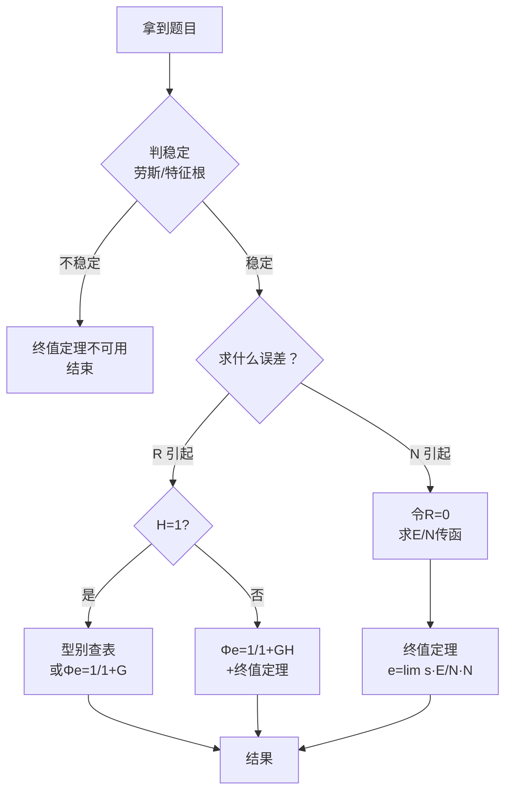

> 返回：[[03 第3章 线性系统的时域分析法]] | 返回目录：[[自动控制原理]]

# 第 3 章（八）扰动误差与前馈补偿

> [!abstract] 本讲定位
> 扰动误差分析、前馈补偿设计、Φ与Φe关系、解题流程与典型例题。

## ⚡ 扰动误差

### 扰动误差传递函数（R=0）

$$E_n(s)=-\frac{G_2(s)}{1+G_1(s)G_2(s)}N(s)$$

其中 $G_1$ 为扰动**之前**环节，$G_2$ 为扰动**之后**环节。

> [!example] ✏️ **例**：$G_1=\dfrac{5}{0.5s+1}$（前），$G_2=\dfrac{1}{s(0.2s+1)}$（后），$N(t)=1(t)$
>
> $G_2\to\infty$（含积分），同除 $G_2$：$e_{ssn}=-\dfrac{1}{K_1}=-\dfrac{1}{5}=-0.2$
>
> 结论：$|e_{ssn}|=\dfrac{1}{K_1}$，只取决于扰动**之前**增益；$G_1$ 含积分则 $e_{ssn}=0$

### 关键结论

阶跃扰动下：$|e_{ssn}|=\dfrac{1}{K_1}$（$K_1=G_1(0)$）

- 只取决于扰动**之前**环节的增益
- 若 $G_1$ **含积分** → $e_{ssn}=0$

### ⚠️ 符号陷阱（重灾区）

| 传递方向 | 符号 | 公式 |
|:--|:--:|:--|
| 扰动 → 输出 | **正** | $\dfrac{Y}{D}=\dfrac{G_p}{1+GH}$ |
| 扰动 → 误差 | **负** | $\dfrac{E}{D}=-\dfrac{G}{1+G}$ |

特殊情况：
- 正反馈 $G>1$ → 分母 $1-G$，可能为负
- 无反馈 $Y=R+D$ → $E/D=-1$（负号来自误差定义）

---

## 🎯 前馈补偿

引入 $G_c(s)$ 消除稳态误差：

| 接法 | $\Phi_e$ | 机理 |
|:--|:--|:--|
| **串联**于 $E$ 之后 | $\dfrac{1}{1+G_cG_0}$ | 含积分 $\dfrac{1}{s}$ 提升型别 |
| **顺馈**由 $R$ 引出 | $\dfrac{1-G_cG_0}{1+G_0}$ | 凑零分子 $G_cG_0\to1$ |

设计三步：写 $\Phi_e$ → 终值定理 → 令 $e_{ss}=0$ 反解 $G_c$。

![[ctrl-feedforward-block.png|520]]

> [!example] ✏️ **例**：Ⅰ 型 $G_0=\dfrac{K}{s(Ts+1)}$，斜坡 $r=At$，设计顺馈 $G_c$ 使 $e_{ss}=0$
>
> $\Phi_e=\dfrac{1-G_cG_0}{1+G_0}$，代入终值定理得 $\boxed{\lim_{s\to0}\frac{G_c}{s}=\frac{1}{K}}$
>
> 取 $G_c=\dfrac{s}{K}$ 即满足；取 $G_c=\dfrac{Ts+1}{K}\equiv\dfrac{1}{G_0}$ 时任意输入误差恒零。
>
> 顺馈型要求 $G_c\sim s$；串联型要求含积分 $\dfrac{1}{s}$。两种接法机理不同，勿混用。

> 前馈补偿**不改特征方程**，只改误差传函**分子**。详见 [[06-2 PID与反馈前馈校正]]。

---

## 📊 Φ 与 Φe 对照表

| 物理量 | 符号 | 公式（H=1） | 公式（H≠1） |
|:--|:--|:--|:--|
| 闭环传递函数 | $\Phi$ | $\dfrac{G}{1+G}$ | $\dfrac{G}{1+GH}$ |
| 误差传递函数 | $\Phi_e$ | $\dfrac{1}{1+G}$ | $\dfrac{1}{1+GH}$ |
| 两者关系 | — | $\Phi_e=1-\Phi$ | **禁止 $1-\Phi$** |

---

## 🚨 三大铁律

> [!danger] **铁律一：稳定性优先**
> 不稳定 → 终值定理失效 → 做题第一步永远判稳定。

> [!danger] **铁律二：型别法只适用于输入 R**
> 扰动 N 必须用终值定理：$e_{ssn}=\lim s\cdot\frac{E}{N}\cdot N$。**不能拿扰动去查表！**

> [!danger] **铁律三：看清 H(s)**
> - $H=1$：可用 $\Phi_e=1-\Phi$
> - $H\neq1$：禁止 $1-\Phi$，直接 $\Phi_e=\frac{1}{1+GH}$

---

## 🗺️ 解题流程图

做题口诀：① 先稳定 → ② 再辨源（R/N 分开） → ③ 选方法 → ④ 查符号

---

## 📤 稳态输出 c_ss

$$c_{ss} = r_{ss} - e_{ss}\ \text{（单位负反馈）}$$

非单位反馈：$c_{ss}=r_{ss}-e_{ss}/K_h$

| 型别 | 阶跃 $c_{ss}$ | 斜坡 $c_{ss}$ |
|:--:|:--:|:--:|
| 0 型 | $\dfrac{RK}{1+K}$（有差） | $\infty$ |
| Ⅰ 型 | $R$（无差） | $R-\dfrac{R}{K_v}$（有差） |
| Ⅱ 型 | $R$（无差） | $R$（无差） |

---

## 3.7 Matlab

`tf`/`step`/`impulse`/`lsim`/`rlocfind` 等见 [[11 MATLAB 基础速查]]。

> [!example] ✏️ 例3.12 不同输入信号下的稳态误差
>
> **题目**：设单位反馈系统的开环传递函数为 $G(s)=1/(Ts)$，输入信号分别为 $r(t)=t^2/2$ 以及 $r(t)=\sin\omega t$，试求控制系统的稳态误差。
>
> **解**：
>
> 1. **当 $r(t)=t^2/2$ 时**：
>    $R(s)=1/s^3$。由式（3-72）求得
>
>    $$
>    E(s)=\frac{T}{s^2(s+1/T)}=-\frac{T^2}{s^2}+\frac{T^2}{s}-\frac{T^2}{s+1/T}
>    $$
>
>    显然，$sE(s)$ 在 $s=0$ 处有一个极点。对上式取拉氏反变换，得误差响应
>
>    $$
>    e(t)=T^2e^{-t/T}+T(t-T)
>    $$
>
>    式中，$e_{ts}(t)=T^2e^{-t/T}$，随时间增长逐渐衰减至零；$e_{ss}(t)=T(t-T)$，表明稳态误差 $e_{ss}(\infty)=\infty$。
>
> 2. **当 $r(t)=\sin\omega t$ 时**：
>    $R(s)=\omega/(s^2+\omega^2)$。由于
>
>    $$
>    \begin{aligned}
>    E(s)&=\frac{\omega s}{(s+1/T)(s^2+\omega^2)}\\
>    &=-\frac{T\omega}{T^2\omega^2+1}\cdot\frac{1}{s+1/T}
>    +\frac{T\omega}{T^2\omega^2+1}\cdot\frac{s}{s^2+\omega^2}\\
>    &\quad+\frac{T^2\omega^3}{T^2\omega^2+1}\cdot\frac{1}{s^2+\omega^2}
>    \end{aligned}
>    $$
>
>    所以得
>
>    $$
>    e_{ss}(t)=\frac{T\omega}{T^2\omega^2+1}\cos\omega t+\frac{T^2\omega^2}{T^2\omega^2+1}\sin\omega t
>    $$
>
>    显然，$e_{ss}(\infty)\neq0$。由于正弦函数的拉氏变换式在虚轴上不解析，所以此时不能应用终值定理法来计算系统在正弦函数作用下的稳态误差，否则会得出
>
>    $$
>    e_{ss}(\infty)=\lim_{s\to0}sE(s)=\lim_{s\to0}\frac{\omega s^2}{(s+1/T)(s^2+\omega^2)}=0
>    $$
>
>    的错误结论。
>
> **结论**：对于正弦输入信号，不能使用终值定理法计算稳态误差，而应采用频率响应法或动态误差系数法。

例 3.12 用多项式与正弦输入考察稳态误差，并指出正弦输入下终值定理失效；例 3.15 改用**动态误差系数法**求正弦输入下的稳态误差 $e_{ss}(t)$。

> [!example] ✏️ 例3.15 正弦输入下的动态误差系数法
>
> **题目**：设单位反馈控制系统的开环传递函数为
>
> $$
> G(s)=\frac{100}{s(0.1s+1)}
> $$
>
> 若输入信号为 $r(t)=\sin5t$，试求系统的稳态误差 $e_{ss}(t)$。
>
> **解**：
>
> 1. **方法一：动态误差系数法**：
>    由于输入信号为正弦函数，无法采用静态误差系数法确定 $e_{ss}(t)$。现采用动态误差系数法求系统的稳态误差。由于系统误差传递函数
>
>    $$
>    \Phi_e(s)=\frac{1}{1+G(s)}=\frac{s(0.1s+1)}{0.1s^2+s+100}=0+10^{-2}s+9\times10^{-4}s^2-1.9\times10^{-5}s^3+\cdots
>    $$
>
>    故动态误差系数为
>
>    $$
>    C_0=0,\quad C_1=10^{-2},\quad C_2=9\times10^{-4},\quad C_3=-1.9\times10^{-5},\quad \cdots
>    $$
>
>    可求得稳态误差
>
>    $$
>    e_{ss}(t)=(C_0-C_2\omega^2+C_4\omega^4-\cdots)\sin\omega t+(C_1\omega-C_3\omega^3+C_5\omega^5-\cdots)\cos\omega t
>    $$
>
>    式中 $\omega=5$。对上述级数求和，得
>
>    $$
>    e_{ss}(t)=-0.055\cos(5t-24.9^\circ)
>    $$
>
>    因此，系统稳态误差为余弦函数，其最大幅值为 $0.055$。
>
> 2. **方法二：反变换法**：
>    误差信号为
>
>    $$
>    E(s)=\Phi_e(s)R(s)=\frac{s^2+10s}{s^2+10s+1000}\cdot\frac{5}{s^2+25}=\frac{as+b}{s^2+10s+1000}+\frac{cs+d}{s^2+25}
>    $$
>
>    式中，系数 $a$、$b$、$c$、$d$ 待定。上式通分后，得如下代数方程组：
>
>    $$
>    \begin{cases}
>    25b+1000d=0\\
>    a+c=0\\
>    b+10c+d=5\\
>    25a+1000c+10d=50
>    \end{cases}
>    $$
>
>    利用行列式求解方法，可以算出：$c=-0.0498$，$d=-0.115$。
>
>    由于闭环系统是稳定的，故稳态下
>
>    $$
>    E_{ss}(s)=\frac{cs+d}{s^2+25}=-\frac{0.0498s+0.115}{s^2+25}
>    $$
>
>    对上式取拉氏反变换，可求得同解1一样的系统稳态误差。
>
> **结论**：对于正弦输入信号，动态误差系数法和反变换法都能求出稳态误差的时域表达式。动态误差系数法适用于缓变输入，而反变换法更通用但计算较繁琐。