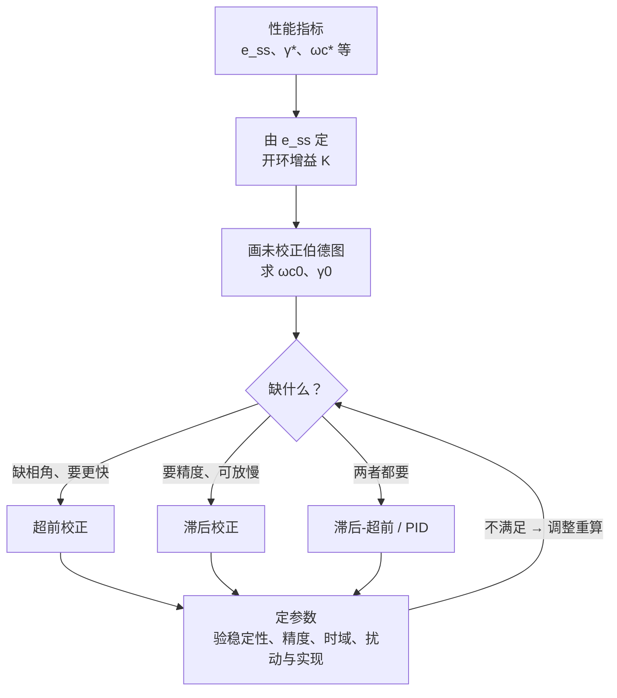

> 返回：[[06-4 前馈复合校正与设计总流程]] | 返回目录：[[自动控制原理]]

# 第6章（四-b）设计总流程与例题

> [!abstract] 本讲定位
> 已拆分为本页总览入口及两篇例题；本页保留校正设计总流程。前置滤波/最小节拍例对应教材§6-5，扰动前馈对应§6-6，完整验收示例对应§6-7；6.7为笔记内部流程编号。

## 🛠️ 6.7 校正设计总流程

超前、滞后的分步设计见 06-1 §6.3.1、6.3.2；验算不合格时调整 $\varphi_m$ 补偿量或更换校正方式（工业基本控制方法 PD/PI/PID 见 §6.2）。

## 🗂️ 分章导航

| 专题 | 对应教材与内容 |
|:--|:--|
| [[06-4-c 前置滤波与最小节拍例题]] | \6-5：例6-7前置滤波、例6-8三阶系数匹配 |
| [[06-4-d 扰动前馈与综合验收例题]] | \6-6/6-7：例6-9扰动补偿、例6-11完整验收 |

### 6.7.1 设计结束前的验收清单

1. **稳定性与裕度**：重新求实际交越频率、相角/幅值裕度和闭环极点；多交越或开环不稳定系统用完整奈氏判据，不仅看一个正裕度。
2. **精度**：检查系统型别、静态误差系数以及指定输入/扰动的误差通道；有限终值还须满足终值定理。
3. **时域指标**：用实际闭环的零极点计算超调与调节时间，标明2%或5%误差带；有前置滤波时采用完整指令通道。
4. **抗扰指标**：按扰动实际注入位置求通道，检查稳态误差或峰值；按输入前馈不会自动抑制独立扰动。
5. **可实现性**：检查参数、因果性、控制器稳定性、高频滚降、噪声、限幅和模型偏差；不满足则返回选型与参数设计。

> [!tip] 频域设计只是初步方案
> 裕度、精度、时域和实现四类检查闭合后，才算完成一次设计。具体完整验收见 [[06-4-d 扰动前馈与综合验收例题]] 的磁盘驱动例。

## 6.8 解题套路

① 先明确结构与性能口径 → ② 精度定低频增益 → ③ 快速性与裕度定整形目标 → ④ 求完整校正器 → ⑤ 重算实际闭环与各扰动通道 → ⑥ 检查可实现性；不合格则回到选型或参数设计。
