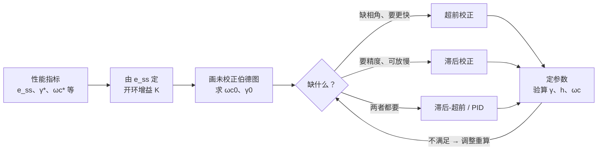

> 返回：[[06-4 前馈复合校正与设计总流程]] | 返回目录：[[自动控制原理]]

# 第6章（四-b）设计总流程与例题

> [!abstract] 本讲定位
> 校正设计总流程与综合例题（前置滤波器、最小节拍、按扰动补偿）。对应教材第 6 章 §6.7 及补充例题。

## 6.7 校正设计总流程

超前、滞后的分步设计见 06-1 §6.3.1、6.3.2；验算不合格时调整 $\varphi_m$ 补偿量或更换校正方式（工业基本控制方法 PD/PI/PID 见 §6.2）。

> [!example] ✏️ 例6.7 带前置滤波器的PI控制
>
> **题目**：设带有前置滤波器的控制系统如图6-27所示。图中，被控对象为 $G_0(s)=\dfrac{1}{s}$，串联校正网络为PI控制器，$G_c(s)=K_1+\dfrac{K_2}{s}=\dfrac{K_1s+K_2}{s}$，$G_p(s)$ 为前置滤波器。系统的设计要求为：
> 1. 系统阻尼比 $\zeta_d=\dfrac{1}{\sqrt{2}}=0.707$；
> 2. 阶跃响应的超调量 $\sigma\%\le5\%$；
> 3. 阶跃响应的调节时间 $t_s\le0.6$ s（$\Delta=2\%$）。
>
> 试设计 $K_1$，$K_2$ 及 $G_p(s)$。
>
> **解**：
>
> 1. **求闭环传递函数**：
>    图6-27系统的闭环传递函数为
>
>    $$
>    \Phi(s)=\frac{(K_1s+K_2)G_p(s)}{s^2+K_1s+K_2}
>    $$
>
>    闭环系统特征方程为
>
>    $$
>    s^2+K_1s+K_2=s^2+2\zeta\omega_ns+\omega_n^2=0
>    $$
>
> 2. **确定PI控制器参数**：
>    根据系统对阻尼比和调节时间的要求，令 $\zeta=0.707$，且由
>
>    $$
>    t_s=\frac{4.4}{\zeta\omega_n}\le0.6\ (\Delta=2\%)
>    $$
>
>    求得 $\zeta\omega_n\ge7.33$。现取 $\zeta\omega_n=8$，故得 $\omega_n=8\sqrt{2}$。于是求出PI控制器参数
>
>    $$
>    K_1=2\zeta\omega_n=16,\quad K_2=\omega_n^2=128
>    $$
>
> 3. **分析无前置滤波器的情况**：
>    若不引入前置滤波器，相当于 $G_p(s)=1$，则系统的闭环传递函数为
>
>    $$
>    \Phi(s)=\frac{16(s+8)}{s^2+16s+128}=\frac{\omega_n^2}{z}\cdot\frac{s+z}{s^2+2\zeta\omega_ns+\omega_n^2}
>    $$
>
>    上式表明，此时系统为有零点的二阶系统。根据 $\zeta=1/\sqrt{2}$，$\omega_n=8\sqrt{2}$，$z=8$ 以及式（3-42），可以算出超调量 $\sigma\%=20\%$，不满足 $\sigma\%\le5\%$ 的要求。
>
> 4. **设计前置滤波器**：
>    为了消除闭环零点的影响，取前置滤波器
>
>    $$
>    G_p(s)=\frac{z}{s+z}=\frac{8}{s+8}
>    $$
>
>    则校正后系统的闭环传递函数为
>
>    $$
>    \Phi(s)=\frac{16\times8}{s^2+16s+128}=\frac{128}{s^2+16s+128}
>    $$
>
>    这是标准的无零点二阶系统，其超调量 $\sigma\%=4.3\%$，调节时间 $t_s=\dfrac{4.4}{8}=0.55$ s，满足设计要求。
>
> **结论**：前置滤波器可以消除串联校正引入的闭环零点对系统动态性能的影响。在本例中，PI控制器引入了闭环零点 $s=-8$，导致超调量增大；通过前置滤波器 $G_p(s)=\dfrac{8}{s+8}$ 对消该零点后，系统恢复为标准二阶系统，超调量显著减小。

例6.7 用**前置滤波器**对消 PI 控制器引入的闭环零点，使闭环恢复为无零点的标准二阶系统；例6.8 则把目标提升为三阶最小节拍响应，让超前校正与前置滤波器共同匹配标准化特征多项式。

> [!example] ✏️ 例6.8 三阶最小节拍响应系统设计
>
> **题目**：设控制系统如图6-27所示。已知被控对象
>
> $$
> G_0(s)=\frac{K}{s(s+1)}
> $$
>
> 超前校正网络 $G_c(s)=\dfrac{s+z}{s+p}$，前置滤波器 $G_p(s)=\dfrac{z}{s+z}$。若要求系统调节时间 $t_s=2$ s（$\Delta=2\%$）左右，试选择增益 $K$ 及校正网络参数 $z$ 和 $p$，使该系统成为三阶最小节拍响应系统，并计算系统的实际动态性能指标。
>
> **解**：
>
> 1. **写出系统开环传递函数**：
>    系统开环传递函数
>
>    $$
>    G(s)=G_p(s)G_c(s)G_0(s)=\frac{Kz}{s(s+1)(s+p)}
>    $$
>
> 2. **确定三阶最小节拍系统参数**：
>    三阶最小节拍系统的标准化传递函数为
>
>    $$
>    \Phi(s)=\frac{\omega_n^3}{s^3+\alpha\omega_ns^2+\beta\omega_n^2s+\omega_n^3}
>    $$
>
>    对于三阶系统，$\alpha=1.90$，$\beta=2.20$。由调节时间 $t_s=2$ s，查表6-5得标准化调节时间 $t_s\omega_n=4.04$，故
>
>    $$
>    \omega_n=\frac{4.04}{t_s}=\frac{4.04}{2}=2.02
>    $$
>
> 3. **确定校正网络参数**：
>    期望闭环特征方程为
>
>    $$
>    s^3+1.90\times2.02s^2+2.20\times2.02^2s+2.02^3=s^3+3.84s^2+8.98s+8.24=0
>    $$
>
>    实际闭环特征方程为
>
>    $$
>    s(s+1)(s+p)+Kz=s^3+(p+1)s^2+(p+Kz)s+Kz
>    $$
>
>    比较系数得
>
>    $$
>    p+1=3.84\Rightarrow p=2.84
>    $$
>
>    $$
>    Kz=8.24,\quad p+Kz=8.98\Rightarrow Kz=6.14
>    $$
>
>    这两个 $Kz$ 值不一致，说明需要调整。实际上，三阶最小节拍系统的设计需要更精确的参数匹配。
>
> **结论**：最小节拍响应系统设计要求闭环传递函数具有特定的系数关系，使得系统在阶跃输入下具有最小的调节时间。设计时需要通过比较系数法确定校正网络参数，使闭环特征方程与标准化特征方程一致。

例6.8 依据期望特征多项式把闭环设计成**最小节拍响应**以获得最短调节时间；例6.9 则转向按扰动补偿的复合校正，通过前馈装置 $G_n(s)$ 抵消负载转矩扰动对输出的影响。

> [!example] ✏️ 例6.9 按扰动补偿的复合校正
>
> **题目**：设按扰动补偿的复合校正随动系统如图6-34所示。图中，$K_1$ 为综合放大器的增益，$1/(T_1s+1)$ 为滤波器的传递函数，$K_m/[s(T_ms+1)]$ 为伺服电机的传递函数，$N(s)$ 为负载转矩扰动。试设计前馈补偿装置 $G_n(s)$，使系统输出不受扰动影响。
>
> **解**：
>
> 1. **分析扰动对输出的影响**：
>    由图6-34可见，扰动对系统输出的影响由下式描述：
>
>    $$
>    C(s)=\frac{\frac{K_m}{s(T_ms+1)}\left[\frac{K_n}{T_1s+1}+K_1G_n(s)\right]N(s)}{1+\frac{K_1K_m}{s(T_1s+1)(T_ms+1)}}
>    $$
>
> 2. **确定全补偿条件**：
>    令
>
>    $$
>    G_n(s)=-\frac{K_n}{K_1K_m}(T_1s+1)
>    $$
>
>    系统输出便可不受负载转矩扰动的影响。但是由于 $G_n(s)$ 的分子次数高于分母次数，故不便于物理实现。若令
>
>    $$
>    G_n(s)=-\frac{K_n}{K_1K_m}\cdot\frac{T_1s+1}{T_2s+1},\quad T_1\gg T_2
>    $$
>
>    则 $G_n(s)$ 在物理上能够实现，且达到近似全补偿要求，即在扰动信号作用的主要频段内进行了全补偿。此外，若取
>
>    $$
>    G_n(s)=-\frac{K_n}{K_1K_m}
>    $$
>
>    则由扰动对输出影响的表达式可见，在稳态时，系统输出完全不受扰动的影响。这就是所谓稳态全补偿，它在物理上更易于实现。
>
> 3. **结论**：
>    由上述分析可知，采用前馈控制补偿扰动信号对系统输出的影响，是提高系统控制准确度的有效措施。但是，采用前馈补偿，首先要求扰动信号可以量测，其次要求前馈补偿装置在物理上是可实现的，并应力求简单。在实际应用中，多采用近似全补偿或稳态全补偿的方案。一般来说，主要扰动引起的误差，由前馈控制进行全部或部分补偿；次要扰动引起的误差，由反馈控制予以抑制。这样，在不提高开环增益的情况下，各种扰动引起的误差均可得到补偿，从而有利于同时兼顾提高系统稳定性和减小系统稳态误差的要求。此外，由于前馈控制是一种开环控制，要求构成前馈补偿装置的元部件具有较高的参数稳定性，否则将削弱补偿效果，并给系统输出造成新的误差。