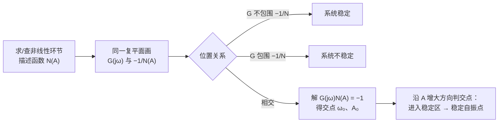

> 返回：[[08 第8章 非线性控制系统分析]] | 返回目录：[[自动控制原理]]

# 第 8 章（二） 描述函数法与解题套路
## 8.3 描述函数法

### 8.3.1 描述函数概念

**定义来源（傅氏级数展开）**：非线性环节输入 $x=A\sin\omega t$ 时，稳态输出 $y(t)$ 是周期函数，展开为傅氏级数：

$$
y(t)=\frac{A_0}{2}+\sum_{n=1}^{\infty}\bigl(A_n\cos n\omega t+B_n\sin n\omega t\bigr)
$$

由于非线性特性一般为**奇对称**（$A_0=0$，且偶次谐波常为零），取**基波分量**（$n=1$）：

$$
y_1(t)=A_1\cos\omega t+B_1\sin\omega t = Y_1\sin(\omega t+\varphi_1)
$$

其中 $A_1=\dfrac{1}{\pi}\displaystyle\int_0^{2\pi}y(t)\cos\omega t\,d(\omega t)$、$B_1=\dfrac{1}{\pi}\int_0^{2\pi}y(t)\sin\omega t\,d(\omega t)$。
描述函数（一阶谐波近似）定义为基波输出对输入的复数比：

$$
\boxed{N(A) = \frac{Y_1}{A}e^{\mathrm{j}\varphi_1} = \frac{B_1+\mathrm{j}A_1}{A}}
$$

**为何只取基波**：非线性环节后的线性部分通常具有**低通滤波特性**，高次谐波被滤除，故仅基波起主要作用。

**由定义直接推导**（Word 补充 doc16，会推导更易记）：以**理想继电** $y(t)=\begin{cases}M,&x>0\\[2pt]-M,&x<0\end{cases}$ 为例，$x=A\sin\omega t$ 时输出为同频方波：
- $A_1=0$（奇对称，$\cos$ 项为零）；
- $B_1=\dfrac{1}{\pi}\int_0^{2\pi}y(t)\sin\omega t\,d(\omega t)=\dfrac{4M}{\pi}$；
  仅在 $y=+M$ 的半周期内积分 $\int_0^\pi M\sin\omega t\,d(\omega t)$ 再乘 $\dfrac{2}{\pi}$；

故 $N(A)=\dfrac{B_1}{A}=\boxed{\dfrac{4M}{\pi A}}$，与查表结果一致。死区/饱和/滞环继电同理由定义积分导出（奇对称性先消 $A_1$，再算 $B_1$ 或含虚部情形）。

### 8.3.2 典型非线性特性的描述函数

**常用三件（必背：理想继电 / 死区继电 / 滞环继电）**：

![[自控-描述函数-常用三件.png|520]]
*理想继电（单竖跳）、死区继电（中间死区±h）、滞环继电（矩形回环带滞环半宽 h）*

> [!note] **理想继电**（幅值 $M$）
> $$
> \boxed{N(A)=\frac{4M}{\pi A}}
> $$
> 纯实数描述函数；$-\dfrac{1}{N(A)}=-\dfrac{\pi A}{4M}$ 沿整条负实轴（$A:0\to+\infty$ 对应 $0\to-\infty$）。

> [!note] **死区继电**（死区半宽 $h$、输出 $M$；$A\ge h$）
> $$
> N(A)=\frac{4M}{\pi A}\sqrt{1-\left(\frac{h}{A}\right)^2}
> $$
> - 纯实数；$-\dfrac{1}{N(A)}$ 在实轴为**双支**：$A\to h^+$ 时从 $-\infty$ 增至最右点 $-\dfrac{\pi h}{2M}$（$A=\sqrt2\,h$ 处 $N$ 最大），再回折向 $-\infty$；
> - 判自振时**两支都要**与 $-\dfrac{1}{G(\mathrm j\omega)}$ 相交检验。

> [!note] **滞环继电**（幅值 $M$、滞环半宽 $h$）
> $$
> N(A)=\frac{4M}{\pi A}\left[\sqrt{1-\left(\frac{h}{A}\right)^2}-\mathrm{j}\frac{h}{A}\right]
> $$
> **含相角滞后**（虚部 $<0$），最易产生自振。

**连续型（饱和 / 死区）**：

![[自控-描述函数-连续型.png|430]]
*饱和（线性区 ±a 后限幅）、死区（中间 ±Δ 无输出）、死区加饱和、变增益（两段斜率）*

> [!note] **饱和**（线性斜率 $k$、线性区半宽 $a$；$A\ge a$）
> $$
> N(A)=\frac{2k}{\pi}\left[\arcsin\frac{a}{A}+\frac{a}{A}\sqrt{1-\left(\frac{a}{A}\right)^2}\right]
> $$
> $N(A)\le k$，大信号等效增益降低。

> [!note] **死区**（死区半宽 $\Delta$、斜率 $k$；$A\ge\Delta$）
> $$
> N(A)=k-\frac{2k}{\pi}\left[\arcsin\frac{\Delta}{A}+\frac{\Delta}{A}\sqrt{1-\left(\frac{\Delta}{A}\right)^2}\right]
> $$
> $N(A)\le k$，小信号等效增益降低。

> [!note] **死区加饱和**（$h$、$a$、$k$）
> $$
> N(A)=\begin{cases}0, & A\le h\\[2pt] \text{上升段}, & h<A<a\\[2pt] \text{下降段}, & A\ge a\end{cases}
> $$
> 三个区域各有不同表达式。

**多值 / 复合型（含虚部）**：

![[自控-描述函数-多值复合型.png|430]]
*间隙（平行四边形回环）、死区+滞环继电、有死区线性（±Δ 处跳变 M）、库仑+黏性摩擦（过原点跳变）*

> [!note] **间隙**（宽度 $2b$、斜率 $k$）
> $$
> N(A)=\frac{k}{\pi}\left[\frac{\pi}{2}+\arcsin\left(1-\frac{2b}{A}\right)+2\left(1-\frac{2b}{A}\right)\sqrt{\frac{b}{A}\left(1-\frac{b}{A}\right)}\right]-\mathrm{j}\frac{4kb}{\pi A}\left(1-\frac{b}{A}\right)
> $$
> 多值非线性，含虚部，相位滞后严重。

> [!note] **死区+滞环继电**（$M$、$h$、$m$；$A\ge h$）
> $$
> N(A)=\frac{2M}{\pi A}\left[\sqrt{1-\left(\frac{h}{A}\right)^2}+\sqrt{1-\left(\frac{mh}{A}\right)^2}\right]+\mathrm{j}\frac{2Mh}{\pi A^2}(m-1)
> $$
> $m=1$ 退化为死区继电、$m=-1$ 退化为滞环继电（教材式 8-76）。

> [!note] **变增益特性**（$K_1$、$K_2$、$s$；$A\ge s$）
> $$
> N(A)=K_2+\frac{2(K_1-K_2)}{\pi}\left[\arcsin\frac{s}{A}+\frac{s}{A}\sqrt{1-\left(\frac{s}{A}\right)^2}\right]
> $$
> $\lvert x\rvert\le s$ 内斜率 $K_1$、之外斜率 $K_2$；$A\to\infty$ 时 $N\to K_2$、$A=s$ 时 $N=K_1$。

> [!note] **有死区的线性特性**（$K$、$M$、$\Delta$；$A\ge\Delta$）
> $$
> N(A)=K-\frac{2K}{\pi}\arcsin\frac{\Delta}{A}+\frac{4M-2K\Delta}{\pi A}\sqrt{1-\left(\frac{\Delta}{A}\right)^2}
> $$
> 死区内输出 $0$，$\pm\Delta$ 处有幅值 $M$ 的跳变，死区外输出 $K(x\mp\Delta)\pm M$（斜率 $K$）。

> [!note] **库仑摩擦 + 黏性摩擦**
> $$
> N(A)=K+\frac{4M}{\pi A}
> $$
> 实数描述函数（等效增益，有实部）。

> [!tip] **记忆要点**
> 理想继电 $N=4M/(\pi A)$ 为基本公式；饱和/死区的描述函数可由理想继电积分叠加推导；滞环继电 = 理想继电 × 复数因子（滞后角约 $-h/A$ rad）。前三项最为常用——求出 $N(A)$ 后立即代入 $G(\mathrm{j}\omega)N(A)=-1$。

### 8.3.3 用描述函数法分析非线性系统

**稳定性判别**（将 $-\dfrac{1}{N(A)}$ 曲线视作"广义 $(-1,\mathrm{j}0)$ 点"，设线性部分最小相位）：

- $G(\mathrm{j}\omega)$ 曲线**不包围** $-\dfrac{1}{N(A)}$ 曲线 → 系统稳定；**包围** → 不稳定；
- **相交** → 可能产生自振，交点满足 $G(\mathrm{j}\omega)N(A)=-1$，由交点定自振幅值 $A_0$ 与频率 $\omega_0$；
- 交点处沿 $A$ 增大方向，$-\dfrac{1}{N(A)}$ 曲线由不稳定区进入稳定区者为**稳定自振点**（能观测到的自持振荡）。

![[非线性-描述函数判稳.png|520]]

> [!example] 例：描述函数法判自持振荡（死区 $\pm2$ + 双积分线性部分）
> **原题以结构图给出**：
>
> ![[自控-死区双积分结构图.png|520]]
>
> *结构图：单位负反馈，死区非线性（半宽 $2$、斜率 $1$）+ 线性部分 $G(s)=\dfrac{1}{s^{2}}$*
>
> 单位负反馈系统：非线性环节为死区特性 $u=\begin{cases}0,&\lvert e\rvert\le2\\[2pt] e-2,&e>2\\[2pt] e+2,&e<-2\end{cases}$（死区半宽 $2$、斜率 $1$），线性部分 $G(s)=\dfrac{1}{s^{2}}$。
> 问是否存在自持振荡。
> **解（描述函数判据）**：死区描述函数
> $$
> \begin{aligned}
> N(A)&=1-\dfrac{2}{\pi}\Bigl[\arcsin\dfrac2A\\[4pt]
> &+\dfrac2A\sqrt{1-\Bigl(\dfrac2A\Bigr)^{2}}\Bigr]\ (A\ge2)
> \end{aligned}
> $$
> 从 $0$ 单调增至 $1$，故 $-\dfrac{1}{N(A)}\in(-\infty,-1]$；而
> $$
> G(\mathrm{j}\omega)=-\dfrac{1}{\omega^{2}}
> $$
> 恰是**整条负实轴**（$\omega:0\to\infty$ 时 $G:-\infty\to0^{-}$）。
> 两条轨迹**重合**：对每个 $A\ge2$ 都存在 $\omega=\sqrt{N(A)}$ 使 $G(\mathrm{j}\omega)N(A)=-1$——交点无穷多且**非横截**（判据退化），预示**一族等幅振荡，振幅与频率由初始条件决定**。
> **相平面验证**（$r=0$ 时 $e=-c$，由 $c''=u$ 得 $\ddot e=-u$）：
> - 区 I（$\lvert e\rvert\le2$）：$\ddot e=0$ ⟹ $\dot e=$ 常数，相轨迹为**水平直线**；
> - 区 II（$e>2$）：$\ddot e+(e-2)=0$，奇点 $(2,0)$ 是**中心**（$\lambda^{2}+1=0$），相轨迹为以 $(2,0)$ 为圆心的圆，等幅振荡；
> - 区 III（$e<-2$）：$\ddot e+(e+2)=0$，奇点 $(-2,0)$ 亦为中心。
> 拼接得**一族操场形闭轨**（II/III 区半圆 + I 区两段直线），任一初速度 $v>0$ 对应一条闭轨 ⟹ 存在**振幅不定的等幅振荡**（保守系统，无唯一稳定极限环；
> $v$ 小时频率 $\omega\to0$、$v$ 大时 $\omega\to1$，与 $\omega=\sqrt{N(A)}$ 吻合）。

![[自控-死区双积分操场形闭轨.png|430]]
*操场形闭轨族：两端半圆（中心 $(2,0)$、$(-2,0)$）+ 死区内两段水平直线拼接，$v$ 越大跑道越大；$e$ 轴 $[-2,2]$ 段（绿）是连续平衡点*

**非线性系统简化方法**（多个非线性环节的处理）：

1. **并联**：$N(A) = N_1(A) + N_2(A)$（描述函数直接相加）——相互位置可互换。
2. **串联**：两个非线性环节串联 → 先画出串联后的总静特性 $z = f_2(f_1(x))$ 曲线，再对该总特性求描述函数 $N(A)$。**一般 $N(A)\neq N_1(A)N_2(A)$**，必须先合并再求 $N$。
3. **线性部分的等效变换**：将结构图化为 $G(\mathrm{j}\omega)$ 在前、非线性 $N(A)$ 在反馈（或串联）的标准形式——线性环节按结构图等效变换规则处理（串/并/反馈/比较点移动），非线性环节保持不动（不可穿越相加点和分支点）。

**改善非线性系统的措施**：调整线性部分（增益、校正装置）；用负反馈包围非线性环节削弱其影响；引入高频颤振信号补偿死区、间隙。

---

## *8.4 反馈线性化概述

> [!note] 教材选学（*8.4），了解即可

非线性系统一般不能直接线性化，但通过**状态坐标变换 + 反馈**可把一类系统化为线性系统（完全或部分线性化），再用线性系统方法设计。

- **思想**：选新的状态变量（常取输出 $y$ 及其直至 $r-1$ 阶导数）使系统化为线性，用反馈抵消非线性项。
- **适用**：要求系统**最小相位**、**相对阶** $r$ 有限且可经坐标变换线性化——非线性部分须能被状态变换与反馈消去。
- **示例**：由机械臂动力学经反馈线性化补偿哥氏力/重力项后，等效为线性双重积分器 $y^{(2)}=v$，再按线性系统配置闭环极点。

---

## 8.5 解题套路

**① 相平面法（分区衔接法）**：

1. 按非线性特性分段，写出各区域的线性微分方程，确定**开关线**（区域分界线）；
2. 每区令各导数为零求**奇点**，由该区特征根判奇点类型（查 8.2.1 表）；
3. 检查奇点是否落在本区域内——不在本区内的为**虚奇点**，只提供趋势不被到达；
4. 各区按对应线性系统画相轨迹，在开关线上**连续衔接**（位置、速度连续）；
5. 若轨迹收敛到封闭曲线 → 存在**极限环**（自振），由环的横向尺寸估振幅、绕行时间估周期。

**② 描述函数法**：

自振求解模板（理想继电 + 最小相位 $G$）：

- $-\dfrac{1}{N(A)}=-\dfrac{\pi A}{4M}$，轨迹为整条负实轴（$A:0\to\infty$ 对应 $0\to-\infty$）；
- 由 $\varphi(\omega_0)=-180°$（或 $\operatorname{Im}\,G(\mathrm{j}\omega_0)=0$）解出**自振频率** $\omega_0$；
- 由幅值条件 $\lvert G(\mathrm{j}\omega_0)\rvert=\dfrac{\pi A_0}{4M}$ 解出**自振振幅**：

$$
\boxed{A_0=\frac{4M}{\pi}\lvert G(\mathrm{j}\omega_0)\rvert}
$$

- 其他非线性环节同理：把 $-\dfrac{1}{N(A)}$ 的表达式与 $G(\mathrm{j}\omega_0)$ 的实部相等联立求解。

> [!example] **例：恒温箱非线性控制设计**（教材例8-10，常考）
> 恒温箱温度控制：加热器有继电特性（开/关），系统含纯延迟 $\tau$。
> **设计步骤**：
> 1. 建立含继电非线性的系统模型；
> 2. 用相平面法分析各区运动，确定极限环（自振）参数：振幅、周期；
> 3. 计算升温时间（如 $t_{\text{升}}=100\ln(585/405)\approx36.77\text{s}$，MATLAB 验证 $36.96\text{s}$）；
> 4. 设计保温精度（如 $\pm5°C$）。
> **要点**：继电型非线性系统的设计核心是**控制极限环的振幅和频率**，使自振满足工程精度要求。
