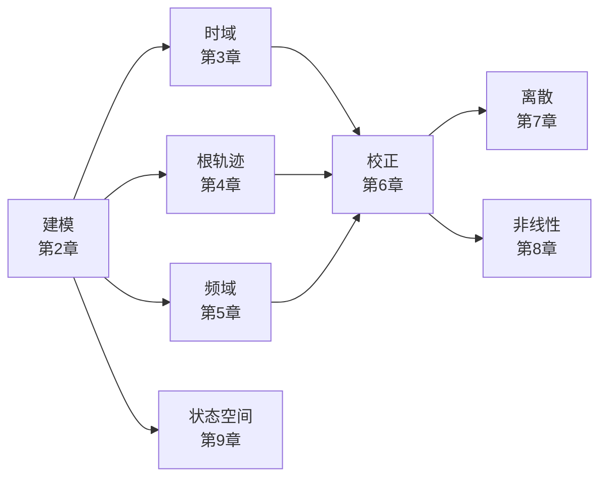

> 返回目录：[[README|知识库总览]]

# 自动控制原理公式笔记

> [!abstract] 本讲定位
> 胡寿松《自动控制原理（第八版）》第 1–9 章复习入口：先用下方问题索引定位，再进入专题读条件、推导与例题。
> **章次对应教材，小节按复习主题重组**；教材节号与书内页码见 [[附录 教材对照与复习索引]]。第 10 章最优控制不在当前笔记范围内。
> **关联笔记**：[[数学]]；状态空间详细内容统一链接至 [[控制理论/现代控制理论/现代控制理论|现代控制理论]]。

## 🔍 按问题索引

| 要解决的问题 | 直接入口 |
|:--|:--|
| 查公式、先确认适用条件 | [[附录 时域分析速查]] · [[附录 频域分析速查]] |
| 按教材节号或页码找笔记 | [[附录 教材对照与复习索引]] |
| 从电路、机械或电机建立模型 | [[02-2 元部件、电路与机械建模\|元部件建模]] · [[02-6 典型系统模型·常用元部件与过程控制\|系统模型]] |
| 一阶、二阶响应与性能反求 | [[03-1 一阶系统与动态性能指标\|一阶]] · [[03-2 二阶系统的动态指标与极点位置\|二阶指标]] · [[03-3 二阶系统的响应与性能改善\|响应与反求]] |
| 判稳定、求参数范围 | [[03-4 高阶系统、稳定性与校正\|劳斯]] · [[05-2 奈氏判据与稳定裕度\|奈氏与裕度]] · [[07-2-b 稳定性分析与综合例\|离散稳定性]] |
| 分清跟踪误差、扰动误差与前馈 | [[03-5 稳态误差]] · [[03-8 扰动误差与前馈补偿]] |
| 找分离点、重根、虚轴交点、最小阻尼 | [[附录 根轨迹特殊点速查]] |
| 由频率曲线反求传递函数 | [[05-3-b 综合题型与例题\|频域综合题]] |
| 选超前、滞后、PID或复合校正 | [[06 第6章 线性系统的校正方法\|校正方法总览]] |
| 求z反变换、设计最少拍系统 | [[07-1-b z变换计算与反变换例题\|z变换例题]] · [[07-3-d 最少拍设计原理与例题\|最少拍设计]] |
| 判别极限环、自振与局部稳定性 | [[08 第8章 非线性控制系统分析\|非线性分析]] |
| 状态空间、能控能观、反馈与观测器 | [[09 第9章 线性系统的状态空间分析与综合\|第9章导航]] |

## 📚 按章节索引

> [!note]- 📂 第 0–1 章 基础与绪论
> -  [[控制理论/自动控制原理/00 拉普拉斯变换（数学基础）|拉普拉斯变换（数学基础）]] — 变换对、性质定理、部分分式反变换、解微分方程
> -  [[控制理论/自动控制原理/01 第1章 自动控制的一般概念|第1章 自动控制的一般概念]] — 反馈原理、基本要求(稳准快)、系统分类

> [!note]- 📂 第 2 章 控制系统的数学模型
> -  [[控制理论/自动控制原理/02 第2章 控制系统的数学模型|第2章 控制系统的数学模型]] — 传递函数、典型环节、结构图化简、梅森公式
> -  [[控制理论/自动控制原理/02-1 传递函数与系统的线性化|2.2、2.5 传递函数与线性化（专题）]] — 传函性质、标准形式、零极点、小偏差线性化
> -  [[控制理论/自动控制原理/02-2 元部件、电路与机械建模|2.1、2.6–2.7 微分方程与典型模型（专题）]] — 电动机三方程、机械系统、电路建模(KVL/KCL/复阻抗/运放)、负载效应
> -  [[控制理论/自动控制原理/02-3 典型环节与结构图等效变换|2.3 典型环节与结构图（专题）]] — 七类环节、结构图等效变换
> -  [[控制理论/自动控制原理/02-4 梅森公式·信号流图与闭环传递函数|2.4 信号流图与梅森（专题）]] — 梅森公式、信号流图、闭环传函与叠加原理
> -  [[02-6 典型系统模型·常用元部件与过程控制|2.7 典型系统模型]] — 电机、液位与热过程
> -  [[控制理论/自动控制原理/02-5 第2章解题套路|2.8 第2章解题套路（专题）]] — 四类题型、MATLAB 表示传函

> [!note]- 📂 第 3 章 线性系统的时域分析法
> -  [[控制理论/自动控制原理/03 第3章 线性系统的时域分析法|第3章 线性系统的时域分析法]] — 一/二阶系统指标、劳斯判据、稳态误差
> -  [[控制理论/自动控制原理/03-1 一阶系统与动态性能指标|3.1–3.2 时域引论与一阶系统（专题）]] — 动态性能指标、一阶系统
> -  [[控制理论/自动控制原理/03-2 二阶系统的动态指标与极点位置|3.3 上半 二阶系统动态指标]] — 标准式、动态指标、极点位置规律
> -  [[控制理论/自动控制原理/03-3 二阶系统的响应与性能改善|3.3 下半 二阶响应与改善]] — 反求参数、临界/过阻尼、性能改善
> -  [[控制理论/自动控制原理/03-4 高阶系统、稳定性与校正|3.4–3.5 高阶系统与稳定性（专题）]] — 主导极点、劳斯判据
> -  [[03-7 相对稳定性与例题|3.5 相对稳定性与例题]] — 根的分布范围、劳斯例题
> -  [[03-5 稳态误差|3.6 稳态误差]] — 误差定义、静态与动态误差系数
> -  [[03-8 扰动误差与前馈补偿|扰动、前馈与动态误差例题]] — 分清注入点、反馈系数、正弦稳态误差
> -  [[控制理论/自动控制原理/03-6 解题套路与典型题型|3.8–3.10 解题套路（专题）]] — 题型速查、教材例题详解

> [!note]- 📂 第 4 章 线性系统的根轨迹法
> -  [[控制理论/自动控制原理/04 第4章 线性系统的根轨迹法|第4章 线性系统的根轨迹法]] — 绘制法则、常见形状、零度/参数根轨迹、性能估算
> -  [[附录 根轨迹特殊点速查]] — 分离/会合点、开环重极点、虚轴交点、临界阻尼与临界稳定

> [!note]- 📂 第 5 章 线性系统的频域分析法
> -  [[控制理论/自动控制原理/05 第5章 线性系统的频域分析法|第5章 线性系统的频域分析法]] — 频率特性、伯德/奈氏绘制与几何技巧、奈氏判据、稳定裕度
> -  [[控制理论/自动控制原理/05-1 频率特性与典型环节伯德图|5.1–5.3 频率特性与开环特性（专题）]] — 频率特性、典型环节 伯德/奈氏
> -  [[控制理论/自动控制原理/05-2 奈氏判据与稳定裕度|5.4 频域判据与裕度（专题）]] — 奈氏判据、补弧穿越计数、稳定裕度
> -  [[控制理论/自动控制原理/05-3 闭环频域指标·解题套路与综合题型|5.5–5.9 频域指标与解题套路（专题）]] — 三频段、闭环特性、MATLAB、解题套路
> -  [[控制理论/自动控制原理/05-3-b 综合题型与例题|5.10 综合题型与例题]] — 反求系统、校正设计

> [!note]- 📂 第 6 章 线性系统的校正方法
> -  [[控制理论/自动控制原理/06 第6章 线性系统的校正方法|第6章 线性系统的校正方法]] — 超前/滞后/滞后-超前(A—B—C—D 图解)、PID、复合校正
> -  [[控制理论/自动控制原理/06-1 串联校正（超前·滞后·滞后-超前）|6.1、6.3 校正概念与装置（专题）]] — 超前/滞后校正原理与设计方法
> -  [[控制理论/自动控制原理/06-1-b 串联校正例题|6.4 串联校正例题]] — 超前/滞后设计例题详解
> -  [[06-2 PID与反馈前馈校正|6.2、6.5 PID 与反馈校正]] — PID 整定、并联反馈
> -  [[06-3 滞后-超前校正|6.3 滞后-超前]] — 参数选择与设计
> -  [[06-4 前馈复合校正与设计总流程|6.6 前馈复合校正]] · [[06-4-b 设计总流程与例题|6.7 设计总流程与例题]]

> [!note]- 📂 第 7 章 线性离散系统的分析与校正
> -  [[控制理论/自动控制原理/07 第7章 线性离散系统的分析与校正|第7章 线性离散系统的分析与校正]] — 采样与 z 变换、差分方程、脉冲传函、朱利判据、最少拍(含无纹波)
> -  [[控制理论/自动控制原理/07-1 采样与z变换|7.1–7.3 采样与 z 变换（专题）]] — 采样保持、z 变换定义与性质
> -  [[控制理论/自动控制原理/07-1-b z变换计算与反变换例题|7.3 z变换计算与反变换例题]] — 部分分式/幂级数/留数法
> -  [[控制理论/自动控制原理/07-1-c 采样与z变换综合例题|7.1–7.3 综合例题]] — 由F(s)求F(z)等
> -  [[控制理论/自动控制原理/07-2 差分方程与系统稳定性|7.4 差分方程与数学模型（专题）]] — 差分方程、脉冲传函、离散时域
> -  [[控制理论/自动控制原理/07-2-b 稳定性分析与综合例|7.5 稳定性分析与综合例]] — s→z映射、w变换、朱利判据
> -  [[控制理论/自动控制原理/07-3 稳态误差与数字控制|7.6 稳态误差（专题）]] — 误差传递函数、静态误差系数
> -  [[07-3-c 数字PID与控制器离散化|7.7 数字PID与离散化]]
> -  [[07-3-d 最少拍设计原理与例题|7.8–7.9 最少拍设计与解题套路]] — 有纹波/无纹波的区别与设计检验

> [!note]- 📂 第 8 章 非线性控制系统分析
> -  [[08 第8章 非线性控制系统分析|第8章 非线性控制系统分析]] — 典型非线性、相平面、描述函数与设计
> -  [[08-1 非线性系统基本概念与相平面法|非线性与相平面]] · [[08-2 描述函数法与解题套路|描述函数与自振例题]]
> -  [[08-3 逆系统方法与非线性控制设计|逆系统与非线性设计]] — 可逆域、内动态、外环与工程约束

> [!note]- 📂 第 9 章 状态空间（含现代控制理论）
> -  [[控制理论/自动控制原理/09 第9章 线性系统的状态空间分析与综合|第9章 线性系统的状态空间分析与综合]] — 状态空间建模与变换、能控能观与分解、极点配置、观测器(全维/降维)、李雅普诺夫
> -  [[09-1 矩阵闭环与解耦方法补充|矩阵闭环与解耦]] · [[09-2 离散可达性与采样保持性补充|离散可达与采样保持性]]
> -  [[控制理论/现代控制理论/现代控制理论|现代控制理论（总览）]] — 状态空间法分章导航
> -  [[控制理论/现代控制理论/00 绪论|现代控制理论 00 绪论]] — 状态空间引论
> -  [[控制理论/现代控制理论/01 状态空间表达式|现代控制理论 01 状态空间表达式]] — 状态变量与表达式、从微分/传函建立、线性变换、求传递函数阵、离散/时变表达式
> -  [[控制理论/现代控制理论/02 状态空间表达式的解|现代控制理论 02 状态空间表达式的解]] — 状态转移矩阵、自由解/非齐次解、时变系统、离散化
> -  [[控制理论/现代控制理论/03 能控性和能观性|现代控制理论 03 能控性和能观性]] — 能控能观判据、对偶、标准型、结构分解、最小实现
> -  [[控制理论/现代控制理论/04 稳定性与李雅普诺夫方法|现代控制理论 04 稳定性与李雅普诺夫方法]] — 稳定性定义、第一/第二法、线性/非线性
> -  [[控制理论/现代控制理论/05 线性定常系统的综合|现代控制理论 05 线性定常系统的综合]] — 状态/输出反馈、极点配置、镇定、解耦、观测器、分离原理

> [!note]- 📂 附录与工具
> -  [[附录 教材对照与复习索引]] — 教材节号、书内页码、覆盖边界
> -  [[附录 时域分析速查]] · [[附录 频域分析速查]]
> -  [[附录 常用数学补充]] — 欧拉公式、分贝换算、相角计算
> -  [[控制理论/自动控制原理/附录 开环增益与闭环增益|附录 开环增益与闭环增益]] — 开环/闭环增益定义、换算与作用辨析
> -  [[附录 根轨迹特殊点速查]] — 特殊点对照图、重根与驻点求法、候选筛选和阻尼辨析
> -  [[控制理论/自动控制原理/11 MATLAB 基础速查|MATLAB 基础速查]] — 建模/连接/分章分析命令(教材附录 B)
> -  [[控制理论/自动控制原理/12 资料索引（OneDrive）|资料索引（OneDrive）]] — 教材 PDF、按章 PPT（控制88-01~40）、Word 补充文档位置一览

## 全书主线

