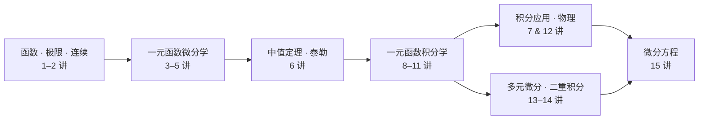

# 数学

> [!abstract] 考研数学二 · 公式 + 解题套路速查手册
> **范围**：高等数学（极限、微分、积分、多元微分、二重积分、微分方程）+ 线性代数；不考概率论、无穷级数、向量空间（多元积分学仅考二重积分）。
> **资料**：张宇《基础30讲》高数/线代分册（`C:\Users\23720\Downloads\27张宇基础30讲高数等2项文件`）。

> [!success] 科目规模
> | 科目 | 讲次 | 专题拆分 | 附录 | 速查入口 |
> |:--|:--:|:--:|:--:|:--|
> | 高等数学 | 15 讲 | 23 个 | 10 个 | [[高等数学公式速查]] |
> | 线性代数 | 8 讲 | — | — | [[线性代数公式速查]] |
> | 合计 | 23 讲 | 23 专题 | 10 附录 | 共 56 份笔记 |

## 🧭 全书主线（高数知识流）

## 📂 速查入口

-  [[高等数学公式速查]] —— 高数全程公式主干速查（按 6 大知识块折叠导航）
-  [[线性代数公式速查]] —— 线代公式速查（按 3 组折叠导航）
- 相关：[[00 拉普拉斯变换（数学基础）]] —— 自控课的数学基础（在自控笔记内）

## 🗂️ 分科导航

### 高等数学（数学二）

> [!note] ① 极限与连续（第 1–2 讲）
> - [[01 第1讲 函数极限与连续]] · [[01-1 函数概念与性质]] · [[01-2 极限与连续]] · [[01-3 极限的概念·性质与两大准则]] · [[01-4 无穷小与极限计算技巧]] · [[01-5 连续与间断·典型例题]]
> - [[02 第2讲 数列极限]] —— 海涅定理、$e$ 定义、三板斧（夹逼/单调有界/定积分）

> [!note] ② 一元函数微分学（第 3–7 讲）
> - [[03 第3讲 一元函数微分学的概念]] · [[04 第4讲 一元函数微分学的计算]] · [[05 第5讲 一元函数微分学的应用（一）几何应用]] · [[06 第6讲 一元函数微分学的应用（二）中值定理与泰勒公式]] · [[07 第7讲 一元函数微分学的应用（三）物理应用]]
> - 专题：[[06-1 中值定理与辅助函数构造]] · [[06-2 泰勒公式·不等式证明·题型例题]]

> [!note] ③ 一元函数积分学（第 8–12 讲）
> - [[08 第8讲 一元函数积分学的概念与性质]] · [[09 第9讲 一元函数积分学的计算]] · [[10 第10讲 一元函数积分学的应用（一）几何应用]] · [[11 第11讲 一元函数积分学的应用（二）积分等式与积分不等式]] · [[12 第12讲 一元函数积分学的应用（三）物理应用]]
> - 专题：[[08-1 不定积分的概念]] · [[08-2 定积分的精确定义与性质]] · [[08-3 数列极限化定积分（等分形式专题）]] · [[08-4 变限积分与反常积分]] · [[09-1 积分方法（凑微分·换元·分部·部分分式）]] · [[09-2 定积分的计算技巧]] · [[09-3 反常积分]] · [[09-4 分部积分表格法]] · [[11-1 积分等式]] · [[11-2 积分不等式]] · [[11-3 比较积分大小与常考题型]]

> [!note] ④ 多元函数微分（第 13 讲）
> - [[13 第13讲 多元函数微分学]] —— 可微判定、链式与隐函数、二元极值与拉格朗日乘数
> - 专题：[[13-1 二元函数极限·连续与概念关系]] · [[13-2 链式法则·隐函数·极值与最值]] · [[13-3 方向导数·梯度与典型例题]]

> [!note] ⑤ 二重积分（第 14 讲）
> - [[14 第14讲 二重积分]] —— 换序、极坐标、普通与轮换对称性
> - 速查：[[附录 二重积分速查]]

> [!note] ⑥ 微分方程（第 15 讲）
> - [[15 第15讲 微分方程]] —— 一阶四类、可降阶、二阶常系数、欧拉方程、解的结构定理
> - 专题：[[15-1 一阶方程与降阶（含偏微分方程）]] · [[15-2 线性微分方程解的结构与二阶常系数解法]] · [[15-3 常考题型与典型例题]]

> [!note] ⑦ 附录与补充（10 个）
> - [[附录 变形技巧]] · [[附录 常用积分表]] · [[附录 三角与代数补充]] · [[附录 常用曲线]] · [[附录 图像变换]] · [[附录 双曲函数]] · [[附录 幂指对函数图像与计算]] · [[附录 常用空间图形]] · [[附录 傅里叶级数]]

### 线性代数（数学二）

> [!note] ⑧ 行列式与矩阵（第 0–2 讲）
> - [[00 线代第0讲 线性代数入门]] · [[01 线代第1讲 行列式]] · [[02 线代第2讲 矩阵（矩阵与秩）]]

> [!note] ⑨ 向量组与方程组（第 3–4 讲）
> - [[03 线代第3讲 向量组]] · [[04 线代第4讲 线性方程组]]

> [!note] ⑩ 特征值与二次型（第 5–7 讲）
> - [[05 线代第5讲 特征值与特征向量]] · [[06 线代第6讲 二次型]] · [[07 线代第3讲 向量组·内积与正交]]（仅数一含向量空间）