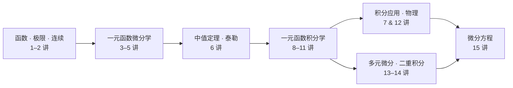

# 数学

> [!abstract] 考研数学二 · 公式 + 真题 + 解题套路速查手册
> **范围**：高等数学（极限、微分、积分、多元微分、二重积分、微分方程）+ 线性代数；另含 2000—2026 年数二真题与解析、应试策略页与错题本。不考概率论、无穷级数、向量空间（多元积分学仅考二重积分）。
> **资料**：根目录 [[27张宇基础30讲高数.pdf|高数教材]] 与 [[27张宇基础30讲线代.pdf|线代教材]]；线代页码见 [[附录 线代教材对照与复习索引]]。

> [!note] 科目入口
> | 科目 | 覆盖范围 | 入口 |
> |:--|:--|:--|
> | 高等数学 | 第1–15讲，按主题拆分并配套 14 类附录 | [[高等数学公式速查]] |
> | 线性代数 | 第0–6讲，专题、例题与 8 类速查附录 | [[线性代数公式速查]] |
> | 数二真题 | 2000—2026 年 27 套卷，607 题归 12 专题 · 39 类题型 | [[考研数学二目录]] |
> | 应试策略 | 近年题型分值统计、证明题技巧与逐题保底 | [[数二题型分析（2021—2026）]] · [[数二证明题技巧清单]] |
> | 错题本 | 一题一篇按年份收录，看板自动筛待复习 | [[00 错题本总览]] · [[01 错题本使用规范]] |
>
> 本页只到「讲次 / 二级专题」；更深一层的拆分件（`NN-x-y`、`NN-x-a` 等）在各讲入口页内导航。线代按知识点或书内、PDF 页码定位可用 [[附录 线代教材对照与复习索引]]。

## 🧭 全书主线（高数知识流）

```mermaid
flowchart LR
 A["函数 · 极限 · 连续<br/>1–2 讲"] --> B["一元函数微分学<br/>3–5 讲"]

 B --> C["中值定理 · 泰勒<br/>6 讲"]

 C --> D["一元函数积分学<br/>8–11 讲"]

 D --> E["积分应用 · 物理<br/>7 & 12 讲"]

 D --> F["多元微分 · 二重积分<br/>13–14 讲"]

 E & F --> G["微分方程<br/>15 讲"]
```

## 速查入口

- [[高等数学公式速查]] —— 高数全程公式主干速查（按 6 大知识块折叠导航）
- [[线性代数公式速查]] —— 按问题、讲次与教材页码检索
- [[考研数学二目录]] —— 真题按年份与题型双向检索（含逐年题量核对）
- [[数二题型分析（2021—2026）]] —— 新大纲以来 132 题的板块分值统计与押题优先级
- [[数二证明题技巧清单]] · [[数二证明题保底（2016—2026）]] —— 证明题该掌握的动作与近十年真题对照
- 相关：[[00 拉普拉斯变换（数学基础）]] —— 自控课的数学基础（在自控笔记内）

## 分科导航

### 高等数学（数学二）

> [!note] ① 极限与连续（第 1–2 讲）
> - [[01 第1讲 函数极限与连续]] —— 函数性质、极限定义与两大准则、等价替换、未定式、连续与间断
> - [[02 第2讲 数列极限]] —— 海涅定理、$e$ 定义、三板斧（夹逼/单调有界/定积分）
> - 专题：[[01-1 函数概念与性质]] · [[01-2 极限与连续]] · [[01-3 极限的概念·性质与两大准则]] · [[01-4 无穷小与极限计算技巧]] · [[01-5 连续与间断·典型例题]] · [[02-1 数列极限典型例题]] · [[02-2 数列极限的性质·海涅定理与 e 的定义]] · [[02-3 数列极限三板斧与收敛判定]]

> [!note] ② 一元函数微分学（第 3–7 讲）
> - [[03 第3讲 一元函数微分学的概念]] · [[04 第4讲 一元函数微分学的计算]] · [[05 第5讲 一元函数微分学的应用（一）几何应用]] · [[06 第6讲 一元函数微分学的应用（二）中值定理与泰勒公式]] · [[07 第7讲 一元函数微分学的应用（三）物理应用]]
> - 专题：[[03-1 定义与可导性]] · [[03-2 导数定义的常考辨析]] · [[03-3 微分与可微·典型例题]] · [[04-1 基本导数表与求导法则]] · [[04-2 分段函数与含绝对值函数求导]] · [[04-3 常用高阶导数]] · [[04-4 切线与法线·典型例题]] · [[05-1 单调性·极值与最值]] · [[05-2 凹凸·拐点与重要结论]] · [[05-3 函数作图·渐近线与曲率]] · [[05-4 方程的根与零点问题]] · [[06-1 中值定理与辅助函数构造]] · [[06-2 泰勒公式·不等式证明·题型例题]] · [[06-3 题型例题（中值定理与不等式证明）]] · [[06-4 五种不等式证明方法与典型例题]] · [[07-1 导数的物理意义与相关变化率]] · [[07-2 物理应用典型例题]] · [[07-3 边际弹性与复利现值（数三选读）]]

> [!note] ③ 一元函数积分学（第 8–12 讲）
> - [[08 第8讲 一元函数积分学的概念与性质]] · [[09 第9讲 一元函数积分学的计算]] · [[10 第10讲 一元函数积分学的应用（一）几何应用]] · [[11 第11讲 一元函数积分学的应用（二）积分等式与积分不等式]] · [[12 第12讲 一元函数积分学的应用（三）物理应用]]
> - 专题：[[08-1 不定积分的概念]] · [[08-2 定积分的精确定义与性质]] · [[08-3 数列极限化定积分（等分形式专题）]] · [[08-4 变限积分与反常积分]] · [[09-1 积分方法（凑微分·换元·分部·部分分式）]] · [[09-2 定积分的计算技巧]] · [[09-3 反常积分]] · [[09-4 分部积分表格法]] · [[09-5 有理函数的部分分式]] · [[09-6 定积分计算核心例题]] · [[09-7 定积分计算进阶例题]] · [[10-1 几何应用公式]] · [[10-2 函数平均值与形心]] · [[10-3 典型例题]] · [[11-1 积分等式]] · [[11-2 积分不等式]] · [[11-3 比较积分大小与常考题型]] · [[12-1 微元法（统一方法）]] · [[12-2 物理应用：引力、平均值、古鲁金定理与经济应用]] · [[12-3 常考题型与典型例题]]

> [!note] ④ 多元函数微分（第 13 讲）
> - [[13 第13讲 多元函数微分学]] —— 可微判定、链式与隐函数、二元极值与拉格朗日乘数
> - 专题：[[13-1 二元函数极限·连续与概念关系]] · [[13-2 链式法则与隐函数]] · [[13-3 二元极值·条件极值与最值]] · [[13-4 闭区域上的最值]] · [[13-5 方向导数、梯度与典型例题]]

> [!note] ⑤ 二重积分（第 14 讲）
> - [[14 第14讲 二重积分]] —— 换序、极坐标、普通与轮换对称性
> - 专题：[[14-1 概念性质与对称性]] · [[14-2 直角坐标与极坐标]] · [[14-3 换元法与古鲁金第二定理]] · [[14-4 综合与证明]] · [[14-5 古鲁金第二定理]]
> - 速查：[[附录 二重积分速查]]

> [!note] ⑥ 微分方程（第 15 讲）
> - [[15 第15讲 微分方程]] —— 一阶四类、可降阶、二阶常系数、欧拉方程、解的结构定理
> - 专题：[[15-1 一阶方程与降阶（含偏微分方程）]] · [[15-2 线性微分方程解的结构与二阶常系数解法]] · [[15-3 常考题型与典型例题]] · [[15-4 一阶常系数线性差分方程]] · [[15-5 一阶线性偏微分方程与典型例题]]

> [!note] ⑦ 附录与补充（14 类）
> - [[附录 基础数学知识]] · [[附录 变形技巧]] · [[附录 常用积分表]] · [[附录 递推公式与反常积分]] · [[附录 定积分速查]] · [[附录 二重积分速查]] · [[附录 三角与代数补充]] · [[附录 常用曲线]] · [[附录 图像变换]] · [[附录 双曲函数]] · [[附录 幂指对函数图像与计算]] · [[附录 常用空间图形]] · [[附录 傅里叶级数]] · [[附录 高数教材对照与复习索引]]

### 线性代数（数学二）

> [!note] ⑧ 行列式与矩阵（第 0–2 讲）
> - [[00 线代第0讲 线性代数入门]] · [[01 线代第1讲 行列式]] · [[02 线代第2讲 矩阵（矩阵与秩）]]
> - 专题：[[01-1 定义与基本性质]] · [[01-2 常用行列式与计算技巧]] · [[01-3 克拉默法则与重要应用]] · [[01-4 常用行列式与消爪]] · [[01-5 递推与抽象行列式计算]] · [[02-1 矩阵运算与方阵的幂]] · [[02-2 伴随矩阵]] · [[02-3 矩阵的秩与典型例题]] · [[02-4 初等变换与分块矩阵]]

> [!note] ⑨ 向量组与方程组（第 3–4 讲）
> - [[03 线代第3讲 向量组]] · [[04 线代第4讲 线性方程组]]
> - 专题：[[03-1 向量组的线性相关性]] · [[03-2 向量的内积与正交]] · [[04-1 解的判定与解的结构]] · [[04-2 典型例题]] · [[04-3 高频结论与证明]] · [[04-4 行列变换、线性相关性与解的关系]]

> [!note] ⑩ 特征值与二次型（第 5–6 讲）
> - [[05 线代第5讲 特征值与特征向量]] · [[06 线代第6讲 二次型]]
> - 专题：[[05-1 特征值与相似对角化]] · [[05-2 实对称矩阵与正交对角化]] · [[05-7 教材注释与拓展对照]] · [[06-1 定义、矩阵表示与秩]] · [[06-2 合同与相似]] · [[06-3 配方法]] · [[06-4 标准形、规范形与惯性定理]] · [[06-5 正交变换化标准形]] · [[06-6 正定判定]] · [[06-7 负定、半定与综合题型]] · [[06-8 参数边界与正定]] · [[06-9 正交变换与反求矩阵]]

> [!note] ⑪ 线代附录（8 类）
> - [[附录 矩阵运算公式速查]] · [[附录 特殊矩阵速查]] · [[附录 矩阵四大等价关系]] · [[附录 线性方程组解的结构速查]] · [[附录 特征值与特征向量速查]] · [[附录 相似变换的传递与不变量]] · [[附录 二次型与正定判定速查]] · [[附录 线代教材对照与复习索引]]

### 数二真题 · 应试策略 · 错题本

> [!note] ⑫ 真题与解析（2000—2026）
> - [[考研数学二目录]] —— 27 套真题与独立答案解析；607 题按 12 专题、39 类题型归档，附逐年题量核对
> - 题号口径：用习题册连续编号（如 2000.6），2000—2003 年另列原卷位置；错题篇回链到当年解析

> [!note] ⑬ 应试策略（统计与清单）
> - [[数二题型分析（2021—2026）]] —— 新大纲六年 132 题的板块分值统计、四年不变规律与押题优先级
> - [[数二证明题技巧清单]] —— 按「结论长相」选招的通用动作与八条核心技巧
> - [[数二证明题保底（2016—2026）]] —— 近十年十道证明题的逐题保底与结论反查

> [!note] ⑭ 错题本（复盘）
> - [[00 错题本总览]] —— 看板与手写索引，按错因、掌握度与复习日期筛题
> - [[01 错题本使用规范]] —— 建篇、字段、复习标注与交给 AI 的口径
> - 已收错题（截至 2026-09-29 共 30 篇）：2000 年 14 · 2001 年 6 · 2002 年 9 · 2003 年 1，按年份放 `错题本\YYYY\` 子目录；实时题量以 [[00 错题本总览]] 的看板为准
