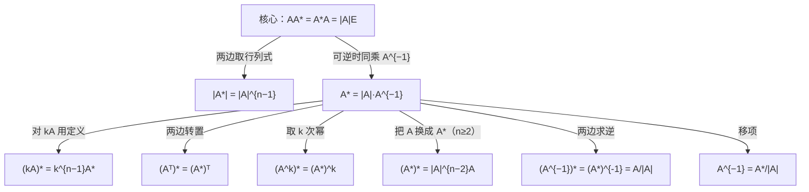

> 返回目录：[[线性代数公式速查]]

# 线代第2讲 矩阵（矩阵与秩）

> [!abstract] 📋 本讲定位
> 本讲对应张宇《基础30讲》线代分册第2讲（矩阵）。

> [!warning] ⚠️ 矩阵运算三大易错
> - **无交换律**：一般 $AB\ne BA$；$(A+B)^{2}=A^{2}+AB+BA+B^{2}$，不能写成 $A^2+2AB+B^2$（除非可交换）。
> - **无消去律**：$AB=O\ \nRightarrow A=O$ 或 $B=O$；$AB=AC\ \nRightarrow B=C$（$A$ 可逆时才行）。
> - **穿脱原则**（顺序反转）：$(AB)^{T}=B^{T}A^{T}$，$(AB)^{-1}=B^{-1}A^{-1}$，$(AB)^{*}=B^{*}A^{*}$。
> - **$(AB)^{k}\ne A^{k}B^{k}$**（一般情况），$(A+B)^{k}$ 也不能套初等代数二项式——除非两矩阵**可交换**（如 $A$ 与 $E$、$A$ 与 $kE$、$A$ 与 $A^{-1}$、数量矩阵与任意同阶矩阵）。
> - **矩阵多项式** $f(x)=a_0+a_1x+\cdots+a_mx^m$ ⟹ $f(A)=a_0E+a_1A+\cdots+a_mA^m$；因 $AE=EA=A$，$E$ 与 $A$ 可交换，故 $f(A)$ 可像多项式一样因式分解/求值（这是 $A^n$ 套路三的理论基础）。

## 📝 几种重要矩阵

| 类型 | 定义 / 条件 | 关键性质 |
|:--|:--|:--|
| 零矩阵 $O$ | 所有元素为 0 | $A+O=A$，$OA=O$ |
| 单位矩阵 $E$（$I$） | 主对角为 1 其余为 0 | $EA=AE=A$，与任何同阶方阵可交换 |
| 数量矩阵 $kE$ | $k\cdot E$ | 与任何同阶方阵**可交换**：$(kE)A=A(kE)=kA$ |
| 对角矩阵 $\operatorname{diag}(a_1,\dots,a_n)$ | 非主对角元全 0 | 乘法对应元相乘；可交换 ⟺ 仍为对角 |
| 上（下）三角 | $i>(<)\,j\Rightarrow a_{ij}=0$ | 乘、逆、和仍为同型三角；$|A|=$ 主对角元之积 |
| 对称矩阵 | $A^{T}=A$ ⟺ $a_{ij}=a_{ji}$ | $A^TA$、$AA^T$ **必为对称**（无论 $A$ 是否方阵） |
| 反对称矩阵 | $A^{T}=-A$ ⟺ $a_{ij}=-a_{ji}$，主对角全 0 | 奇阶反对称 ⟹ $|A|=0$ |

> [!note] 📌 **$n$ 阶方阵 $A$ 可逆的等价条件（高频选填，全家桶）**
> $A$ 可逆 ⟺ $\lvert A\rvert\ne0$ ⟺ $r(A)=n$（满秩）⟺ $A$ 的 $n$ 个行（列）向量线性无关 ⟺ 齐次组 $Ax=0$ 只有零解 ⟺ 非齐次组 $Ax=b$ 有唯一解 ⟺ $A$ 的特征值全不为 $0$ ⟺ $A$ 与单位阵 $E$ 等价 ⟺ $A$ 可表为初等矩阵之积。

> [!tip] 💡 张宇视角（Gram 矩阵 / 余弦相似度）
> 对矩阵 $A$（按列分块 $A=[\alpha_1,\dots,\alpha_n]$），$A^TA$ 的 $(i,j)$ 元 $=\alpha_i^T\alpha_j=\|\alpha_i\|\|\alpha_j\|\cos\theta_{ij}$。即 $A^TA$ 集中了各列向量的**模长**与**两两夹角余弦**（相似度）；$AA^T$ 同理对行。这正是不绘图也能研究高维数据相关性的工具，是后续 [[05 线代第5讲 特征值与特征向量]] 主成分分析的雏形。

---

## 📝 方阵的幂 $A^{n}$（三种套路）

> [!note] 📌 张宇第2讲 ★★★ 必背方法（例 2.1–2.3）
> 求 $A^n$ 的三大套路，**按题选一**：

| 套路 | 适用场景 | 操作 |
|:--|:--|:--|
| **① 秩 1 法** | $r(A)=1$（行/列向量成比例，可满秩分解 $A=\alpha\beta^T$） | $A^n=(\beta^T\alpha)^{n-1}A=(\operatorname{tr}A)^{n-1}A$（$\beta^T\alpha$ 是**数**可提出） |
| **② 试算归纳** | 低阶、$A^2,A^3$ 有规律（如旋转矩阵 $A^4=E$ 等周期现象） | 算 $A^2,A^3,\dots$ 找周期 / 递推 → 归纳得 $A^n$ |
| **③ 二项展开** | $A$ 可拆 $A=B+C$ 且 $BC=CB$（常取 $A=kE+B$） | $A^n=(kE+B)^n=\sum\limits_{m=0}^{n}\binom{n}{m}k^{n-m}B^{m}$；若 $B$ 为严格上三角幂零（$B^s=O$）则取前 $s$ 项 |

> [!example] ✏️ 套路①（$r(A)=1$）
> $A=\alpha\beta^T$，$\alpha,\beta\in\mathbb{R}^3$ ⟹ $A^n=(\beta^T\alpha)^{n-1}\alpha\beta^T=(\operatorname{tr}A)^{n-1}A$。关键：$\beta^T\alpha$ 是一阶矩阵（数），利用**结合律**把它提到前面。

> [!example] ✏️ 套路③（$A=E+B$，$B$ 严格上三角 $B^3=O$）
> $A^n=(E+B)^n=E+nB+\dfrac{n(n-1)}{2}B^2$（$B^3$ 及以后全 0）。单位矩阵与任何同阶方阵可交换 ⟹ 二项式可正常展开。

---

| 公式                                          | 公式                                              |
| :-------------------------------------------- | :------------------------------------------------ |
| $\boxed{A^{-1}=\dfrac{A^{*}}{\lvert A\rvert}}$        | $\boxed{\lvert A^{-1}\rvert=\dfrac{1}{\lvert A\rvert}}$   |
| $(kA)^{-1}=\dfrac{1}{k}A^{-1}\ (k\ne0)$       | $(A^{T})^{-1}=(A^{-1})^{T}$                       |
| $(A^{k})^{-1}=(A^{-1})^{k}$                   | $A$ 可逆 $\iff \lvert A\rvert\ne0 \iff r(A)=n$    |

求逆三法：

1. **二阶口诀**：$\begin{pmatrix}a&b\\c&d\end{pmatrix}^{-1}=\dfrac{1}{ad-bc}\begin{pmatrix}d&-b\\-c&a\end{pmatrix}$（主对角互换、副对角变号）；
2. **初等行变换**：$(A\mid E)\xrightarrow{\text{行}}(E\mid A^{-1})$；
3. **定义凑**：由矩阵方程凑 $A\cdot(\ \cdot\ )=E$，如 $A^{2}-A-2E=O\Rightarrow A^{-1}=\dfrac{A-E}{2}$。

### 🔧 矩阵方程的三种标准形式（张宇第2讲重点）

先把方程恒等变形化为标准形，再按**左乘右乘**规则解（矩阵乘法无交换律，乘的方向决定 $X$ 在哪边）：

| 标准形 | 解法 | 结果 |
|:--|:--|:--|
| $AX=B$（$A$ 可逆） | 两边**左乘** $A^{-1}$ | $X=A^{-1}B$ |
| $XA=B$（$A$ 可逆） | 两边**右乘** $A^{-1}$ | $X=BA^{-1}$ |
| $AXB=C$（$A,B$ 可逆） | 左乘 $A^{-1}$、右乘 $B^{-1}$ | $X=A^{-1}CB^{-1}$ |

> [!warning] ⚠️ 易错
> $AX=B$ 和 $XA=B$ 的解**不同**（$A^{-1}B\ne BA^{-1}$），务必分清 $X$ 在左还是在右。化简技巧：**提公因子、和差化积**——如 $AB=A+B\Rightarrow (A-E)(B-E)=E$；$A^2+AB+BA+B^2$ 不能随便合并为 $(A+B)^2$（除非可交换）。

---

## 📝 伴随矩阵 $A^{*}$

**定义易错**：$A^{*}$ 的 $(i,j)$ 元是 $A_{ji}$（代数余子式要**转置**排放）。

| 公式                                                | 公式                                       |
| :-------------------------------------------------- | :----------------------------------------- |
| $\boxed{AA^{*}=A^{*}A=\lvert A\rvert E}$（核心，一切由此推）| $\lvert A^{*}\rvert=\lvert A\rvert^{n-1}$  |
| $A^{*}=\lvert A\rvert A^{-1}$（$A$ 可逆时）         | $(A^{*})^{*}=\lvert A\rvert^{n-2}A\ (n\ge2)$ |
| $(A^{-1})^{*}=(A^{*})^{-1}=\dfrac{A}{\lvert A\rvert}$（$A$ 可逆）| $(A^{k})^{*}=(A^{*})^{k}$ |
| $(kA)^{*}=k^{n-1}A^{*}$                             | $(A^{T})^{*}=(A^{*})^{T}$                  |
| $\lvert(A^{*})^{*}\rvert=\lvert A\rvert^{(n-1)^{2}}$；当 $n=2$ 时 $(A^{*})^{*}=A$ | $A^{-1}=\dfrac{A^{*}}{\lvert A\rvert}$（求逆用）|

$$
\boxed{r(A^{*})=\begin{cases}n, & r(A)=n\\ 1, & r(A)=n-1\\ 0, & r(A)\le n-2\end{cases}}
$$

> **关系网：一切由核心式推（可逆时）**：

---

## 💡 初等变换与初等矩阵

- **左乘行变换、右乘列变换**。
- 三类初等矩阵的逆仍是同类：$E_{ij}^{-1}=E_{ij}$，$E_{i}(k)^{-1}=E_{i}\!\left(\dfrac1k\right)$，$E_{ij}(k)^{-1}=E_{ij}(-k)$。
- $A$ 可逆 $\iff$ $A$ 是有限个初等矩阵的乘积；任意 $A$ 有等价标准形 $PAQ=\begin{pmatrix}E_r&O\\O&O\end{pmatrix}$。

> [!warning] ⚠️ 初等变换用途三区别（高频易错）
> - **求秩**：行、列变换**可混用**（不改变秩）；
> - **求逆**：$(A\mid E)\to(E\mid A^{-1})$ **只用行变换**（或只用列变换，不能混用）；
> - **解方程组**：增广矩阵**只能用行变换**（列变换会打乱变量对应）。
> 不要与行列式的性质混淆：行列式允许列变换（配合变号），矩阵初等变换是另一套规则。

**等价标准形的应用（求可逆 $P$ 使 $PA=B$）**：
1. 作 $\begin{pmatrix}A&O\\B&E\end{pmatrix}$ 或直接对 $[A\mid E]$ 用行变换，把 $A$ 化成 $B$（即记录行变换的乘积 $P$）；
2. 实操：对 $[A\mid E]\xrightarrow{\text{行}}$ 化 $[B\mid P]$，则 $PA=B$，$P$ 即所求；
3. 若要求全部可逆 $P$：解 $PA=B$ 等价于 $P^TA^T=B^T$，把 $P^T$ 按列分块 $\bigl[\xi_1,\dots,\xi_n\bigr]$，逐列解 $A^T\xi_j=b_j$（$b_j$ 为 $B^T$ 第 $j$ 列），基础解系通解中 $\xi$ 非零即可保证 $P$ 可逆。

---

## 📝 分块矩阵

$$
\begin{pmatrix}A&O\\O&B\end{pmatrix}^{-1}=\begin{pmatrix}A^{-1}&O\\O&B^{-1}\end{pmatrix},\qquad
\begin{pmatrix}O&A\\B&O\end{pmatrix}^{-1}=\begin{pmatrix}O&B^{-1}\\A^{-1}&O\end{pmatrix}
$$

$$
\begin{pmatrix}A&O\\C&B\end{pmatrix}^{-1}=\begin{pmatrix}A^{-1}&O\\-B^{-1}CA^{-1}&B^{-1}\end{pmatrix},\qquad
\begin{pmatrix}A&O\\O&B\end{pmatrix}^{n}=\begin{pmatrix}A^{n}&O\\O&B^{n}\end{pmatrix}
$$

---

## 📝 矩阵的秩

$r(A)$ = 最高阶非零子式的阶数 = 行阶梯形的非零行数；初等变换不改变秩。

| 不等式 / 等式                                         | 备注                              |
| :---------------------------------------------------- | :-------------------------------- |
| $0\le r(A_{m\times n})\le\min(m,n)$                   | $r=m$ 行满秩，$r=n$ 列满秩        |
| $r(A)=r(A^{T})=r(A^{T}A)=r(AA^{T})$                   | 实矩阵                            |
| $r(kA)=r(A)\ (k\ne0)$；$r(PAQ)=r(A)$（$P,Q$ 可逆）    | 可逆因子不改秩                    |
| $r(A+B)\le r(A)+r(B)$                                 |                                   |
| $r(AB)\le\min\bigl(r(A),\,r(B)\bigr)$                 |                                   |
| $r(AB)\ge r(A)+r(B)-n$                                | $n$ 为 $A$ 的列数（Sylvester）    |
| $AB=O\ \Rightarrow\ r(A)+r(B)\le n$                   | $B$ 的列都是 $Ax=0$ 的解          |
| $\max\bigl(r(A),r(B)\bigr)\le r(A\mid B)\le r(A)+r(B)$ | 拼块                             |

> [!warning] ⚠️ **$AB=O$ 必背结论**（张宇第2讲，选填高频）
> 设 $A_{m\times n},B_{n\times l}$ 且 $AB=O$：
> 1. **$B$ 的每一列都是 $Ax=0$ 的解**（最基本，由定义直接看出）；
> 2. $r(A)+r(B)\le n$（$n$ 为 $A$ 的列数 / $B$ 的行数）；
> 3. 若 $A$ 可逆（或列满秩 $r(A)=n$）⟹ $B=O$；若 $B$ 可逆 ⟹ $A=O$；
> 4. $A\ne O,B\ne O$ 时必有 $r(A)<n,\ r(B)<n$（即 $A$ 列不满秩、$B$ 行不满秩）——所以**两非零矩阵相乘为 $O$，两者都不可逆**（方阵时 $\lvert A\rvert=\lvert B\rvert=0$）；
> 5. 推论：$A^{2}=O$（$A\ne O$）⟹ $r(A)\le\dfrac{n}{2}$（幂零矩阵，配合 [[05 线代第5讲 特征值与特征向量]] 特征值全为 0）。

---

## ✏️ 典型例题

> [!example] ✏️ **例1：逆矩阵**
> 求 $A=\begin{pmatrix}1&2\\3&4\end{pmatrix}^{-1}$：二阶口诀 $=\dfrac{1}{4-6}\begin{pmatrix}4&-2\\-3&1\end{pmatrix}=-\dfrac12\begin{pmatrix}4&-2\\-3&1\end{pmatrix}=\begin{pmatrix}-2&1\\\frac32&-\frac12\end{pmatrix}$。

> [!example] ✏️ **例2：矩阵方程（分清左右乘）**
> 解 $AX=B$，$A=\begin{pmatrix}1&2\\3&4\end{pmatrix}$，$B=\begin{pmatrix}1&0\\0&1\end{pmatrix}=E$：$X=A^{-1}B=A^{-1}=\begin{pmatrix}-2&1\\\frac32&-\frac12\end{pmatrix}$。若改为 $XA=B$，则 $X=BA^{-1}$ 与上**不同**（乘法无交换律）。

> [!example] ✏️ **例3：定义凑逆**
> 设 $A$ 满足 $A^2-A-2E=O$，求 $A^{-1}$：$A^2-A=2E\Rightarrow A\cdot\dfrac{A-E}{2}=E$ ⟹ $A^{-1}=\dfrac{A-E}{2}$。

> [!example] ✏️ **例4：伴随矩阵**
> $A=\begin{pmatrix}1&2\\3&4\end{pmatrix}$：$A^{*}=\begin{pmatrix}4&-2\\-3&1\end{pmatrix}$（主对角互换、副对角变号），$\lvert A^{*}\rvert=\lvert A\rvert^{2-1}=-2$，验证 $AA^{*}=\lvert A\rvert E$。

> [!example] ✏️ **例5：秩不等式**
> 设 $A_{3\times4}$，$B_{4\times3}$，若 $AB$ 可逆，求 $r(A)$：$r(A)\le3$ 且 $r(A)\ge r(AB)=3$（因 $r(AB)\le r(A)$），故 $r(A)=3$（行满秩）。同理 $r(B)=3$（列满秩）。
