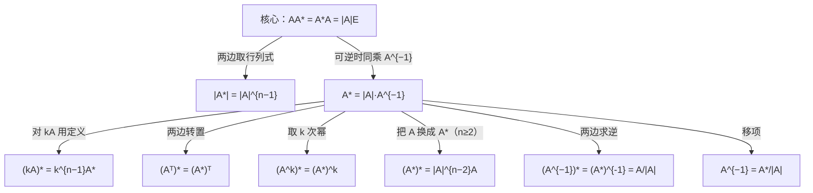

> 返回：[[02 线代第2讲 矩阵（矩阵与秩）]] | 返回目录：[[线性代数公式速查]]

# 第2讲（二） 伴随矩阵

## 伴随矩阵 $A^{*}$

**定义易错**：$A^{*}$ 的 $(i,j)$ 元是 $A_{ji}$（代数余子式要**转置**排放）。

> [!warning] **行列式三易错**（张宇第2讲，★★★选填高频）
> 1. $\lvert kA\rvert=k^{n}\lvert A\rvert$（$n\ge2,\,k\ne0,1$）——数乘**整个矩阵**，行列式乘 $k^{n}$；
> 2. 数乘行列式**某一行（列）**：$k\lvert A\rvert$——只乘某一行/列，行列式乘 $k$；
> 3. $\lvert A+B\rvert\ne\lvert A\rvert+\lvert B\rvert$——行列式对加法**不满足分配律**（但对乘法满足 $\lvert AB\rvert=\lvert A\rvert\lvert B\rvert$）。
>
> 推论：$A\ne O \nRightarrow \lvert A\rvert\ne0$（零矩阵行列式为 0；非零矩阵行列式也可能为 0，如秩不满）。

| 公式 | 公式 |
| :-------------------------------------------------- | :----------------------------------------- |
| $\boxed{AA^{*}=A^{*}A=\lvert A\rvert E}$（核心，一切由此推）| $\lvert A^{*}\rvert=\lvert A\rvert^{n-1}$ |
| $A^{*}=\lvert A\rvert A^{-1}$（$A$ 可逆时） | $(A^{*})^{*}=\lvert A\rvert^{n-2}A\ (n\ge2)$ |
| $(A^{-1})^{*}=(A^{*})^{-1}=\dfrac{A}{\lvert A\rvert}$（$A$ 可逆）| $(A^{k})^{*}=(A^{*})^{k}$ |
| $(kA)^{*}=k^{n-1}A^{*}$ | $(A^{T})^{*}=(A^{*})^{T}$ |
| $\lvert(A^{*})^{*}\rvert=\lvert A\rvert^{(n-1)^{2}}$；当 $n=2$ 时 $(A^{*})^{*}=A$ | $A^{-1}=\dfrac{A^{*}}{\lvert A\rvert}$（求逆用）|

$$
\boxed{r(A^{*})=\begin{cases}n, & r(A)=n\\[2pt] 1, & r(A)=n-1\\[2pt] 0, & r(A)\le n-2\end{cases}}
$$

> [!note] 三情形的推导（选填高频：已知 $r(A)=n-1$ 求 $r(A^{*})$）
> - $r(A)=n$：$A^{*}=\lvert A\rvert A^{-1}$ 可逆 ⟹ $r=n$；
> - $r(A)=n-1$：由 $AA^{*}=O$，$A^{*}$ 的列都是 $Ax=0$ 的解，而解空间维数 $n-r(A)=1$ ⟹ $r(A^{*})\le1$；又 $A$ 有 $n-1$ 阶非零子式 ⟹ $A^{*}\ne O$ ⟹ $r=1$；
> - $r(A)\le n-2$：所有 $n-1$ 阶子式全为 $0$ ⟹ $A^{*}=O$ ⟹ $r=0$。
> 记忆口诀：「**满秩满、降一秩一、降二变零**」。
>
> **关系网：一切由核心式推（可逆时）**：

> [!example] ✏️ 例题1. 二阶伴随矩阵验证 $AA^{*}=|A|E$（张宇例2.6）
> **题目**：已知 $A=\begin{pmatrix}a&b\\c&d\end{pmatrix}$，计算 $AA^{*}$。
> **解**：$A$ 的代数余子式为
> $$
> \begin{aligned}
> A_{11}&=d,\\[4pt]
> A_{12}&=-c,\\[4pt]
> A_{21}&=-b,\\[4pt]
> A_{22}&=a
> \end{aligned}
> $$
> 伴随矩阵（**转置**排列）
>
> $$
> A^{*}=\begin{pmatrix}A_{11}&A_{21}\\A_{12}&A_{22}\end{pmatrix}=\begin{pmatrix}d&-b\\-c&a\end{pmatrix}
> $$
> 计算乘积
> $$
> \begin{aligned}
> AA^{*}&=\begin{pmatrix}a&b\\c&d\end{pmatrix}\begin{pmatrix}d&-b\\-c&a\end{pmatrix}\\
> &=\begin{pmatrix}ad-bc&-ab+ab\\cd-cd&-bc+ad\end{pmatrix}\\
> &=\begin{pmatrix}ad-bc&0\\0&ad-bc\end{pmatrix}
> \end{aligned}
> $$
> 即
> $$
> \begin{aligned}
> AA^{*}&=(ad-bc)E\\
> &=|A|E\quad\checkmark
> \end{aligned}
> $$
> **要点**：本例验证了伴随矩阵的核心公式 $AA^{*}=|A|E$，对任意 $n$ 阶方阵均成立——即使 $A$ 不可逆（此时 $|A|=0$，$AA^{*}=O$）。

> [!example] ✏️ 例题2. 二阶矩阵求逆（$A^{-1}=\dfrac{A^{*}}{|A|}$）（张宇例2.7）
> **题目**：已知 $A=\begin{pmatrix}a&b\\c&d\end{pmatrix}$，写出 $A$ 可逆的一个充要条件，当 $A$ 可逆时，求 $A^{-1}$。
> **解**：$A$ 可逆的充要条件为 $|A|=ad-bc\ne0$。
> 当 $ad-bc\ne0$ 时，由例2.6知 $A^{*}=\begin{pmatrix}d&-b\\-c&a\end{pmatrix}$，利用公式 $A^{-1}=\dfrac{A^{*}}{|A|}$ 得
>
> $$
> A^{-1}=\frac{1}{ad-bc}\begin{pmatrix}d&-b\\-c&a\end{pmatrix}
> $$
> **要点**：2阶矩阵求伴随的口诀：**主对调，副变号**——主对角线 $a_{11},a_{22}$ 互换，副对角线 $a_{12},a_{21}$ 取负号。注意：$A^{-1}$ 公式中不要忘记除以 $|A|$；$A^{*}$ 的元素是 $A$ 的**代数余子式**（注意正负号），且 $A_{ij}$ 位于 $A^{*}$ 中相对 $A$ 的元素 $a_{ji}$ 的位置上（转置排放）。

> [!example] ✏️ 例题3. 伴随法求逆（三阶）（张宇例2.8）
> **题目**：求矩阵 $A=\begin{pmatrix}0&1&0\\2&1&0\\-3&2&-5\end{pmatrix}$ 的逆矩阵。
> **解**：由
> $$
> \begin{aligned}
> |A|&=0\times\begin{vmatrix}1&0\\2&-5\end{vmatrix}-1\times\begin{vmatrix}2&0\\-3&-5\end{vmatrix}+0\times\begin{vmatrix}2&1\\-3&2\end{vmatrix}\\
> &=-1\times(-10)\\
> &=2\ne0
> \end{aligned}
> $$
> 知 $A$ 可逆。下面求 $A^{*}$，需计算 $A$ 的全部9个代数余子式：
>
> $$
> \begin{aligned}
> A_{11}&=+\begin{vmatrix}1&0\\2&-5\end{vmatrix}=-5,\\[4pt]
> A_{12}&=-\begin{vmatrix}2&0\\-3&-5\end{vmatrix}=10,\\[4pt]
> A_{13}&=+\begin{vmatrix}2&1\\-3&2\end{vmatrix}=7,\\[4pt]
> A_{21}&=-\begin{vmatrix}1&0\\2&-5\end{vmatrix}=5,\\[4pt]
> A_{22}&=+\begin{vmatrix}0&0\\-3&-5\end{vmatrix}=0,\\[4pt]
> A_{23}&=-\begin{vmatrix}0&1\\-3&2\end{vmatrix}=-3,\\[4pt]
> A_{31}&=+\begin{vmatrix}1&0\\1&0\end{vmatrix}=0,\\[4pt]
> A_{32}&=-\begin{vmatrix}0&0\\2&0\end{vmatrix}=0,\\[4pt]
> A_{33}&=+\begin{vmatrix}0&1\\2&1\end{vmatrix}=-2
> \end{aligned}
> $$
> 伴随矩阵（**转置**排列，$A_{ij}$ 放到 $(j,i)$ 位置）
>
> $$
> A^{*}=\begin{pmatrix}-5&5&0\\10&0&0\\7&-3&-2\end{pmatrix}
> $$
> 因此
> $$
> \begin{aligned}
> A^{-1}&=\frac{A^{*}}{|A|}=\frac{1}{2}\begin{pmatrix}-5&5&0\\10&0&0\\7&-3&-2\end{pmatrix}\\
> &=\begin{pmatrix}-\frac{5}{2}&\frac{5}{2}&0\\[4pt]5&0&0\\[4pt]\frac{7}{2}&-\frac{3}{2}&-1\end{pmatrix}
> \end{aligned}
> $$
> 验证 $AA^{-1}=E$：
> $$
> \begin{aligned}
> &\begin{pmatrix}0&1&0\\2&1&0\\-3&2&-5\end{pmatrix}\begin{pmatrix}-\frac{5}{2}&\frac{5}{2}&0\\5&0&0\\\frac{7}{2}&-\frac{3}{2}&-1\end{pmatrix}\\
> &=\begin{pmatrix}5&0&0\\-5+5&5&0\\\frac{15}{2}+10-\frac{35}{2}&-\frac{15}{2}+0+\frac{15}{2}&5\end{pmatrix}\\
> &=\begin{pmatrix}1&0&0\\0&1&0\\0&0&1\end{pmatrix}\quad\checkmark
> \end{aligned}
> $$
> **要点**：伴随法求逆的易错点——
> - $A^{*}$ 的元素是**代数余子式**，注意每个余子式前的正负号 $(-1)^{i+j}$；
> - $A_{ij}$ 放在 $A^{*}$ 的 $(j,i)$ 位置（**转置**！不是 $(i,j)$）；
> - 最后不要忘记 $A^{-1}=\dfrac{A^{*}}{|A|}$ 中除以 $|A|$；
> - 计算量大（$n^2$ 个 $n-1$ 阶行列式），一般只适用于低阶或特殊矩阵。

> [!example] ✏️ 例题4. 求二重伴随 $(A^{*})^{*}=|A|^{n-2}A$（张宇例2.9）
> **题目**：设 $A=\begin{pmatrix}1&2&0\\2&0&4\\0&4&5\end{pmatrix}$，$A^{*}$ 是 $A$ 的伴随矩阵，则 $(A^{*})^{*}=$________。
> **解**：由公式 $AA^{*}=|A|E$，当 $|A|\ne0$ 时，有 $A^{*}=|A|A^{-1}$ 可逆，且
> $$
> (A^{*})^{*}=|A|^{n-2}A\quad(n\ge2)
> $$
> 先求 $|A|$（按第一行展开）
>
> $$
> \begin{aligned}
> |A|&=1\times\begin{vmatrix}0&4\\4&5\end{vmatrix}-2\times\begin{vmatrix}2&4\\0&5\end{vmatrix}+0\\
> &=1\times(0-16)-2\times(10-0)\\
> &=-16-20\\
> &=-36
> \end{aligned}
> $$
> 由 $n=3$，得
> $$
> \begin{aligned}
> (A^{*})^{*}&=|A|^{3-2}A\\
> &=|A|\cdot A\\
> &=-36\begin{pmatrix}1&2&0\\2&0&4\\0&4&5\end{pmatrix}\\
> &=\begin{pmatrix}-36&-72&0\\-72&0&-144\\0&-144&-180\end{pmatrix}
> \end{aligned}
> $$
> **要点**：求 $(A^{*})^{*}$ 不必先求 $A^{*}$ 再求伴随——直接用公式 $(A^{*})^{*}=|A|^{n-2}A$ 一步到位。当 $n=2$ 时，$(A^{*})^{*}=|A|^{0}A=A$（2阶矩阵的二重伴随等于自身）。
---
