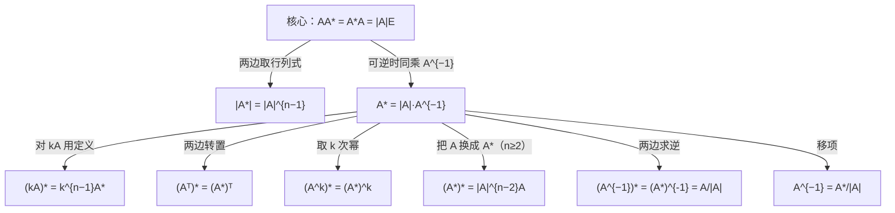

> 返回：[[02 线代第2讲 矩阵（矩阵与秩）]] | 返回目录：[[线性代数公式速查]]

# 第2讲（二） 伴随矩阵

> [!abstract] 本讲定位
> 伴随矩阵的定义、公式与秩分段，结合低阶矩阵求逆与二重伴随例题。

> [!tip] 🎯 考点速记
> - **一切从核心式出发**：$AA^{*}=A^{*}A=\lvert A\rvert E$；可逆时 $A^{*}=\lvert A\rvert A^{-1}$，其余公式都是这两条的推论。
> - **定义易错**：$A^{*}$ 的 $(i,j)$ 元是 $A_{ji}$——代数余子式**转置**排放，漏转置是最常见的低级错。
> - **秩分段口诀**：满秩满、降一秩一、降二变零（$r(A)\le n-2$ 时 $A^{*}=O$）。
> - **三个高频变形**：$\lvert A^{*}\rvert=\lvert A\rvert^{n-1}$、$(kA)^{*}=k^{n-1}A^{*}$、$(A^{*})^{*}=\lvert A\rvert^{n-2}A$（$n=2$ 时 $(A^{*})^{*}=A$）。
> - **二阶求逆**用 $A^{-1}=A^{*}/\lvert A\rvert$ 最快；五道配套例题见 [[02-2-a 例题·伴随矩阵五题]]。

## 🧩 2.4 伴随矩阵 $A^{*}$

以下伴随公式以 $n\ge2$ 阶方阵为常规范围；含逆矩阵的式子须另有可逆前提。

**定义易错**：$A^{*}$ 的 $(i,j)$ 元是 $A_{ji}$（代数余子式要**转置**排放）。

> [!warning] **行列式三易错**（张宇第2讲，★★★选填高频）
> 1. $\lvert kA\rvert=k^{n}\lvert A\rvert$（$n\ge2,\,k\ne0,1$）——数乘**整个矩阵**，行列式乘 $k^{n}$；
>
> 2. 数乘行列式**某一行（列）**：$k\lvert A\rvert$——只乘某一行/列，行列式乘 $k$；
>
> 3. $\lvert A+B\rvert\ne\lvert A\rvert+\lvert B\rvert$——行列式对加法**不满足分配律**（但对乘法满足 $\lvert AB\rvert=\lvert A\rvert\lvert B\rvert$）。
>
> 推论：$A\ne O \nRightarrow \lvert A\rvert\ne0$（零矩阵行列式为 0；非零矩阵行列式也可能为 0，如秩不满）。

| 公式 | 公式 |
| :-------------------------------------------------- | :----------------------------------------- |
| $\boxed{AA^{*}=A^{*}A=\lvert A\rvert E}$（核心，一切由此推）| $\lvert A^{*}\rvert=\lvert A\rvert^{n-1}$ |
| $A^{*}=\lvert A\rvert A^{-1}$（$A$ 可逆时） | $(A^{*})^{*}=\lvert A\rvert^{n-2}A\ (n\ge2)$ |
| $(A^{-1})^{*}=(A^{*})^{-1}=\frac{A}{\lvert A\rvert}$（$A$ 可逆）| $(A^{k})^{*}=(A^{*})^{k}$ |
| $(kA)^{*}=k^{n-1}A^{*}$ | $(A^{T})^{*}=(A^{*})^{T}$ |
| $\lvert(A^{*})^{*}\rvert=\lvert A\rvert^{(n-1)^{2}}$；当 $n=2$ 时 $(A^{*})^{*}=A$ | $A^{-1}=\frac{A^{*}}{\lvert A\rvert}$（求逆用）|

$$
\boxed{r(A^{*})=\begin{cases}n, & r(A)=n\\[2pt] 1, & r(A)=n-1\\[2pt] 0, & r(A)\le n-2\end{cases}}
$$

> [!derivation] 三情形的推导（选填高频：已知 $r(A)=n-1$ 求 $r(A^{*})$）
> - $r(A)=n$：$A^{*}=\lvert A\rvert A^{-1}$ 可逆 ⟹ $r=n$；
>
> - $r(A)=n-1$：由 $AA^{*}=O$，$A^{*}$ 的列都是 $Ax=0$ 的解，而解空间维数 $n-r(A)=1$ ⟹ $r(A^{*})\le1$；又 $A$ 有 $n-1$ 阶非零子式 ⟹ $A^{*}\ne O$ ⟹ $r=1$；
>
> - $r(A)\le n-2$：所有 $n-1$ 阶子式全为 $0$ ⟹ $A^{*}=O$ ⟹ $r=0$。
> 记忆口诀：「**满秩满、降一秩一、降二变零**」。
>
> **关系网：一切由核心式推（可逆时）**：

本页五个例题已独立成篇，见 [[02-2-a 例题·伴随矩阵五题]]。

> 相关：上一节 [[02-1 矩阵运算与方阵的幂]] · 下一节 [[02-2-a 例题·伴随矩阵五题]] · 本讲 [[02 线代第2讲 矩阵（矩阵与秩）]] · 速查 [[线性代数公式速查]]
