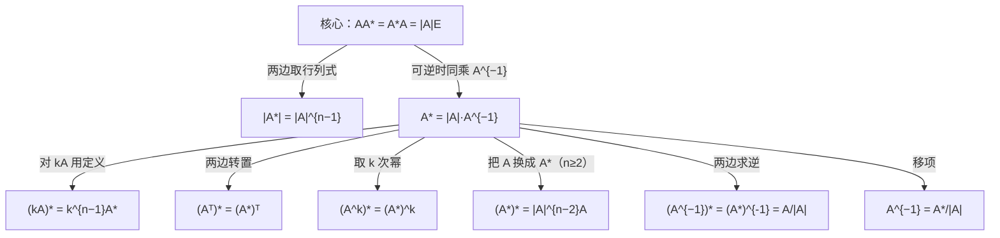

> 返回：[[02 线代第2讲 矩阵（矩阵与秩）]] | 返回目录：[[线性代数公式速查]]

# 第2讲（二） 伴随矩阵与初等变换

## 伴随矩阵 $A^{*}$

**定义易错**：$A^{*}$ 的 $(i,j)$ 元是 $A_{ji}$（代数余子式要**转置**排放）。

> [!warning] **行列式三易错**（张宇第2讲，★★★选填高频）
> 1. $\lvert kA\rvert=k^{n}\lvert A\rvert$（$n\ge2,\,k\ne0,1$）——数乘**整个矩阵**，行列式乘 $k^{n}$；
> 2. 数乘行列式**某一行（列）**：$k\lvert A\rvert$——只乘某一行/列，行列式乘 $k$；
> 3. $\lvert A+B\rvert\ne\lvert A\rvert+\lvert B\rvert$——行列式对加法**不满足分配律**（但对乘法满足 $\lvert AB\rvert=\lvert A\rvert\lvert B\rvert$）。
>
> 推论：$A\ne O \nRightarrow \lvert A\rvert\ne0$（零矩阵行列式为 0；非零矩阵行列式也可能为 0，如秩不满）。

| 公式                                                | 公式                                       |
| :-------------------------------------------------- | :----------------------------------------- |
| $\boxed{AA^{*}=A^{*}A=\lvert A\rvert E}$（核心，一切由此推）| $\lvert A^{*}\rvert=\lvert A\rvert^{n-1}$  |
| $A^{*}=\lvert A\rvert A^{-1}$（$A$ 可逆时）         | $(A^{*})^{*}=\lvert A\rvert^{n-2}A\ (n\ge2)$ |
| $(A^{-1})^{*}=(A^{*})^{-1}=\dfrac{A}{\lvert A\rvert}$（$A$ 可逆）| $(A^{k})^{*}=(A^{*})^{k}$ |
| $(kA)^{*}=k^{n-1}A^{*}$                             | $(A^{T})^{*}=(A^{*})^{T}$                  |
| $\lvert(A^{*})^{*}\rvert=\lvert A\rvert^{(n-1)^{2}}$；当 $n=2$ 时 $(A^{*})^{*}=A$ | $A^{-1}=\dfrac{A^{*}}{\lvert A\rvert}$（求逆用）|

$$
\boxed{r(A^{*})=\begin{cases}n, & r(A)=n\\[2pt] 1, & r(A)=n-1\\[2pt] 0, & r(A)\le n-2\end{cases}}
$$

> [!note] 三情形的推导（选填高频：已知 $r(A)=n-1$ 求 $r(A^{*})$）
> - $r(A)=n$：$A^{*}=\lvert A\rvert A^{-1}$ 可逆 ⟹ $r=n$；
> - $r(A)=n-1$：由 $AA^{*}=O$，$A^{*}$ 的列都是 $Ax=0$ 的解，而解空间维数 $n-r(A)=1$ ⟹ $r(A^{*})\le1$；又 $A$ 有 $n-1$ 阶非零子式 ⟹ $A^{*}\ne O$ ⟹ $r=1$；
> - $r(A)\le n-2$：所有 $n-1$ 阶子式全为 $0$ ⟹ $A^{*}=O$ ⟹ $r=0$。
> 记忆口诀：「**满秩满、降一秩一、降二变零**」。
>
> **关系网：一切由核心式推（可逆时）**：

---

## 初等变换与初等矩阵

- **左乘行变换、右乘列变换**。

> [!tip] 化行阶梯形 / 行最简形（操作规范）
> - **行阶梯形**：每行第一个非零元（首元）所在列随行号**严格右移**，首元下方全 $0$；
> - **行最简形**：阶梯形基础上，首元**化为 $1$** 且所在列**其余元素全为 $0$**（对给定矩阵唯一）。
> - **标准流程**（只用行变换）：自上而下逐列——① 选该列第一个非零元作首元（必要时**换行**）；② 用**倍加**把首元下方全消为 $0$；③ 逐列重复至最后一行；④ 要最简形时，再自下而上消首元上方、并把每个首元归一。
> - **分工**：求**秩**化到阶梯形即可（非零行数）；求**逆**、**基础解系**、**极大无关组**必须化到行最简形。
- 三类初等矩阵的逆仍是同类：$E_{ij}^{-1}=E_{ij}$，$E_{i}(k)^{-1}=E_{i}\!\left(\dfrac1k\right)$，$E_{ij}(k)^{-1}=E_{ij}(-k)$。
- **初等矩阵的行列式**：$\lvert E_{ij}\rvert=-1$、$\lvert E_{i}(k)\rvert=k$、$\lvert E_{ij}(k)\rvert=1$——与行列式三性质**一一对应**
  （换行变号 / 某行乘 $k$ 行列式乘 $k$ / 倍加不变），即由 $\lvert PA\rvert=\lvert P\rvert\lvert A\rvert$ 即可推回这些性质。
- $A$ 可逆 $\iff$ $A$ 是有限个初等矩阵的乘积；任意 $A$ 有等价标准形 $PAQ=\begin{pmatrix}E_r&O\\O&O\end{pmatrix}$。

> [!warning] 初等变换用途三区别（高频易错）
> - **求秩**：行、列变换**可混用**（不改变秩）；
> - **求逆**：$(A\mid E)\to(E\mid A^{-1})$ **只用行变换**（或只用列变换，不能混用）；
> - **解方程组**：增广矩阵**只能用行变换**（列变换会打乱变量对应）。
> 不要与行列式的性质混淆：行列式允许列变换（配合变号），矩阵初等变换是另一套规则。**同一变换对三对象的影响**：
>
> | 变换 | 行列式 | 矩阵的秩 | 方程组 $Ax=b$ |
> |:--|:--|:--|:--|
> | 换两行 | **变号** | 不变 | 解不变（行变换） |
> | 某行乘 $k\ne0$ | **乘 $k$** | 不变 | 解不变（行变换） |
> | 倍加 | 不变 | 不变 | 解不变（行变换） |
> | 列变换 | 允许（换列同样变号） | 求秩可混用 | **禁止**（打乱变量对应） |
>
> 三者统一于 $\lvert PAQ\rvert=\lvert P\rvert\lvert Q\rvert\lvert A\rvert$：行（列）变换 = 左（右）乘初等矩阵，而行列式三性质正是初等矩阵行列式 $-1,\,k,\,1$ 的体现。

**等价标准形的应用（求可逆 $P$ 使 $PA=B$）**：
1. 实操：对 $[A\mid E]\xrightarrow{\text{行}}$ 化 $[B\mid P]$，则 $PA=B$，$P$ 即所求（行变换跟踪法）；
2. **求 $P,Q$ 使 $PAQ=\begin{pmatrix}E_r&O\\O&O\end{pmatrix}$**：拼 $\begin{pmatrix}A&E_m\\E_n&O\end{pmatrix}$，
   对上半块 $[A\mid E_m]$ 做**行变换**、对左半块 $\begin{bmatrix}A\\E_n\end{bmatrix}$ 做**列变换**，
   把 $A$ 位置化为 $\begin{pmatrix}E_r&O\\O&O\end{pmatrix}$——此时右上块 $E_m\to P$、左下块 $E_n\to Q$，即 $PAQ=$ 标准形。
3. 若要求全部可逆 $P$：解 $PA=B$ 等价于 $A^TP^T=B^T$（两边取转置），把 $P^T$ 按列分块 $\bigl[\xi_1,\dots,\xi_n\bigr]$，
   逐列解 $A^T\xi_j=b_j$（$b_j$ 为 $B^T$ 第 $j$ 列），取通解后选自由参数使 $\xi_1,\dots,\xi_n$ **线性无关**（即 $\det P^T\ne0$）——仅逐列非零不足以保证 $P$ 可逆（各列可能成比例，如都取同一个非零解向量时 $P$ 秩 1）。

---

## 分块矩阵

$$
\begin{pmatrix}A&O\\O&B\end{pmatrix}^{-1}=\begin{pmatrix}A^{-1}&O\\O&B^{-1}\end{pmatrix},\qquad
\begin{pmatrix}O&A\\B&O\end{pmatrix}^{-1}=\begin{pmatrix}O&B^{-1}\\A^{-1}&O\end{pmatrix}
$$

$$
\begin{pmatrix}A&O\\C&B\end{pmatrix}^{-1}=\begin{pmatrix}A^{-1}&O\\-B^{-1}CA^{-1}&B^{-1}\end{pmatrix},\qquad
\begin{pmatrix}A&O\\O&B\end{pmatrix}^{n}=\begin{pmatrix}A^{n}&O\\O&B^{n}\end{pmatrix}
$$

| 内容 | 公式 / 结论 |
| :-- | :-- |
| **分块转置**（高频易错） | $\begin{pmatrix}A&B\\C&D\end{pmatrix}^{T}=\begin{pmatrix}A^{T}&C^{T}\\B^{T}&D^{T}\end{pmatrix}$（**整体转置 + 各块转置**） |
| **上三角分块逆** | $\begin{pmatrix}A&C\\O&B\end{pmatrix}^{-1}=\begin{pmatrix}A^{-1}&-A^{-1}CB^{-1}\\O&B^{-1}\end{pmatrix}$（$A,B$ 可逆） |
| **分块秩** | $r\!\begin{pmatrix}A&O\\O&B\end{pmatrix}=r(A)+r(B)$；$r\!\begin{pmatrix}A&C\\O&B\end{pmatrix}\ge r(A)+r(B)$ |
| **准对角性质** | $\operatorname{diag}(A,B)$ 可逆 ⟺ $A,B$ 都可逆；特征值 $=$ 两块的**并**；$\lvert\operatorname{diag}(A,B)\rvert=\lvert A\rvert\lvert B\rvert$ |
| **准对角伴随** | $\operatorname{diag}(A,B)^{*}=\operatorname{diag}(\lvert B\rvert A^{*},\,\lvert A\rvert B^{*})$（注意交叉乘行列式！）|

---
