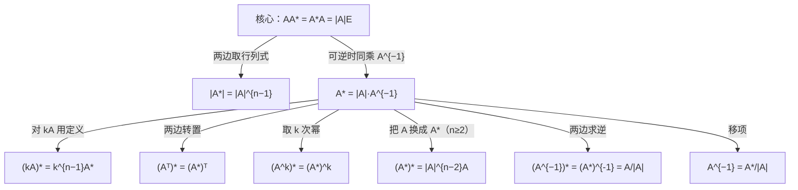

> 返回：[[02 线代第2讲 矩阵（矩阵与秩）]] | 返回目录：[[线性代数公式速查]]

# 第2讲（二） 伴随矩阵与初等变换

## 伴随矩阵 $A^{*}$

**定义易错**：$A^{*}$ 的 $(i,j)$ 元是 $A_{ji}$（代数余子式要**转置**排放）。

> [!warning] **行列式三易错**（张宇第2讲，★★★选填高频）
> 1. $\lvert kA\rvert=k^{n}\lvert A\rvert$（$n\ge2,\,k\ne0,1$）——数乘**整个矩阵**，行列式乘 $k^{n}$；
> 2. 数乘行列式**某一行（列）**：$k\lvert A\rvert$——只乘某一行/列，行列式乘 $k$；
> 3. $\lvert A+B\rvert\ne\lvert A\rvert+\lvert B\rvert$——行列式对加法**不满足分配律**（但对乘法满足 $\lvert AB\rvert=\lvert A\rvert\lvert B\rvert$）。
>
> 推论：$A\ne O \nRightarrow \lvert A\rvert\ne0$（零矩阵行列式为 0；非零矩阵行列式也可能为 0，如秩不满）。

| 公式                                                | 公式                                       |
| :-------------------------------------------------- | :----------------------------------------- |
| $\boxed{AA^{*}=A^{*}A=\lvert A\rvert E}$（核心，一切由此推）| $\lvert A^{*}\rvert=\lvert A\rvert^{n-1}$  |
| $A^{*}=\lvert A\rvert A^{-1}$（$A$ 可逆时）         | $(A^{*})^{*}=\lvert A\rvert^{n-2}A\ (n\ge2)$ |
| $(A^{-1})^{*}=(A^{*})^{-1}=\dfrac{A}{\lvert A\rvert}$（$A$ 可逆）| $(A^{k})^{*}=(A^{*})^{k}$ |
| $(kA)^{*}=k^{n-1}A^{*}$                             | $(A^{T})^{*}=(A^{*})^{T}$                  |
| $\lvert(A^{*})^{*}\rvert=\lvert A\rvert^{(n-1)^{2}}$；当 $n=2$ 时 $(A^{*})^{*}=A$ | $A^{-1}=\dfrac{A^{*}}{\lvert A\rvert}$（求逆用）|

$$
\boxed{r(A^{*})=\begin{cases}n, & r(A)=n\\[2pt] 1, & r(A)=n-1\\[2pt] 0, & r(A)\le n-2\end{cases}}
$$

> [!note] 三情形的推导（选填高频：已知 $r(A)=n-1$ 求 $r(A^{*})$）
> - $r(A)=n$：$A^{*}=\lvert A\rvert A^{-1}$ 可逆 ⟹ $r=n$；
> - $r(A)=n-1$：由 $AA^{*}=O$，$A^{*}$ 的列都是 $Ax=0$ 的解，而解空间维数 $n-r(A)=1$ ⟹ $r(A^{*})\le1$；又 $A$ 有 $n-1$ 阶非零子式 ⟹ $A^{*}\ne O$ ⟹ $r=1$；
> - $r(A)\le n-2$：所有 $n-1$ 阶子式全为 $0$ ⟹ $A^{*}=O$ ⟹ $r=0$。
> 记忆口诀：「**满秩满、降一秩一、降二变零**」。
>
> **关系网：一切由核心式推（可逆时）**：

> [!example] 1. ✏️ 例2.6 计算 $AA^{*}$ 验证伴随公式
>
> 已知 $A=\begin{pmatrix}a&b\\c&d\end{pmatrix}$，计算 $AA^{*}$。
>
> **解**：$A$ 的代数余子式为
>
> $$
> A_{11}=d,\quad A_{12}=-c,\quad A_{21}=-b,\quad A_{22}=a
> $$
>
> 伴随矩阵（**转置**排列）
>
> $$
> A^{*}=\begin{pmatrix}A_{11}&A_{21}\\A_{12}&A_{22}\end{pmatrix}=\begin{pmatrix}d&-b\\-c&a\end{pmatrix}
> $$
>
> 计算乘积
>
> $$
> AA^{*}=\begin{pmatrix}a&b\\c&d\end{pmatrix}\begin{pmatrix}d&-b\\-c&a\end{pmatrix}=\begin{pmatrix}ad-bc&-ab+ab\\cd-cd&-bc+ad\end{pmatrix}=\begin{pmatrix}ad-bc&0\\0&ad-bc\end{pmatrix}
> $$
>
> 即
>
> $$
> AA^{*}=(ad-bc)E=|A|E \quad\checkmark
> $$
>
> > [!tip] 本例验证了伴随矩阵的核心公式 $AA^{*}=|A|E$，对任意 $n$ 阶方阵均成立——即使 $A$ 不可逆（此时 $|A|=0$，$AA^{*}=O$）。
>
> [!example] 2. ✏️ 例2.7 2阶矩阵伴随与可逆条件
>
> 已知 $A=\begin{pmatrix}a&b\\c&d\end{pmatrix}$，写出 $A$ 可逆的一个充要条件，当 $A$ 可逆时，求 $A^{-1}$。
>
> **解**：$A$ 可逆的充要条件为 $|A|=ad-bc\ne0$。
>
> 当 $ad-bc\ne0$ 时，由例2.6知 $A^{*}=\begin{pmatrix}d&-b\\-c&a\end{pmatrix}$，利用公式 $A^{-1}=\dfrac{A^{*}}{|A|}$ 得
>
> $$
> A^{-1}=\frac{1}{ad-bc}\begin{pmatrix}d&-b\\-c&a\end{pmatrix}
> $$
>
> > [!note] 2阶矩阵求伴随的口诀：**主对调，副变号**——主对角线 $a_{11},a_{22}$ 互换，副对角线 $a_{12},a_{21}$ 取负号。
> > 注意：$A^{-1}$ 公式中不要忘记除以 $|A|$；$A^{*}$ 的元素是 $A$ 的**代数余子式**（注意正负号），且 $A_{ij}$ 位于 $A^{*}$ 中相对于 $A$ 的元素 $a_{ji}$ 的位置上（转置排放）。
>
> [!example] 3. ✏️ 例2.8 3阶矩阵伴随法求逆
>
> 求矩阵 $A=\begin{pmatrix}0&1&0\\2&1&0\\-3&2&-5\end{pmatrix}$ 的逆矩阵。
>
> **解**：由
>
> $$
> |A|=0\times\begin{vmatrix}1&0\\2&-5\end{vmatrix}-1\times\begin{vmatrix}2&0\\-3&-5\end{vmatrix}+0\times\begin{vmatrix}2&1\\-3&2\end{vmatrix}=-1\times(-10)=2\ne0
> $$
>
> 知 $A$ 可逆。下面求 $A^{*}$，需计算 $A$ 的全部9个代数余子式：
>
> $$
> \begin{aligned}
> &A_{11}=+\begin{vmatrix}1&0\\2&-5\end{vmatrix}=-5, &\quad &A_{12}=-\begin{vmatrix}2&0\\-3&-5\end{vmatrix}=10, &\quad &A_{13}=+\begin{vmatrix}2&1\\-3&2\end{vmatrix}=7\\[6pt]
> &A_{21}=-\begin{vmatrix}1&0\\2&-5\end{vmatrix}=5, &\quad &A_{22}=+\begin{vmatrix}0&0\\-3&-5\end{vmatrix}=0, &\quad &A_{23}=-\begin{vmatrix}0&1\\-3&2\end{vmatrix}=-3\\[6pt]
> &A_{31}=+\begin{vmatrix}1&0\\1&0\end{vmatrix}=0, &\quad &A_{32}=-\begin{vmatrix}0&0\\2&0\end{vmatrix}=0, &\quad &A_{33}=+\begin{vmatrix}0&1\\2&1\end{vmatrix}=-2
> \end{aligned}
> $$
>
> 伴随矩阵（**转置**排列，$A_{ij}$ 放到 $(j,i)$ 位置）
>
> $$
> A^{*}=\begin{pmatrix}-5&5&0\\10&0&0\\7&-3&-2\end{pmatrix}
> $$
>
> 因此
>
> $$
> A^{-1}=\frac{A^{*}}{|A|}=\frac{1}{2}\begin{pmatrix}-5&5&0\\10&0&0\\7&-3&-2\end{pmatrix}=\begin{pmatrix}-\frac{5}{2}&\frac{5}{2}&0\\[4pt]5&0&0\\[4pt]\frac{7}{2}&-\frac{3}{2}&-1\end{pmatrix}
> $$
>
> 验证 $AA^{-1}=E$：
>
> $$
> \begin{pmatrix}0&1&0\\2&1&0\\-3&2&-5\end{pmatrix}\begin{pmatrix}-\frac{5}{2}&\frac{5}{2}&0\\5&0&0\\\frac{7}{2}&-\frac{3}{2}&-1\end{pmatrix}=\begin{pmatrix}5&0&0\\-5+5&5&0\\\frac{15}{2}+10-\frac{35}{2}&-\frac{15}{2}+0+\frac{15}{2}&5\end{pmatrix}=\begin{pmatrix}1&0&0\\0&1&0\\0&0&1\end{pmatrix}\quad\checkmark
> $$
>
> > [!warning] 伴随法求逆的易错点
> > - $A^{*}$ 的元素是**代数余子式**，注意每个余子式前的正负号 $(-1)^{i+j}$；
> > - $A_{ij}$ 放在 $A^{*}$ 的 $(j,i)$ 位置（**转置**！不是 $(i,j)$）；
> > - 最后不要忘记 $A^{-1}=\dfrac{A^{*}}{|A|}$ 中除以 $|A|$；
> > - 计算量大（$n^2$ 个 $n-1$ 阶行列式），一般只适用于低阶或特殊矩阵。
>
> [!example] 4. ✏️ 例2.9 $(A^{*})^{*}$ 的求法
>
> 设 $A=\begin{pmatrix}1&2&0\\2&0&4\\0&4&5\end{pmatrix}$，$A^{*}$ 是 $A$ 的伴随矩阵，则 $(A^{*})^{*}=$________。
>
> **解**：由公式 $AA^{*}=|A|E$，当 $|A|\ne0$ 时，有 $A^{*}=|A|A^{-1}$ 可逆，且
>
> $$
> (A^{*})^{*}=|A|^{n-2}A\quad(n\ge2)
> $$
>
> 先求 $|A|$（按第一行展开）
>
> $$
> |A|=1\times\begin{vmatrix}0&4\\4&5\end{vmatrix}-2\times\begin{vmatrix}2&4\\0&5\end{vmatrix}+0=1\times(0-16)-2\times(10-0)=-16-20=-36
> $$
>
> 由 $n=3$，得
>
> $$
> (A^{*})^{*}=|A|^{3-2}A=|A|\cdot A=-36\begin{pmatrix}1&2&0\\2&0&4\\0&4&5\end{pmatrix}=\begin{pmatrix}-36&-72&0\\-72&0&-144\\0&-144&-180\end{pmatrix}
> $$
>
> > [!tip] **技巧**：求 $(A^{*})^{*}$ 不必先求 $A^{*}$ 再求伴随——直接用公式 $(A^{*})^{*}=|A|^{n-2}A$ 一步到位。
> > 当 $n=2$ 时，$(A^{*})^{*}=|A|^{0}A=A$（2阶矩阵的二重伴随等于自身）。
>
---

## 初等变换与初等矩阵

- **左乘行变换、右乘列变换**。

> [!tip] 化行阶梯形 / 行最简形（操作规范）
> - **行阶梯形**：每行第一个非零元（首元）所在列随行号**严格右移**，首元下方全 $0$；
> - **行最简形**：阶梯形基础上，首元**化为 $1$** 且所在列**其余元素全为 $0$**（对给定矩阵唯一）。
> - **标准流程**（只用行变换）：自上而下逐列——① 选该列第一个非零元作首元（必要时**换行**）；② 用**倍加**把首元下方全消为 $0$；③ 逐列重复至最后一行；④ 要最简形时，再自下而上消首元上方、并把每个首元归一。
> - **分工**：求**秩**化到阶梯形即可（非零行数）；求**逆**、**基础解系**、**极大无关组**必须化到行最简形。
- 三类初等矩阵的逆仍是同类：$E_{ij}^{-1}=E_{ij}$，$E_{i}(k)^{-1}=E_{i}\!\left(\dfrac1k\right)$，$E_{ij}(k)^{-1}=E_{ij}(-k)$。
- **初等矩阵的行列式**：$\lvert E_{ij}\rvert=-1$、$\lvert E_{i}(k)\rvert=k$、$\lvert E_{ij}(k)\rvert=1$——与行列式三性质**一一对应**
  （换行变号 / 某行乘 $k$ 行列式乘 $k$ / 倍加不变），即由 $\lvert PA\rvert=\lvert P\rvert\lvert A\rvert$ 即可推回这些性质。
- $A$ 可逆 $\iff$ $A$ 是有限个初等矩阵的乘积；任意 $A$ 有等价标准形 $PAQ=\begin{pmatrix}E_r&O\\O&O\end{pmatrix}$。

> [!warning] 初等变换用途三区别（高频易错）
> - **求秩**：行、列变换**可混用**（不改变秩）；
> - **求逆**：$(A\mid E)\to(E\mid A^{-1})$ **只用行变换**（或只用列变换，不能混用）；
> - **解方程组**：增广矩阵**只能用行变换**（列变换会打乱变量对应）。
> 不要与行列式的性质混淆：行列式允许列变换（配合变号），矩阵初等变换是另一套规则。**同一变换对三对象的影响**：
>
> | 变换 | 行列式 | 矩阵的秩 | 方程组 $Ax=b$ |
> |:--|:--|:--|:--|
> | 换两行 | **变号** | 不变 | 解不变（行变换） |
> | 某行乘 $k\ne0$ | **乘 $k$** | 不变 | 解不变（行变换） |
> | 倍加 | 不变 | 不变 | 解不变（行变换） |
> | 列变换 | 允许（换列同样变号） | 求秩可混用 | **禁止**（打乱变量对应） |
>
> 三者统一于 $\lvert PAQ\rvert=\lvert P\rvert\lvert Q\rvert\lvert A\rvert$：行（列）变换 = 左（右）乘初等矩阵，而行列式三性质正是初等矩阵行列式 $-1,\,k,\,1$ 的体现。

**等价标准形的应用（求可逆 $P$ 使 $PA=B$）**：
1. 实操：对 $[A\mid E]\xrightarrow{\text{行}}$ 化 $[B\mid P]$，则 $PA=B$，$P$ 即所求（行变换跟踪法）；
2. **求 $P,Q$ 使 $PAQ=\begin{pmatrix}E_r&O\\O&O\end{pmatrix}$**：拼 $\begin{pmatrix}A&E_m\\E_n&O\end{pmatrix}$，
   对上半块 $[A\mid E_m]$ 做**行变换**、对左半块 $\begin{bmatrix}A\\E_n\end{bmatrix}$ 做**列变换**，

   把 $A$ 位置化为 $\begin{pmatrix}E_r&O\\O&O\end{pmatrix}$——此时右上块 $E_m\to P$、左下块 $E_n\to Q$，即 $PAQ=$ 标准形。
3. 若要求全部可逆 $P$：解 $PA=B$ 等价于 $A^TP^T=B^T$（两边取转置），把 $P^T$ 按列分块 $\bigl[\xi_1,\dots,\xi_n\bigr]$，
   逐列解 $A^T\xi_j=b_j$（$b_j$ 为 $B^T$ 第 $j$ 列），取通解后选自由参数使 $\xi_1,\dots,\xi_n$ **线性无关**（即 $\det P^T\ne0$）——仅逐列非零不足以保证 $P$ 可逆（各列可能成比例，如都取同一个非零解向量时 $P$ 秩 1）。

> [!example] 5. ✏️ 例2.12 初等行变换法求逆（3阶）
>
> 设 $A=\begin{pmatrix}1&0&-1\\2&1&-1\\-1&-1&-1\end{pmatrix}$，求 $A^{-1}$。
>
> **解**：构造增广矩阵 $[A\mid E]$，只用**行变换**把左半块化为 $E$，右半块即为 $A^{-1}$：
>
> $$
> [A\mid E]=\left(\begin{array}{ccc|ccc}1&0&-1&1&0&0\\2&1&-1&0&1&0\\-1&-1&-1&0&0&1\end{array}\right)
> $$
>
> **第1步**：消第1列下方元素（$r_2-2r_1$，$r_3+r_1$）
>
> $$
> \xrightarrow{\substack{r_2-2r_1\\[2pt]r_3+r_1}}\left(\begin{array}{ccc|ccc}1&0&-1&1&0&0\\0&1&1&-2&1&0\\0&-1&-2&1&0&1\end{array}\right)
> $$
>
> **第2步**：消第2列下方元素（$r_3+r_2$）
>
> $$
> \xrightarrow{r_3+r_2}\left(\begin{array}{ccc|ccc}1&0&-1&1&0&0\\0&1&1&-2&1&0\\0&0&-1&-1&1&1\end{array}\right)
> $$
>
> **第3步**：第3行乘 $(-1)$ 归一（$-r_3$）
>
> $$
> \xrightarrow{-r_3}\left(\begin{array}{ccc|ccc}1&0&-1&1&0&0\\0&1&1&-2&1&0\\0&0&1&1&-1&-1\end{array}\right)
> $$
>
> **第4步**：自下而上消首元上方（$r_1+r_3$，$r_2-r_3$）
>
> $$
> \xrightarrow{\substack{r_1+r_3\\[2pt]r_2-r_3}}\left(\begin{array}{ccc|ccc}1&0&0&2&-1&-1\\0&1&0&-3&2&1\\0&0&1&1&-1&-1\end{array}\right)
> $$
>
> 左半块已化为 $E$，故
>
> $$
> A^{-1}=\begin{pmatrix}2&-1&-1\\-3&2&1\\1&-1&-1\end{pmatrix}
> $$
>
> **验证** $AA^{-1}=E$：
>
> $$
> \begin{pmatrix}1&0&-1\\2&1&-1\\-1&-1&-1\end{pmatrix}\begin{pmatrix}2&-1&-1\\-3&2&1\\1&-1&-1\end{pmatrix}=\begin{pmatrix}2-0-1&-1-0+1&-1-0+1\\4-3-1&-2+2+1&-2+1+1\\-2+3-1&1-2+1&1-1+1\end{pmatrix}=\begin{pmatrix}1&0&0\\0&1&0\\0&0&1\end{pmatrix}\quad\checkmark
> $$
>
> > [!note] **初等行变换法 vs 伴随法**
> > - **行变换法**：适用于任意阶数，计算量较小（只需对增广矩阵做行变换），是考试中求数值矩阵逆的**首选方法**；
> > - **伴随法**：需计算 $n^2$ 个 $n-1$ 阶行列式，计算量大，一般只适用于低阶或特殊矩阵；但公式本身在理论推导中很重要。
> > - 为保证计算正确，求出 $A^{-1}$ 后应验证 $AA^{-1}=E$ 或 $A^{-1}A=E$。
>
---

## 分块矩阵

$$
\begin{pmatrix}A&O\\O&B\end{pmatrix}^{-1}=\begin{pmatrix}A^{-1}&O\\O&B^{-1}\end{pmatrix},\qquad

\begin{pmatrix}O&A\\B&O\end{pmatrix}^{-1}=\begin{pmatrix}O&B^{-1}\\A^{-1}&O\end{pmatrix}
$$

$$
\begin{pmatrix}A&O\\C&B\end{pmatrix}^{-1}=\begin{pmatrix}A^{-1}&O\\-B^{-1}CA^{-1}&B^{-1}\end{pmatrix},\qquad

\begin{pmatrix}A&O\\O&B\end{pmatrix}^{n}=\begin{pmatrix}A^{n}&O\\O&B^{n}\end{pmatrix}
$$

| 内容 | 公式 / 结论 |
| :-- | :-- |
| **分块转置**（高频易错） | $\begin{pmatrix}A&B\\C&D\end{pmatrix}^{T}=\begin{pmatrix}A^{T}&C^{T}\\B^{T}&D^{T}\end{pmatrix}$（整体转置 + 各块转置） |
| **上三角分块逆** | $\begin{pmatrix}A&C\\O&B\end{pmatrix}^{-1}=\begin{pmatrix}A^{-1}&-A^{-1}CB^{-1}\\O&B^{-1}\end{pmatrix}$（$A,B$ 可逆） |
| **分块秩** | $r\!\begin{pmatrix}A&O\\O&B\end{pmatrix}=r(A)+r(B)$；$r\!\begin{pmatrix}A&C\\O&B\end{pmatrix}\ge r(A)+r(B)$ |
| **准对角性质** | $\operatorname{diag}(A,B)$ 可逆 ⟺ $A,B$ 都可逆；特征值 $=$ 两块的**并**；$\lvert\operatorname{diag}(A,B)\rvert=\lvert A\rvert\lvert B\rvert$ |
| **准对角伴随** | $\operatorname{diag}(A,B)^{*}=\operatorname{diag}(\lvert B\rvert A^{*},\,\lvert A\rvert B^{*})$（交叉乘行列式）|
---