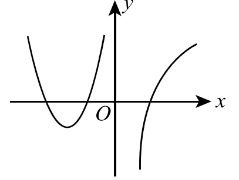
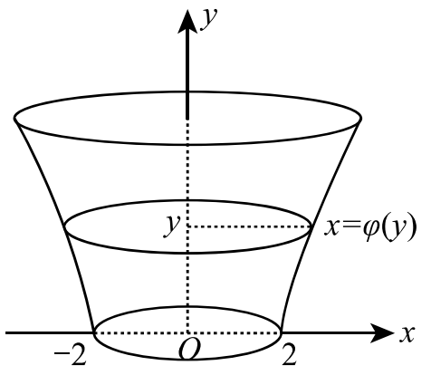

# 2003年考研数学二试题

---

## 一、填空题（本题共6小题，每小题4分，满分24分）

(1) 若 $x\to0$ 时，$(1-ax^2)^{\frac{1}{4}}-1$ 与 $x\sin x$ 是等价无穷小，则 $a=$______。

(2) 设函数 $y=f(x)$ 由方程 $xy+2\ln x=y^4$ 所确定，则曲线 $y=f(x)$ 在点 $(1,1)$ 处的切线方程是______。

(3) $y=2^x$ 的麦克劳林公式中 $x^n$ 项的系数是______。

(4) 设曲线的极坐标方程为 $\rho=\mathrm{e}^{a\theta}\ (a>0)$，则该曲线上相应于 $\theta$ 从 $0$ 变到 $2\pi$ 的一段弧与极轴所围成的图形的面积为______。

(5) 设 $\alpha$ 为3维列向量，$\alpha^{\mathrm{T}}$ 是 $\alpha$ 的转置，若 $\alpha\alpha^{\mathrm{T}}=\begin{pmatrix}1&-1&1\\-1&1&-1\\1&-1&1\end{pmatrix}$，则 $\alpha^{\mathrm{T}}\alpha=$______。

(6) 设3阶方阵 $A,B$ 满足 $A^2B-A-B=E$，其中 $E$ 为3阶单位矩阵，若 $A=\begin{pmatrix}1&0&1\\0&2&0\\-2&0&1\end{pmatrix}$，则 $|B|=$______。

---

## 二、选择题（本题共6小题，每小题4分，满分24分）

(1) 设 $\{a_n\},\{b_n\},\{c_n\}$ 均为非负数列，且 $\lim_{n\to\infty}a_n=0,\ \lim_{n\to\infty}b_n=1,\ \lim_{n\to\infty}c_n=\infty$，则必有 $(\quad)$。

(A) $a_n<b_n$ 对任意 $n$ 成立.  (B) $b_n<c_n$ 对任意 $n$ 成立.  (C) 极限 $\lim_{n\to\infty}a_nc_n$ 不存在.  (D) 极限 $\lim_{n\to\infty}b_nc_n$ 不存在.

(2) 设 $a_n=\dfrac{3}{2}\int_0^{\frac{n}{n+1}}x^{n-1}\sqrt{1+x^n}\,\mathrm{d}x$，则极限 $\lim_{n\to\infty}na_n$ 等于 $(\quad)$。

(A) $(1+\mathrm{e})^{\frac{3}{2}}+1$.  (B) $(1+\mathrm{e}^{-1})^{\frac{3}{2}}-1$.  (C) $(1+\mathrm{e}^{-1})^{\frac{3}{2}}+1$.  (D) $(1+\mathrm{e})^{\frac{3}{2}}-1$.

(3) 已知 $y=\dfrac{x}{\ln x}$ 是微分方程 $y'=\dfrac{y}{x}+\varphi\left(\dfrac{x}{y}\right)$ 的解，则 $\varphi\left(\dfrac{x}{y}\right)$ 的表达式为 $(\quad)$。

(A) $-\dfrac{y^2}{x^2}$.  (B) $\dfrac{y^2}{x^2}$.  (C) $-\dfrac{x^2}{y^2}$.  (D) $\dfrac{x^2}{y^2}$.

(4) 设函数 $f(x)$ 在 $(-\infty,+\infty)$ 内连续，其导函数的图形如图所示，则 $f(x)$ 有 $(\quad)$。

(A) 一个极小值点和两个极大值点.  (B) 两个极小值点和一个极大值点.  (C) 两个极小值点和两个极大值点.  (D) 三个极小值点和一个极大值点.

(5) 设 $I_1=\int_0^{\frac{\pi}{4}}\dfrac{\tan x}{x}\,\mathrm{d}x,\ I_2=\int_0^{\frac{\pi}{4}}\dfrac{x}{\tan x}\,\mathrm{d}x$，则 $(\quad)$。

(A) $I_1>I_2>1$.  (B) $1>I_1>I_2$.  (C) $I_2>I_1>1$.  (D) $1>I_2>I_1$.

(6) 设向量组 $\mathrm{I}:\alpha_1,\alpha_2,\cdots,\alpha_r$ 可由向量组 $\mathrm{II}:\beta_1,\beta_2,\cdots,\beta_s$ 线性表示，则 $(\quad)$。

(A) 当 $r<s$ 时，向量组 $\mathrm{II}$ 必线性相关.  (B) 当 $r>s$ 时，向量组 $\mathrm{II}$ 必线性相关.  (C) 当 $r<s$ 时，向量组 $\mathrm{I}$ 必线性相关.  (D) 当 $r>s$ 时，向量组 $\mathrm{I}$ 必线性相关.

---

## 三、（本题满分10分）

设函数 $f(x)=\begin{cases}\dfrac{\ln(1+ax^3)}{x-\arcsin x}, & x<0,\\[5pt] 6, & x=0,\\[5pt] \dfrac{\mathrm{e}^{ax}+x^2-ax-1}{x\sin\dfrac{x}{4}}, & x>0,\end{cases}$ 问 $a$ 为何值时，$f(x)$ 在 $x=0$ 处连续；$a$ 为何值时，$x=0$ 是 $f(x)$ 的可去间断点？

## 四、（本题满分9分）

设函数 $y=y(x)$ 由参数方程 $\begin{cases}x=1+2t^2,\\[4pt] y=\displaystyle\int_1^{1+2\ln t}\dfrac{\mathrm{e}^u}{u}\,\mathrm{d}u,\end{cases}\ (t>1)$ 所确定，求 $\dfrac{\mathrm{d}^2y}{\mathrm{d}x^2}\bigg|_{x=9}$。

## 五、（本题满分9分）

计算不定积分 $\displaystyle\int\dfrac{x\mathrm{e}^{\arctan x}}{(1+x^2)^{3/2}}\,\mathrm{d}x$。

## 六、（本题满分12分）

设函数 $y=y(x)$ 在 $(-\infty,+\infty)$ 内具有二阶导数，且 $y'\neq0$，$x=x(y)$ 是 $y=y(x)$ 的反函数。

(1) 试将 $x=x(y)$ 所满足的微分方程 $\dfrac{\mathrm{d}^2x}{\mathrm{d}y^2}+(y+\sin x)\left(\dfrac{\mathrm{d}x}{\mathrm{d}y}\right)^3=0$ 变换为 $y=y(x)$ 满足的微分方程；

(2) 求变换后的微分方程满足初始条件 $y(0)=0,\ y'(0)=\dfrac{3}{2}$ 的解。

## 七、（本题满分12分）

讨论曲线 $y=4\ln x+k$ 与 $y=4x+\ln^4x$ 的交点个数。

## 八、（本题满分12分）

设位于第一象限的曲线 $y=f(x)$ 过点 $\left(\dfrac{\sqrt{2}}{2},\dfrac{1}{2}\right)$，其上任一点 $P(x,y)$ 处的法线与 $y$ 轴的交点为 $Q$，且线段 $PQ$ 被 $x$ 轴平分。

(1) 求曲线 $y=f(x)$ 的方程；

(2) 已知曲线 $y=\sin x$ 在 $[0,\pi]$ 上的弧长为 $l$，试用 $l$ 表示曲线 $y=f(x)$ 的弧长 $s$。

## 九、（本题满分10分）

有一平底容器，其内侧壁是由曲线 $x=\varphi(y)\ (y\ge0)$ 绕 $y$ 轴旋转而成的旋转曲面（如图），容器的底面圆的半径为 $2\mathrm{m}$。根据设计要求，当以 $3\mathrm{m}^3/\mathrm{min}$ 的速率向容器内注入液体时，液面的面积将以 $\pi\mathrm{m}^2/\mathrm{min}$ 的速率均匀扩大（假设注入液体前，容器内无液体）。

(1) 根据 $t$ 时刻液面的面积，写出 $t$ 与 $\varphi(y)$ 之间的关系式；

(2) 求曲线 $x=\varphi(y)$ 的方程。

（注：$\mathrm{m}$ 表示长度单位米，$\mathrm{min}$ 表示时间单位分。）

## 十、（本题满分10分）

设函数 $f(x)$ 在闭区间 $[a,b]$ 上连续，在开区间 $(a,b)$ 内可导，且 $f'(x)>0$。若极限 $\lim_{x\to a^+}\dfrac{f(2x-a)}{x-a}$ 存在，证明：

(1) 在 $(a,b)$ 内 $f(x)>0$；

(2) 在 $(a,b)$ 内存在点 $\xi$，使 $\dfrac{b^2-a^2}{\displaystyle\int_a^b f(x)\,\mathrm{d}x}=\dfrac{2\xi}{f(\xi)}$；

(3) 在 $(a,b)$ 内存在与 (2) 中 $\xi$ 相异的点 $\eta$，使 $f'(\eta)(b^2-a^2)=\dfrac{2\xi}{\xi-a}\displaystyle\int_a^b f(x)\,\mathrm{d}x$。

## 十一、（本题满分10分）

若矩阵 $A=\begin{pmatrix}2&2&0\\8&2&a\\0&0&6\end{pmatrix}$ 相似于对角矩阵 $\Lambda$，试确定常数 $a$ 的值；并求可逆矩阵 $P$ 使 $P^{-1}AP=\Lambda$。

## 十二、（本题满分8分）

已知平面上三条不同直线的方程分别为

$$l_1:\ ax+2by+3c=0,$$

$$l_2:\ bx+2cy+3a=0,$$

$$l_3:\ cx+2ay+3b=0.$$

试证：这三条直线交于一点的充分必要条件为 $a+b+c=0$。
