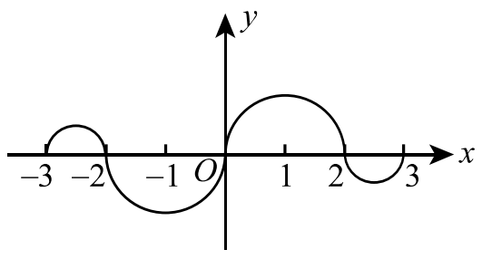

# 2007年考研数学二试题

## 一、选择题（本题共10小题，每小题4分，满分40分）

(1) 当 $x \to 0^+$ 时，与 $\sqrt{x}$ 等价的无穷小量是（ ）
(A) $1 - e^{\sqrt{x}}$.
(B) $\ln\dfrac{1+x}{1-\sqrt{x}}$.
(C) $\sqrt{1+\sqrt{x}} - 1$.
(D) $1 - \cos\sqrt{x}$.

(2) 函数 $f(x) = \dfrac{(e^{\frac{1}{x}} + e)\tan x}{x(e^{\frac{1}{x}} - e)}$ 在 $[-\pi,\pi]$ 上的第一类间断点是 $x =$（ ）
(A) $0$.
(B) $1$.
(C) $-\dfrac{\pi}{2}$.
(D) $\dfrac{\pi}{2}$.

(3) 如图，连续函数 $y = f(x)$ 在区间 $[-3,-2]$，$[2,3]$ 上的图形分别是直径为 1 的上、下半圆周，在区间 $[-2,0]$，$[0,2]$ 上的图形分别是直径为 2 的下、上半圆周. 设 $F(x) = \displaystyle\int_0^x f(t)\,\mathrm{d}t$，则下列结论正确的是（ ）

(A) $F(3) = -\dfrac{3}{4}F(-2)$.
(B) $F(3) = \dfrac{5}{4}F(2)$.
(C) $F(-3) = \dfrac{3}{4}F(2)$.
(D) $F(-3) = -\dfrac{5}{4}F(-2)$.

(4) 设函数 $f(x)$ 在 $x = 0$ 处连续，下列命题错误的是（ ）
(A) 若 $\lim_{x \to 0}\dfrac{f(x)}{x}$ 存在，则 $f(0) = 0$.
(B) 若 $\lim_{x \to 0}\dfrac{f(x)+f(-x)}{x}$ 存在，则 $f(0) = 0$.
(C) 若 $\lim_{x \to 0}\dfrac{f(x)}{x}$ 存在，则 $f'(0)$ 存在.
(D) 若 $\lim_{x \to 0}\dfrac{f(x)-f(-x)}{x}$ 存在，则 $f'(0)$ 存在.

(5) 曲线 $y = \dfrac{1}{x} + \ln(1+e^x)$ 渐近线的条数为（ ）
(A) $0$.
(B) $1$.
(C) $2$.
(D) $3$.

(6) 设函数 $f(x)$ 在 $(0,+\infty)$ 内具有二阶导数，且 $f''(x) > 0$，令 $u_n = f(n)\,(n = 1,2,\cdots)$，则下列结论正确的是（ ）
(A) 若 $u_1 > u_2$，则 $\{u_n\}$ 必收敛.
(B) 若 $u_1 > u_2$，则 $\{u_n\}$ 必发散.
(C) 若 $u_1 < u_2$，则 $\{u_n\}$ 必收敛.
(D) 若 $u_1 < u_2$，则 $\{u_n\}$ 必发散.

(7) 二元函数 $f(x,y)$ 在点 $(0,0)$ 处可微的一个充分条件是（ ）
(A) $\lim_{(x,y) \to (0,0)}\left[f(x,y)-f(0,0)\right] = 0$.
(B) $\lim_{x \to 0}\dfrac{f(x,0)-f(0,0)}{x} = 0$，且 $\lim_{y \to 0}\dfrac{f(0,y)-f(0,0)}{y} = 0$.
(C) $\lim_{(x,y) \to (0,0)}\dfrac{f(x,y)-f(0,0)}{\sqrt{x^2+y^2}} = 0$.
(D) $\lim_{x \to 0}\left[f'_x(x,0)-f'_x(0,0)\right] = 0$，且 $\lim_{y \to 0}\left[f'_y(0,y)-f'_y(0,0)\right] = 0$.

(8) 设函数 $f(x,y)$ 连续，则二次积分 $\displaystyle\int_{\frac{\pi}{2}}^{\pi}\mathrm{d}x\int_{\sin x}^{1} f(x,y)\,\mathrm{d}y$ 等于（ ）
(A) $\displaystyle\int_0^1 \mathrm{d}y\int_{\pi+\arcsin y}^{\pi} f(x,y)\,\mathrm{d}x$.
(B) $\displaystyle\int_0^1 \mathrm{d}y\int_{\pi-\arcsin y}^{\pi} f(x,y)\,\mathrm{d}x$.
(C) $\displaystyle\int_0^1 \mathrm{d}y\int_{\frac{\pi}{2}}^{\pi+\arcsin y} f(x,y)\,\mathrm{d}x$.
(D) $\displaystyle\int_0^1 \mathrm{d}y\int_{\frac{\pi}{2}}^{\pi-\arcsin y} f(x,y)\,\mathrm{d}x$.

(9) 设向量组 $\boldsymbol{\alpha}_1,\boldsymbol{\alpha}_2,\boldsymbol{\alpha}_3$ 线性无关，则下列向量组线性相关的是（ ）
(A) $\boldsymbol{\alpha}_1-\boldsymbol{\alpha}_2,\ \boldsymbol{\alpha}_2-\boldsymbol{\alpha}_3,\ \boldsymbol{\alpha}_3-\boldsymbol{\alpha}_1$.
(B) $\boldsymbol{\alpha}_1+\boldsymbol{\alpha}_2,\ \boldsymbol{\alpha}_2+\boldsymbol{\alpha}_3,\ \boldsymbol{\alpha}_3+\boldsymbol{\alpha}_1$.
(C) $\boldsymbol{\alpha}_1-2\boldsymbol{\alpha}_2,\ \boldsymbol{\alpha}_2-2\boldsymbol{\alpha}_3,\ \boldsymbol{\alpha}_3-2\boldsymbol{\alpha}_1$.
(D) $\boldsymbol{\alpha}_1+2\boldsymbol{\alpha}_2,\ \boldsymbol{\alpha}_2+2\boldsymbol{\alpha}_3,\ \boldsymbol{\alpha}_3+2\boldsymbol{\alpha}_1$.

(10) 设矩阵 $\boldsymbol{A} = \begin{pmatrix} 2 & -1 & -1 \\ -1 & 2 & -1 \\ -1 & -1 & 2 \end{pmatrix}$，$\boldsymbol{B} = \begin{pmatrix} 1 & 0 & 0 \\ 0 & 1 & 0 \\ 0 & 0 & 0 \end{pmatrix}$，则 $\boldsymbol{A}$ 与 $\boldsymbol{B}$（ ）
(A) 合同且相似.
(B) 合同，但不相似.
(C) 不合同，但相似.
(D) 既不合同，也不相似.

## 二、填空题（本题共6小题，每小题4分，满分24分）

(11) $\lim_{x \to 0}\dfrac{\arctan x - \sin x}{x^3} = \_\_\_\_\_\_.$

(12) 曲线 $\begin{cases} x = \cos t + \cos^2 t \\ y = 1 + \sin t \end{cases}$ 上对应于 $t = \dfrac{\pi}{4}$ 的点处的法线斜率为 $\_\_\_\_\_\_.$

(13) 设函数 $y = \dfrac{1}{2x+3}$，则 $y^{(n)}(0) = \_\_\_\_\_\_.$

(14) 二阶常系数非齐次线性微分方程 $y'' - 4y' + 3y = 2e^{2x}$ 的通解为 $\_\_\_\_\_\_.$

(15) 设 $f(u,v)$ 是二元可微函数，$z = f\left(\dfrac{y}{x}, \dfrac{x}{y}\right)$，则 $x\dfrac{\partial z}{\partial x} - y\dfrac{\partial z}{\partial y} = \_\_\_\_\_\_.$

(16) 设矩阵 $\boldsymbol{A} = \begin{pmatrix} 0 & 1 & 0 & 0 \\ 0 & 0 & 1 & 0 \\ 0 & 0 & 0 & 1 \\ 0 & 0 & 0 & 0 \end{pmatrix}$，则 $\boldsymbol{A}^3$ 的秩为 $\_\_\_\_\_\_.$

## 三、解答题（本题共8小题，满分86分. 解答应写出文字说明、证明过程或演算步骤）

### (17)（本题满分10分）

设 $f(x)$ 是区间 $\left[0, \dfrac{\pi}{4}\right]$ 上的单调、可导函数，且满足
$$\int_0^{f(x)} f^{-1}(t)\,\mathrm{d}t = \int_0^x t\frac{\cos t - \sin t}{\sin t + \cos t}\,\mathrm{d}t,$$
其中 $f^{-1}$ 是 $f$ 的反函数，求 $f(x)$.

### (18)（本题满分11分）

设 $D$ 是位于曲线 $y = \sqrt{x}a^{-\frac{x}{2a}}\,(a > 1,\ 0 \leqslant x < +\infty)$ 下方、$x$ 轴上方的无界区域.

（Ⅰ）求区域 $D$ 绕 $x$ 轴旋转一周所成旋转体的体积 $V(a)$；

（Ⅱ）当 $a$ 为何值时，$V(a)$ 最小？并求此最小值.

### (19)（本题满分10分）

求微分方程 $y''(x+y'^2) = y'$ 满足初始条件 $y(1) = y'(1) = 1$ 的特解.

### (20)（本题满分11分）

已知函数 $f(u)$ 具有二阶导数，且 $f'(0) = 1$，函数 $y = y(x)$ 由方程 $y - xe^{y-1} = 1$ 所确定. 设 $z = f(\ln y - \sin x)$，求 $\left.\dfrac{\mathrm{d}z}{\mathrm{d}x}\right|_{x=0}$，$\left.\dfrac{\mathrm{d}^2z}{\mathrm{d}x^2}\right|_{x=0}$.

### (21)（本题满分11分）

设函数 $f(x),g(x)$ 在 $[a,b]$ 上连续，在 $(a,b)$ 内具有二阶导数且存在相等的最大值，$f(a) = g(a)$，$f(b) = g(b)$，证明：存在 $\xi \in (a,b)$，使得 $f''(\xi) = g''(\xi)$.

### (22)（本题满分11分）

设二元函数
$$f(x,y) = \begin{cases} x^2, & |x|+|y| \leqslant 1, \\ \dfrac{1}{\sqrt{x^2+y^2}}, & 1 < |x|+|y| \leqslant 2, \end{cases}$$
计算二重积分 $\displaystyle\iint_D f(x,y)\,\mathrm{d}\sigma$，其中 $D = \{(x,y) \mid |x|+|y| \leqslant 2\}$.

### (23)（本题满分11分）

设线性方程组
$$\begin{cases} x_1 + x_2 + x_3 = 0, \\ x_1 + 2x_2 + ax_3 = 0, \\ x_1 + 4x_2 + a^2x_3 = 0, \end{cases} \quad \text{①}$$
与方程组
$$x_1 + 2x_2 + x_3 = a - 1 \quad \text{②}$$
有公共解，求 $a$ 的值及所有公共解.

### (24)（本题满分11分）

设 3 阶实对称矩阵 $\boldsymbol{A}$ 的特征值为 $\lambda_1 = 1,\ \lambda_2 = 2,\ \lambda_3 = -2$，$\boldsymbol{\alpha}_1 = (1,-1,1)^T$ 是 $\boldsymbol{A}$ 的属于 $\lambda_1$ 的一个特征向量. 记 $\boldsymbol{B} = \boldsymbol{A}^5 - 4\boldsymbol{A}^3 + \boldsymbol{E}$，其中 $\boldsymbol{E}$ 为 3 阶单位矩阵.

（Ⅰ）验证 $\boldsymbol{\alpha}_1$ 是矩阵 $\boldsymbol{B}$ 的特征向量，并求 $\boldsymbol{B}$ 的全部特征值与特征向量；

（Ⅱ）求矩阵 $\boldsymbol{B}$.
