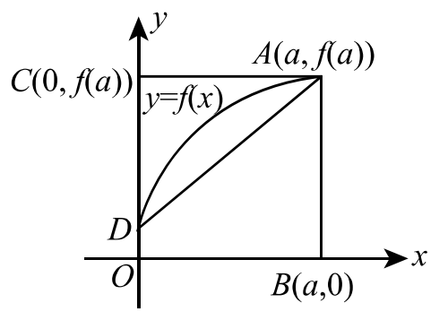
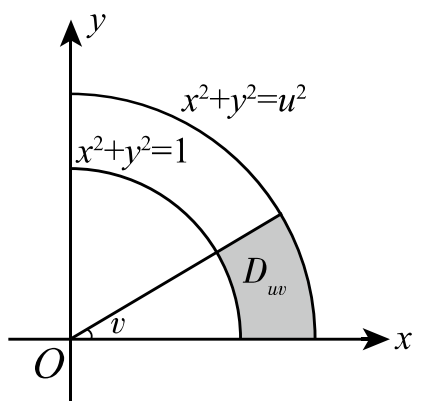

# 2008年全国硕士研究生招生考试试题

## 一、选择题（本题共8小题，每小题4分，满分32分）

（1）设函数 $f(x) = x^2 (x-1)(x-2)$，则 $f'(x)$ 的零点个数为（　）

（A）0

（B）1

（C）2

（D）3

（2）如图，曲线段的方程为 $y = f(x)$，函数 $f(x)$ 在区间 $[0, a]$ 上有连续导数，则定积分 $\int_0^a x f'(x) \,\mathrm{d}x$ 等于（　）

（A）曲边梯形 $ABOD$ 的面积

（B）梯形 $ABOD$ 的面积

（C）曲边三角形 $ACD$ 的面积

（D）三角形 $ACD$ 的面积

（3）在下列微分方程中，以 $y = C_1 e^x + C_2 \cos 2x + C_3 \sin 2x$（$C_1, C_2, C_3$ 为任意常数）为通解的是（　）

（A）$y''' + y'' - 4y' - 4y = 0$

（B）$y''' + y'' + 4y' + 4y = 0$

（C）$y''' - y'' - 4y' + 4y = 0$

（D）$y''' - y'' + 4y' - 4y = 0$

（4）设函数 $f(x) = \dfrac{\ln|x|}{|x-1|} \sin x$，则 $f(x)$ 有（　）

（A）1个可去间断点，1个跳跃间断点

（B）1个可去间断点，1个无穷间断点

（C）2个跳跃间断点

（D）2个无穷间断点

（5）设函数 $f(x)$ 在 $(-\infty, +\infty)$ 内单调有界，$\{x_n\}$ 为数列，下列命题正确的是（　）

（A）若 $\{x_n\}$ 收敛，则 $\{f(x_n)\}$ 收敛

（B）若 $\{x_n\}$ 单调，则 $\{f(x_n)\}$ 收敛

（C）若 $\{f(x_n)\}$ 收敛，则 $\{x_n\}$ 收敛

（D）若 $\{f(x_n)\}$ 单调，则 $\{x_n\}$ 收敛

（6）设函数 $f$ 连续。若 $F(u, v) = \iint_{D_{uv}} \dfrac{f(x^2 + y^2)}{\sqrt{x^2 + y^2}} \,\mathrm{d}x\,\mathrm{d}y$，其中区域 $D_{uv}$ 为图中阴影部分，则 $\dfrac{\partial F}{\partial u} =$（　）

（A）$v f(u^2)$

（B）$\dfrac{v}{u} f(u^2)$

（C）$v f(u)$

（D）$\dfrac{v}{u} f(u)$

（7）设 $\boldsymbol{A}$ 为 $n$ 阶非零矩阵，$\boldsymbol{E}$ 为 $n$ 阶单位矩阵，若 $\boldsymbol{A}^3 = \boldsymbol{O}$，则（　）

（A）$\boldsymbol{E} - \boldsymbol{A}$ 不可逆，$\boldsymbol{E} + \boldsymbol{A}$ 不可逆

（B）$\boldsymbol{E} - \boldsymbol{A}$ 不可逆，$\boldsymbol{E} + \boldsymbol{A}$ 可逆

（C）$\boldsymbol{E} - \boldsymbol{A}$ 可逆，$\boldsymbol{E} + \boldsymbol{A}$ 可逆

（D）$\boldsymbol{E} - \boldsymbol{A}$ 可逆，$\boldsymbol{E} + \boldsymbol{A}$ 不可逆

（8）设 $\boldsymbol{A} = \begin{pmatrix} 1 & 2 \\ 2 & 1 \end{pmatrix}$，则在实数域上与 $\boldsymbol{A}$ 合同的矩阵为（　）

（A）$\begin{pmatrix} -2 & 1 \\ 1 & -2 \end{pmatrix}$

（B）$\begin{pmatrix} 2 & -1 \\ -1 & 2 \end{pmatrix}$

（C）$\begin{pmatrix} 2 & 1 \\ 1 & 2 \end{pmatrix}$

（D）$\begin{pmatrix} 1 & -2 \\ -2 & 1 \end{pmatrix}$

## 二、填空题（本题共6小题，每小题4分，满分24分）

（9）已知函数 $f(x)$ 连续，且 $\lim_{x \to 0} \dfrac{1 - \cos[x f(x)]}{(e^{x^2} - 1) f(x)} = 1$，则 $f(0) =$ ________.

（10）微分方程 $(y + x^2 e^{-x}) \,\mathrm{d}x - x \,\mathrm{d}y = 0$ 的通解是 $y =$ ________.

（11）曲线 $\sin(xy) + \ln(y - x) = x$ 在点 $(0, 1)$ 处的切线方程是 ________.

（12）曲线 $y = (x - 5) x^{\frac{2}{3}}$ 的拐点坐标为 ________.

（13）设 $z = \left(\dfrac{y}{x}\right)^{\frac{x}{y}}$，则 $\left. \dfrac{\partial z}{\partial x} \right|_{(1,2)} =$ ________.

（14）设3阶矩阵 $\boldsymbol{A}$ 的特征值为 $2, 3, \lambda$。若行列式 $|2\boldsymbol{A}| = -48$，则 $\lambda =$ ________.

## 三、解答题（本题共9小题，满分94分，解答应写出文字说明、证明过程或演算步骤）

（15）（本题满分9分）

求极限 $\lim_{x \to 0} \dfrac{[\sin x - \sin(\sin x)] \sin x}{x^4}$.

（16）（本题满分10分）

设函数 $y = y(x)$ 由参数方程 $\begin{cases} x = x(t), \\ y = \int_0^{t^2} \ln(1+u) \,\mathrm{d}u \end{cases}$ 确定，其中 $x(t)$ 是初值问题

$$
\begin{cases}
\dfrac{\mathrm{d}x}{\mathrm{d}t} - 2t e^{-x} = 0, \\[4pt]
x|_{t=0} = 0
\end{cases}
$$

的解，求 $\dfrac{\mathrm{d}^2 y}{\mathrm{d}x^2}$.

（17）（本题满分9分）

计算 $\int_0^1 \dfrac{x^2 \arcsin x}{\sqrt{1 - x^2}} \,\mathrm{d}x$.

（18）（本题满分11分）

计算 $\iint_D \max\{xy, 1\} \,\mathrm{d}x\,\mathrm{d}y$，其中 $D = \{(x, y) \mid 0 \leqslant x \leqslant 2, \; 0 \leqslant y \leqslant 2\}$.

（19）（本题满分11分）

设 $f(x)$ 是区间 $[0, +\infty)$ 上具有连续导数的单调增加函数，且 $f(0) = 1$。对任意的 $t \in [0, +\infty)$，直线 $x = 0$、$x = t$，曲线 $y = f(x)$ 以及 $x$ 轴所围成的曲边梯形绕 $x$ 轴旋转一周生成旋转体。若该旋转体的侧面积在数值上等于其体积的2倍，求函数 $f(x)$ 的表达式。

（20）（本题满分11分）

（Ⅰ）证明积分中值定理：若函数 $f(x)$ 在闭区间 $[a, b]$ 上连续，则至少存在一点 $\eta \in [a, b]$，使得 $\int_a^b f(x) \,\mathrm{d}x = f(\eta)(b - a)$；

（Ⅱ）若函数 $\varphi(x)$ 具有二阶导数，且满足 $\varphi(2) > \varphi(1)$，$\varphi(2) > \int_2^3 \varphi(x) \,\mathrm{d}x$，则至少存在一点 $\xi \in (1, 3)$，使得 $\varphi''(\xi) < 0$.

（21）（本题满分11分）

求函数 $u = x^2 + y^2 + z^2$ 在约束条件 $z = x^2 + y^2$ 和 $x + y + z = 4$ 下的最大值与最小值。

（22）（本题满分12分）

设 $n$ 元线性方程组 $\boldsymbol{Ax} = \boldsymbol{b}$，其中

$$
\boldsymbol{A} = \begin{pmatrix}
2a & 1 & & & \\
a^2 & 2a & 1 & & \\
& a^2 & 2a & 1 & \\
& & \ddots & \ddots & \ddots \\
& & & a^2 & 2a & 1 \\
& & & & a^2 & 2a
\end{pmatrix}_{n \times n}, \quad
\boldsymbol{x} = \begin{pmatrix} x_1 \\ x_2 \\ \vdots \\ x_n \end{pmatrix}, \quad
\boldsymbol{b} = \begin{pmatrix} 1 \\ 0 \\ \vdots \\ 0 \end{pmatrix}.
$$

（Ⅰ）证明行列式 $|\boldsymbol{A}| = (n+1)a^n$;

（Ⅱ）当 $a$ 为何值时，该方程组有唯一解，并求 $x_1$;

（Ⅲ）当 $a$ 为何值时，该方程组有无穷多解，并求通解。

（23）（本题满分10分）

设 $\boldsymbol{A}$ 为3阶矩阵，$\boldsymbol{\alpha}_1, \boldsymbol{\alpha}_2$ 为 $\boldsymbol{A}$ 的分别属于特征值 $-1, 1$ 的特征向量，向量 $\boldsymbol{\alpha}_3$ 满足 $\boldsymbol{A\alpha}_3 = \boldsymbol{\alpha}_2 + \boldsymbol{\alpha}_3$.

（Ⅰ）证明 $\boldsymbol{\alpha}_1, \boldsymbol{\alpha}_2, \boldsymbol{\alpha}_3$ 线性无关；

（Ⅱ）令 $\boldsymbol{P} = (\boldsymbol{\alpha}_1, \boldsymbol{\alpha}_2, \boldsymbol{\alpha}_3)$，求 $\boldsymbol{P}^{-1}\boldsymbol{AP}$.
