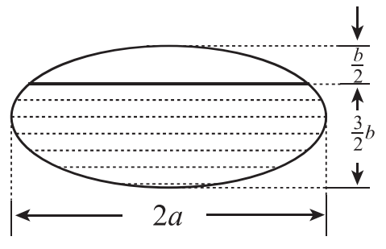

# 2010年全国硕士研究生招生考试试题

## 一、选择题（本题共8小题，每小题4分，共32分。在每小题给出的四个选项中，只有一项符合题目要求，把所选项前的字母填在题后的括号内。）

（1）函数 $f(x) = \dfrac{x^2 - x}{x^2 - 1}\sqrt{1 + \dfrac{1}{x^2}}$ 的无穷间断点的个数为（　）

（A）0

（B）1

（C）2

（D）3

（2）设 $y_1, y_2$ 是一阶线性非齐次微分方程 $y' + p(x)y = q(x)$ 的两个特解，若常数 $\lambda, \mu$ 使 $\lambda y_1 + \mu y_2$ 是该方程的解，$\lambda y_1 - \mu y_2$ 是该方程对应的齐次方程的解，则（　）

（A）$\lambda = \dfrac{1}{2}, \; \mu = \dfrac{1}{2}$

（B）$\lambda = -\dfrac{1}{2}, \; \mu = -\dfrac{1}{2}$

（C）$\lambda = \dfrac{2}{3}, \; \mu = \dfrac{1}{3}$

（D）$\lambda = \dfrac{2}{3}, \; \mu = \dfrac{2}{3}$

（3）曲线 $y = x^2$ 与曲线 $y = a \ln x$（$a \neq 0$）相切，则 $a =$（　）

（A）$4e$

（B）$3e$

（C）$2e$

（D）$e$

（4）设 $m, n$ 均是正整数，则反常积分 $\int_0^1 \dfrac{\sqrt[m]{\ln^2(1-x)}}{\sqrt[n]{x}} \,\mathrm{d}x$ 的收敛性（　）

（A）仅与 $m$ 的取值有关

（B）仅与 $n$ 的取值有关

（C）与 $m, n$ 的取值都有关

（D）与 $m, n$ 的取值都无关

（5）设函数 $z = z(x, y)$ 由方程 $F\left(\dfrac{y}{x}, \dfrac{z}{x}\right) = 0$ 确定，其中 $F$ 为可微函数，且 $F'_2 \neq 0$，则 $x\dfrac{\partial z}{\partial x} + y\dfrac{\partial z}{\partial y} =$（　）

（A）$x$

（B）$z$

（C）$-x$

（D）$-z$

（6）$\lim_{n \to \infty} \sum_{i=1}^n \sum_{j=1}^n \dfrac{n}{(n+i)(n^2 + j^2)} =$（　）

（A）$\int_0^1 \mathrm{d}x \int_0^x \dfrac{1}{(1+x)(1+y^2)} \,\mathrm{d}y$

（B）$\int_0^1 \mathrm{d}x \int_0^x \dfrac{1}{(1+x)(1+y)} \,\mathrm{d}y$

（C）$\int_0^1 \mathrm{d}x \int_0^1 \dfrac{1}{(1+x)(1+y)} \,\mathrm{d}y$

（D）$\int_0^1 \mathrm{d}x \int_0^1 \dfrac{1}{(1+x)(1+y^2)} \,\mathrm{d}y$

（7）设向量组 $\text{I}: \boldsymbol{\alpha}_1, \boldsymbol{\alpha}_2, \cdots, \boldsymbol{\alpha}_r$ 可由向量组 $\text{II}: \boldsymbol{\beta}_1, \boldsymbol{\beta}_2, \cdots, \boldsymbol{\beta}_s$ 线性表示。下列命题正确的是（　）

（A）若向量组 $\text{I}$ 线性无关，则 $r \leqslant s$

（B）若向量组 $\text{I}$ 线性相关，则 $r > s$

（C）若向量组 $\text{II}$ 线性无关，则 $r \leqslant s$

（D）若向量组 $\text{II}$ 线性相关，则 $r > s$

（8）设 $\boldsymbol{A}$ 为4阶实对称矩阵，且 $\boldsymbol{A}^2 + \boldsymbol{A} = \boldsymbol{O}$。若 $\boldsymbol{A}$ 的秩为3，则 $\boldsymbol{A}$ 相似于（　）

（A）$\begin{pmatrix} 1 & & & \\ & 1 & & \\ & & 1 & \\ & & & 0 \end{pmatrix}$

（B）$\begin{pmatrix} 1 & & & \\ & 1 & & \\ & & -1 & \\ & & & 0 \end{pmatrix}$

（C）$\begin{pmatrix} 1 & & & \\ & -1 & & \\ & & -1 & \\ & & & 0 \end{pmatrix}$

（D）$\begin{pmatrix} -1 & & & \\ & -1 & & \\ & & -1 & \\ & & & 0 \end{pmatrix}$

## 二、填空题（本题共6小题，每小题4分，共24分，把答案填在题中横线上。）

（9）3阶常系数线性齐次微分方程 $y''' - 2y'' + y' - 2y = 0$ 的通解为 $y =$ ________.

（10）曲线 $y = \dfrac{2x^3}{x^2 + 1}$ 的渐近线方程为 ________.

（11）函数 $y = \ln(1 - 2x)$ 在 $x = 0$ 处的 $n$ 阶导数 $y^{(n)}(0) =$ ________.

（12）当 $0 \leqslant \theta \leqslant \pi$ 时，对数螺线 $r = e^{\theta}$ 的弧长为 ________.

（13）已知一个长方形的长 $l$ 以 $2\,\text{cm/s}$ 的速率增加，宽 $w$ 以 $3\,\text{cm/s}$ 的速率增加，则当 $l = 12\,\text{cm}, \; w = 5\,\text{cm}$ 时，它的对角线增加的速率为 ________.

（14）设 $\boldsymbol{A}, \boldsymbol{B}$ 为3阶矩阵，且 $|\boldsymbol{A}| = 3, \; |\boldsymbol{B}| = 2, \; |\boldsymbol{A}^{-1} + \boldsymbol{B}| = 2$，则 $|\boldsymbol{A} + \boldsymbol{B}^{-1}| =$ ________.

## 三、解答题（本题共9小题，共94分，解答应写出文字说明、证明过程或演算步骤。）

（15）（本题满分10分）

求函数 $f(x) = \int_1^{x^2} (x^2 - t) e^{-t^2} \,\mathrm{d}t$ 的单调区间与极值。

（16）（本题满分10分）

（Ⅰ）比较 $\int_0^1 |\ln t|\,[\ln(1+t)]^n \,\mathrm{d}t$ 与 $\int_0^1 t^n |\ln t| \,\mathrm{d}t$（$n = 1, 2, \cdots$）的大小，说明理由；

（Ⅱ）记 $u_n = \int_0^1 |\ln t|\,[\ln(1+t)]^n \,\mathrm{d}t$（$n = 1, 2, \cdots$），求极限 $\lim_{n \to \infty} u_n$.

（17）（本题满分11分）

设函数 $y = f(x)$ 由参数方程 $\begin{cases} x = 2t + t^2, \\ y = \psi(t) \end{cases}$（$t > -1$）所确定，其中 $\psi(t)$ 具有2阶导数，且 $\psi(1) = \dfrac{5}{2}, \; \psi'(1) = 6$，已知 $\dfrac{\mathrm{d}^2 y}{\mathrm{d}x^2} = \dfrac{3}{4(1+t)}$，求函数 $\psi(t)$.

（18）（本题满分10分）

一个高为 $l$ 的柱体形贮油罐，底面是长轴为 $2a$、短轴为 $2b$ 的椭圆。现将贮油罐平放，当油罐中油面高度为 $\dfrac{3}{2}b$ 时（如图），计算油的质量。（长度单位为 $\text{m}$，质量单位为 $\text{kg}$，油的密度为常量 $\rho$，单位为 $\text{kg/m}^3$。）

（19）（本题满分11分）

设函数 $u = f(x, y)$ 具有二阶连续偏导数，且满足等式 $4\dfrac{\partial^2 u}{\partial x^2} + 12\dfrac{\partial^2 u}{\partial x \partial y} + 5\dfrac{\partial^2 u}{\partial y^2} = 0$。确定 $a, b$ 的值，使等式在变换 $\xi = x + ay, \; \eta = x + by$ 下化简为 $\dfrac{\partial^2 u}{\partial \xi \partial \eta} = 0$。

（20）（本题满分10分）

计算二重积分 $I = \iint_D r^2 \sin \theta \sqrt{1 - r^2 \cos 2\theta} \,\mathrm{d}r\,\mathrm{d}\theta$，其中 $D = \left\{(r, \theta) \mid 0 \leqslant r \leqslant \sec \theta, \; 0 \leqslant \theta \leqslant \dfrac{\pi}{4}\right\}$。

（21）（本题满分10分）

设函数 $f(x)$ 在闭区间 $[0, 1]$ 上连续，在开区间 $(0, 1)$ 内可导，且 $f(0) = 0, \; f(1) = \dfrac{1}{3}$。

证明：存在 $\xi \in \left(0, \dfrac{1}{2}\right)$、$\eta \in \left(\dfrac{1}{2}, 1\right)$，使得 $f'(\xi) + f'(\eta) = \xi^2 + \eta^2$。

（22）（本题满分11分）

设 $\boldsymbol{A} = \begin{pmatrix} \lambda & 1 & 1 \\ 0 & \lambda - 1 & 0 \\ 1 & 1 & \lambda \end{pmatrix}, \; \boldsymbol{b} = \begin{pmatrix} a \\ 1 \\ 1 \end{pmatrix}$。已知线性方程组 $\boldsymbol{Ax} = \boldsymbol{b}$ 存在两个不同的解。

（Ⅰ）求 $\lambda, a$;

（Ⅱ）求方程组 $\boldsymbol{Ax} = \boldsymbol{b}$ 的通解。

（23）（本题满分11分）

设 $\boldsymbol{A} = \begin{pmatrix} 0 & -1 & 4 \\ -1 & 3 & a \\ 4 & a & 0 \end{pmatrix}$，正交矩阵 $\boldsymbol{Q}$ 使 $\boldsymbol{Q}^T\boldsymbol{AQ}$ 为对角矩阵，若 $\boldsymbol{Q}$ 的第1列为 $\dfrac{1}{\sqrt{6}}(1, 2, 1)^T$，求 $a, \boldsymbol{Q}$.
