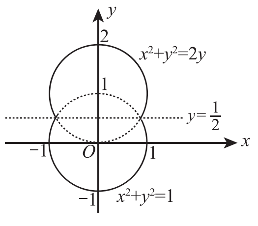

# 2011年考研数学二试题

## 一、选择题（本题共8小题，每小题4分，共32分。在每小题给出的四个选项中，只有一项符合题目要求，把所选项前的字母填在题后的括号内。）

（1）已知当 $x \to 0$ 时，函数 $f(x) = 3\sin x - \sin 3x$ 与 $cx^k$ 是等价无穷小，则（　）

（A）$k = 1, c = 4$

（B）$k = 1, c = -4$

（C）$k = 3, c = 4$

（D）$k = 3, c = -4$

（2）设函数 $f(x)$ 在 $x = 0$ 处可导，且 $f(0) = 0$，则 $\lim_{x \to 0}\frac{x^2 f(x) - 2f(x^3)}{x^3} =$（　）

（A）$-2f'(0)$

（B）$-f'(0)$

（C）$f'(0)$

（D）$0$

（3）函数 $f(x) = \ln|(x-1)(x-2)(x-3)|$ 的驻点个数为（　）

（A）0

（B）1

（C）2

（D）3

（4）微分方程 $y'' - \lambda^2 y = e^{\lambda x} + e^{-\lambda x}$（$\lambda > 0$）的特解形式为（　）

（A）$a(e^{\lambda x} + e^{-\lambda x})$

（B）$ax(e^{\lambda x} + e^{-\lambda x})$

（C）$x(ae^{\lambda x} + be^{-\lambda x})$

（D）$x^2(ae^{\lambda x} + be^{-\lambda x})$

（5）设函数 $f(x), g(x)$ 均有二阶连续导数，满足 $f(0) > 0, g(0) < 0$，且 $f'(0) = g'(0) = 0$，则函数 $z = f(x)g(y)$ 在点 $(0, 0)$ 处取得极小值的一个充分条件是（　）

（A）$f''(0) < 0, g''(0) > 0$

（B）$f''(0) < 0, g''(0) < 0$

（C）$f''(0) > 0, g''(0) > 0$

（D）$f''(0) > 0, g''(0) < 0$

（6）设 $I = \int_0^{\frac{\pi}{4}}\ln(\sin x)dx, J = \int_0^{\frac{\pi}{4}}\ln(\cot x)dx, K = \int_0^{\frac{\pi}{4}}\ln(\cos x)dx$，则 $I, J, K$ 的大小关系为（　）

（A）$I < J < K$

（B）$I < K < J$

（C）$J < I < K$

（D）$K < J < I$

（7）设 $\boldsymbol{A}$ 为3阶矩阵，将 $\boldsymbol{A}$ 的第2列加到第1列得矩阵 $\boldsymbol{B}$，再交换 $\boldsymbol{B}$ 的第2行与第3行得单位矩阵。记 $\boldsymbol{P}_1 = \begin{pmatrix} 1 & 0 & 0 \\ 1 & 1 & 0 \\ 0 & 0 & 1 \end{pmatrix}, \boldsymbol{P}_2 = \begin{pmatrix} 1 & 0 & 0 \\ 0 & 0 & 1 \\ 0 & 1 & 0 \end{pmatrix}$，则 $\boldsymbol{A} =$（　）

（A）$\boldsymbol{P}_1\boldsymbol{P}_2$

（B）$\boldsymbol{P}_1^{-1}\boldsymbol{P}_2$

（C）$\boldsymbol{P}_2\boldsymbol{P}_1$

（D）$\boldsymbol{P}_2\boldsymbol{P}_1^{-1}$

（8）设 $\boldsymbol{A} = (\boldsymbol{\alpha}_1, \boldsymbol{\alpha}_2, \boldsymbol{\alpha}_3, \boldsymbol{\alpha}_4)$ 是4阶矩阵，$\boldsymbol{A}^*$ 为 $\boldsymbol{A}$ 的伴随矩阵。若 $(1, 0, 1, 0)^T$ 是方程组 $\boldsymbol{Ax} = \boldsymbol{0}$ 的一个基础解系，则 $\boldsymbol{A}^*\boldsymbol{x} = \boldsymbol{0}$ 的基础解系可为（　）

（A）$\boldsymbol{\alpha}_1, \boldsymbol{\alpha}_3$

（B）$\boldsymbol{\alpha}_1, \boldsymbol{\alpha}_2$

（C）$\boldsymbol{\alpha}_1, \boldsymbol{\alpha}_2, \boldsymbol{\alpha}_3$

（D）$\boldsymbol{\alpha}_2, \boldsymbol{\alpha}_3, \boldsymbol{\alpha}_4$

## 二、填空题（本题共6小题，每小题4分，共24分，把答案填在题中横线上。）

（9）$\lim_{x \to 0}\left(\frac{1 + 2^x}{2}\right)^{\frac{1}{x}} =$ ______.

（10）微分方程 $y' + y = e^{-x}\cos x$ 满足条件 $y(0) = 0$ 的解为 $y =$ ______.

（11）曲线 $y = \int_0^x \tan t dt$（$0 \le x \le \frac{\pi}{4}$）的弧长 $s =$ ______.

（12）设函数 $f(x) = \begin{cases} \lambda e^{-\lambda x}, & x > 0, \\ 0, & x \le 0, \end{cases} \lambda > 0$，则 $\int_{-\infty}^{+\infty} x f(x)dx =$ ______.

（13）设平面区域 $D$ 由直线 $y = x$，圆 $x^2 + y^2 = 2y$ 及 $y$ 轴所围成，则二重积分 $\iint_D xy d\sigma =$ ______.

（14）二次型 $f(x_1, x_2, x_3) = x_1^2 + 3x_2^2 + x_3^2 + 2x_1x_2 + 2x_1x_3 + 2x_2x_3$，则 $f$ 的正惯性指数为 ______.

## 三、解答题（本题共9小题，共94分，解答应写出文字说明、证明过程或演算步骤。）

（15）（本题满分10分）

已知函数 $F(x) = \frac{\int_0^x \ln(1 + t^2)dt}{x^\alpha}$。设 $\lim_{x \to +\infty}F(x) = \lim_{x \to 0^+}F(x) = 0$，试求 $\alpha$ 的取值范围。

（16）（本题满分11分）

设函数 $y = y(x)$ 由参数方程 $\begin{cases} x = \frac{1}{3}t^3 + t + \frac{1}{3}, \\ y = \frac{1}{3}t^3 - t + \frac{1}{3} \end{cases}$ 确定，求 $y = y(x)$ 的极值和曲线 $y = y(x)$ 的凹凸区间及拐点。

（17）（本题满分9分）

设函数 $z = f(xy, yg(x))$，其中函数 $f$ 具有二阶连续偏导数，函数 $g(x)$ 可导且在 $x = 1$ 处取得极值 $g(1) = 1$，求 $\left.\frac{\partial^2 z}{\partial x \partial y}\right|_{\substack{x = 1 \\ y = 1}}$.

（18）（本题满分10分）

设函数 $y(x)$ 具有二阶导数，且曲线 $l: y = y(x)$ 与直线 $y = x$ 相切于原点。记 $\alpha$ 为曲线 $l$ 在点 $(x, y)$ 处切线的倾角，若 $\frac{d\alpha}{dx} = \frac{dy}{dx}$，求 $y(x)$ 的表达式。

（19）（本题满分10分）

（Ⅰ）证明：对任意的正整数 $n$，都有 $\frac{1}{n+1} < \ln\left(1 + \frac{1}{n}\right) < \frac{1}{n}$ 成立；

（Ⅱ）设 $a_n = 1 + \frac{1}{2} + \cdots + \frac{1}{n} - \ln n$（$n = 1, 2, \cdots$），证明数列 $\{a_n\}$ 收敛。

（20）（本题满分11分）

一容器的内侧是由图中曲线绕 $y$ 轴旋转一周而成的曲面，该曲线由 $x^2 + y^2 = 2y$（$y \ge \frac{1}{2}$）与 $x^2 + y^2 = 1$（$y \le \frac{1}{2}$）连接而成。

（Ⅰ）求容器的容积；

（Ⅱ）若将容器内盛满的水从容器顶部全部抽出，至少需要做多少功？

（长度单位：m，重力加速度为 $g \text{ m/s}^2$，水的密度为 $10^3 \text{ kg/m}^3$）

（21）（本题满分11分）

已知函数 $f(x, y)$ 具有二阶连续偏导数，且 $f(1, y) = f(x, 1) = 0$，$\iint_D f(x, y)dxdy = a$，其中 $D = \{(x, y) \mid 0 \le x \le 1, 0 \le y \le 1\}$，计算二重积分 $I = \iint_D xy f''_{xy}(x, y)dxdy$.

（22）（本题满分11分）

设向量组 $\boldsymbol{\alpha}_1 = (1, 0, 1)^T, \boldsymbol{\alpha}_2 = (0, 1, 1)^T, \boldsymbol{\alpha}_3 = (1, 3, 5)^T$ 不能由向量组 $\boldsymbol{\beta}_1 = (1, 1, 1)^T, \boldsymbol{\beta}_2 = (1, 2, 3)^T, \boldsymbol{\beta}_3 = (3, 4, a)^T$ 线性表示。

（Ⅰ）求 $a$ 的值；

（Ⅱ）将 $\boldsymbol{\beta}_1, \boldsymbol{\beta}_2, \boldsymbol{\beta}_3$ 用 $\boldsymbol{\alpha}_1, \boldsymbol{\alpha}_2, \boldsymbol{\alpha}_3$ 线性表示。

（23）（本题满分11分）

设 $\boldsymbol{A}$ 为3阶实对称矩阵，$\boldsymbol{A}$ 的秩为2，且

$$
\boldsymbol{A}\begin{pmatrix} 1 & 1 \\ 0 & 0 \\ -1 & 1 \end{pmatrix} = \begin{pmatrix} -1 & 1 \\ 0 & 0 \\ 1 & 1 \end{pmatrix}.
$$

（Ⅰ）求 $\boldsymbol{A}$ 的所有特征值与特征向量；

（Ⅱ）求矩阵 $\boldsymbol{A}$。
