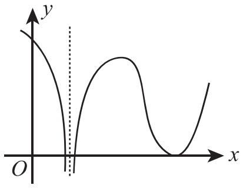

# 2016年考研数学二试题

## 一、选择题（本题共8小题，每小题4分，共32分。在每小题给出的四个选项中，只有一项符合题目要求，把所选项前的字母填在题后的括号内。）

（1）设 $\alpha_1 = x(\cos\sqrt{x} - 1)$，$\alpha_2 = \sqrt{x}\ln(1 + \sqrt[3]{x})$，$\alpha_3 = \sqrt[3]{x + 1} - 1$. 当 $x \to 0^+$ 时，以上3个无穷小量按照从低阶到高阶的排序是（　）

（A）$\alpha_1, \alpha_2, \alpha_3$.

（B）$\alpha_2, \alpha_3, \alpha_1$.

（C）$\alpha_2, \alpha_1, \alpha_3$.

（D）$\alpha_3, \alpha_2, \alpha_1$.

（2）已知函数 $f(x) = \begin{cases} 2(x - 1), & x < 1, \\ \ln x, & x \geqslant 1, \end{cases}$ 则 $f(x)$ 的一个原函数是（　）

（A）$F(x) = \begin{cases} (x - 1)^2, & x < 1, \\ x(\ln x - 1), & x \geqslant 1. \end{cases}$

（B）$F(x) = \begin{cases} (x - 1)^2, & x < 1, \\ x(\ln x + 1) - 1, & x \geqslant 1. \end{cases}$

（C）$F(x) = \begin{cases} (x - 1)^2, & x < 1, \\ x(\ln x + 1) + 1, & x \geqslant 1. \end{cases}$

（D）$F(x) = \begin{cases} (x - 1)^2, & x < 1, \\ x(\ln x - 1) + 1, & x \geqslant 1. \end{cases}$

（3）反常积分 ① $\int_{-\infty}^0 \frac{1}{x^2}e^{\frac{1}{x}}\,\mathrm{d}x$，② $\int_0^{+\infty} \frac{1}{x^2}e^{\frac{1}{x}}\,\mathrm{d}x$ 的敛散性为（　）

（A）①收敛，②收敛.

（B）①收敛，②发散.

（C）①发散，②收敛.

（D）①发散，②发散.

（4）设函数 $f(x)$ 在 $(-\infty, +\infty)$ 内连续，其导函数的图形如图所示，则（　）

（A）函数 $f(x)$ 有2个极值点，曲线 $y = f(x)$ 有2个拐点.

（B）函数 $f(x)$ 有2个极值点，曲线 $y = f(x)$ 有3个拐点.

（C）函数 $f(x)$ 有3个极值点，曲线 $y = f(x)$ 有1个拐点.

（D）函数 $f(x)$ 有3个极值点，曲线 $y = f(x)$ 有2个拐点.

（5）设函数 $f_i(x) \ (i = 1, 2)$ 具有二阶连续导数，且 $f_i''(x_0) < 0 \ (i = 1, 2)$. 若两条曲线 $y = f_i(x) \ (i = 1, 2)$ 在点 $(x_0, y_0)$ 处具有公切线 $y = g(x)$，且在该点处曲线 $y = f_1(x)$ 的曲率大于曲线 $y = f_2(x)$ 的曲率，则在 $x_0$ 的某个邻域内，有（　）

（A）$f_1(x) \leqslant f_2(x) \leqslant g(x)$.

（B）$f_2(x) \leqslant f_1(x) \leqslant g(x)$.

（C）$f_1(x) \leqslant g(x) \leqslant f_2(x)$.

（D）$f_2(x) \leqslant g(x) \leqslant f_1(x)$.

（6）已知函数 $f(x, y) = \frac{e^x}{x - y}$，则（　）

（A）$f'_x - f'_y = 0$.

（B）$f'_x + f'_y = 0$.

（C）$f'_x - f'_y = f$.

（D）$f'_x + f'_y = f$.

（7）设 $\boldsymbol{A}, \boldsymbol{B}$ 是可逆矩阵，且 $\boldsymbol{A}$ 与 $\boldsymbol{B}$ 相似，则下列结论错误的是（　）

（A）$\boldsymbol{A}^{\mathrm{T}}$ 与 $\boldsymbol{B}^{\mathrm{T}}$ 相似.

（B）$\boldsymbol{A}^{-1}$ 与 $\boldsymbol{B}^{-1}$ 相似.

（C）$\boldsymbol{A} + \boldsymbol{A}^{\mathrm{T}}$ 与 $\boldsymbol{B} + \boldsymbol{B}^{\mathrm{T}}$ 相似.

（D）$\boldsymbol{A} + \boldsymbol{A}^{-1}$ 与 $\boldsymbol{B} + \boldsymbol{B}^{-1}$ 相似.

（8）设二次型 $f(x_1, x_2, x_3) = a(x_1^2 + x_2^2 + x_3^2) + 2x_1x_2 + 2x_2x_3 + 2x_1x_3$ 的正、负惯性指数分别为1，2，则（　）

（A）$a > 1$.

（B）$a < -2$.

（C）$-2 < a < 1$.

（D）$a = 1$ 或 $a = -2$.

## 二、填空题（本题共6小题，每小题4分，共24分，把答案填在题中横线上。）

（9）曲线 $y = \frac{x^3}{1 + x^2} + \arctan(1 + x^2)$ 的斜渐近线方程为 ______.

（10）极限 $\lim_{n \to \infty} \frac{1}{n^2}\left(\sin\frac{1}{n} + 2\sin\frac{2}{n} + \cdots + n\sin\frac{n}{n}\right) =$ ______.

（11）以 $y = x^2 - e^x$ 和 $y = x^2$ 为特解的一阶非齐次线性微分方程为 ______.

（12）已知函数 $f(x)$ 在 $(-\infty, +\infty)$ 上连续，且 $f(x) = (x + 1)^2 + 2\int_0^x f(t)\,\mathrm{d}t$，则当 $n \geqslant 2$ 时，$f^{(n)}(0) =$ ______.

（13）已知动点 $P$ 在曲线 $y = x^3$ 上运动，记坐标原点与点 $P$ 间的距离为 $l$. 若点 $P$ 的横坐标对时间的变化率为常数 $v_0$，则当点 $P$ 运动到点 $(1, 1)$ 时，$l$ 对时间的变化率是 ______.

（14）设矩阵 $\boldsymbol{A} = \begin{pmatrix} a & -1 & -1 \\ -1 & a & -1 \\ -1 & -1 & a \end{pmatrix}$ 与矩阵 $\begin{pmatrix} 1 & 1 & 0 \\ 0 & -1 & 1 \\ 1 & 0 & 1 \end{pmatrix}$ 等价，则 $a =$ ______.

## 三、解答题（本题共9小题，共94分，解答应写出文字说明、证明过程或演算步骤。）

（15）（本题满分10分）

求极限 $\lim_{x \to 0} (\cos 2x + 2x\sin x)^{\frac{1}{x^4}}$.

（16）（本题满分10分）

设函数 $f(x) = \int_0^1 |t^2 - x^2|\,\mathrm{d}t \ (x > 0)$，求 $f'(x)$，并求 $f(x)$ 的最小值.

（17）（本题满分10分）

已知函数 $z = z(x, y)$ 由方程 $(x^2 + y^2)z + \ln z + 2(x + y + 1) = 0$ 确定，求 $z = z(x, y)$ 的极值.

（18）（本题满分10分）

设 $D$ 是由直线 $y = 1$，$y = x$，$y = -x$ 围成的有界区域，计算二重积分 $\iint_D \frac{x^2 - xy - y^2}{x^2 + y^2}\,\mathrm{d}x\mathrm{d}y$.

（19）（本题满分10分）

已知 $y_1(x) = e^x$，$y_2(x) = u(x)e^x$ 是二阶微分方程 $(2x - 1)y'' - (2x + 1)y' + 2y = 0$ 的两个解. 若 $u(-1) = e$，$u(0) = -1$，求 $u(x)$，并写出该微分方程的通解.

（20）（本题满分11分）

设 $D$ 是由曲线 $y = \sqrt{1 - x^2} \ (0 \leqslant x \leqslant 1)$ 与 $\begin{cases} x = \cos^3 t, \\ y = \sin^3 t, \end{cases} \ \left(0 \leqslant t \leqslant \frac{\pi}{2}\right)$ 围成的平面区域，求 $D$ 绕 $x$ 轴旋转一周所得旋转体的体积和表面积.

（21）（本题满分11分）

已知函数 $f(x)$ 在区间 $\left[0, \frac{3\pi}{2}\right]$ 上连续，在 $\left(0, \frac{3\pi}{2}\right)$ 内是函数 $\frac{\cos x}{2x - 3\pi}$ 的一个原函数，且 $f(0) = 0$.

（Ⅰ）求 $f(x)$ 在区间 $\left[0, \frac{3\pi}{2}\right]$ 上的平均值；

（Ⅱ）证明 $f(x)$ 在区间 $\left(0, \frac{3\pi}{2}\right)$ 内存在唯一零点.

（22）（本题满分11分）

设矩阵 $\boldsymbol{A} = \begin{pmatrix} 1 & 1 & 1-a \\ 1 & 0 & a \\ a+1 & 1 & a+1 \end{pmatrix}$，$\boldsymbol{\beta} = \begin{pmatrix} 0 \\ 1 \\ 2a-2 \end{pmatrix}$，且方程组 $\boldsymbol{Ax} = \boldsymbol{\beta}$ 无解.

（Ⅰ）求 $a$ 的值；

（Ⅱ）求方程组 $\boldsymbol{A}^{\mathrm{T}}\boldsymbol{Ax} = \boldsymbol{A}^{\mathrm{T}}\boldsymbol{\beta}$ 的通解.

（23）（本题满分11分）

已知矩阵 $\boldsymbol{A} = \begin{pmatrix} 0 & -1 & 1 \\ 2 & -3 & 0 \\ 0 & 0 & 0 \end{pmatrix}$.

（Ⅰ）求 $\boldsymbol{A}^{99}$；

（Ⅱ）设3阶矩阵 $\boldsymbol{B} = (\boldsymbol{\alpha}_1, \boldsymbol{\alpha}_2, \boldsymbol{\alpha}_3)$ 满足 $\boldsymbol{B}^2 = \boldsymbol{BA}$. 记 $\boldsymbol{B}^{100} = (\boldsymbol{\beta}_1, \boldsymbol{\beta}_2, \boldsymbol{\beta}_3)$，将 $\boldsymbol{\beta}_1, \boldsymbol{\beta}_2, \boldsymbol{\beta}_3$ 分别表示为 $\boldsymbol{\alpha}_1, \boldsymbol{\alpha}_2, \boldsymbol{\alpha}_3$ 的线性组合.
