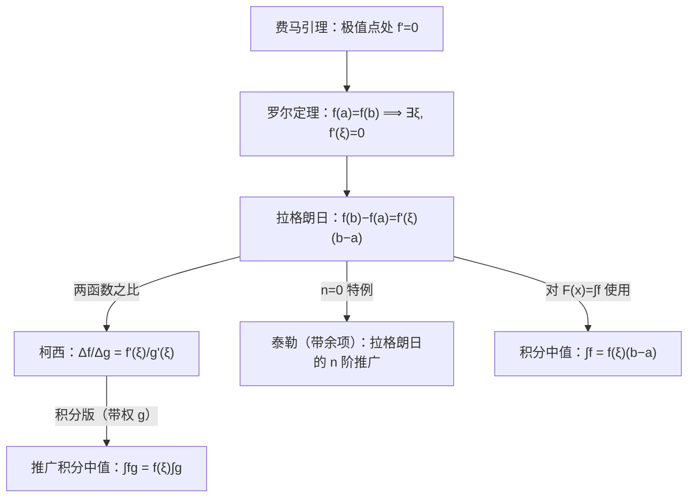

> 返回：[[06 第6讲 一元函数微分学的应用（二）中值定理与泰勒公式]] | 返回目录：[[高等数学公式速查]]

# 第6讲（一）中值定理与辅助函数构造

> [!abstract] 本讲定位
> 费马引理、四大中值定理（罗尔/拉格朗日/柯西/积分中值）、构造辅助函数证明套路（乘积/除法/指数因子）。

## 费马引理（张宇第6讲，一切中值定理的起点）

$$
\boxed{\text{$f$ 在 }x_0\text{ 处取极值且可导}\ \Longrightarrow\ f'(x_0)=0}
$$

- **极值点**（局部最大/最小）是证明题构造的出发点：罗尔定理正是对取到端点等值内部的极值点用费马引理证得 $f'(\xi)=0$。
- 条件缺一不可：**可导**（不可导点如 $\lvert x\rvert$ 在 0 处取极小但 $f'(0)$ 不存在）；**极值**（驻点不一定是极值点，如 $x^3$ 在 0 处 $f'(0)=0$ 但无极值）。
- **用途**：① 找极值候选点（驻点 + 不可导点 + 端点）；② 证明"可导函数在开区间内部取最值 ⟹ 该点为驻点"。

**达布定理（导数的介值性，了解）**：$f$ 在 $[a,b]$ 可导，$f'_-(a)<\mu<f'_+(b)$（或 $f'(a)<\mu<f'(b)$）⟹ $\exists\,\xi\in(a,b):\ f'(\xi)=\mu$。

推论：**导函数没有第一类间断点**（跳跃间断不可能出现在导函数上）——这是第8讲"有第一类间断的函数无原函数"的根源（[[08 第8讲 一元函数积分学的概念与性质]]）。

> [!example] **导数零点定理**（达布定理的直接推论，张宇例6.3）
> 设 $f$ 在 $[a,b]$ 可导，且端点单侧导数异号：
> $$
> f'_+(a)\cdot f'_-(b)<0
> $$
> 则
> $$
> \exists\,\xi\in(a,b):\ f'(\xi)=0
> $$
>
> **证（走费马引理）**：由 $f'_+(a)>0$，在 $a$ 的右邻域
> $$
> f(x)>f(a)
> $$
> 由 $f'_-(b)<0$，在 $b$ 的左邻域
> $$
> f(x)>f(b)
> $$
> 故 $f$ 在 $[a,b]$ 上的最大值在内部取得，由费马引理即得。

---

## 四大中值定理

| 定理 | 条件 | 结论 |
| :-- | :-- | :-- |
| 罗尔 | $[a,b]$ 连续、$(a,b)$ 可导、$f(a)=f(b)$ | $\exists\,\xi\in(a,b):\ f'(\xi)=0$ |
| 拉格朗日 | $[a,b]$ 连续、$(a,b)$ 可导 | $f(b)-f(a)=f'(\xi)(b-a)$ |
| 柯西 | 再加 $g'(x)\ne 0$ | $\dfrac{f(b)-f(a)}{g(b)-g(a)}=\dfrac{f'(\xi)}{g'(\xi)}$ |
| 积分中值 | $f$ 在 $[a,b]$ 连续 | $\displaystyle\int_a^b f\,dx=f(\xi)(b-a),\ \xi\in[a,b]$ |

> **定理之间的关系（一张图记全）**：

> [!note] **两条推广形式（无穷区间专用）**
> - **推广零点定理**：$f$ 在 $(a,b)$ 内连续，$\lim\limits_{x\to a^+}f=\alpha$、$\lim\limits_{x\to b^-}f=\beta$，$\alpha\beta<0$ ⟹ $f(x)=0$ 在 $(a,b)$ 内至少有一个根；
>   - 注：$a,b,\alpha,\beta$ 都可为 $\pm\infty$。
> - **推广罗尔定理**：$f$ 在 $(a,b)$ 内可导，$\lim\limits_{x\to a^+}f=\lim\limits_{x\to b^-}f=A$ ⟹ $\exists\,\xi\in(a,b):\ f'(\xi)=0$。
> 用法：端点无定义或区间为无穷时，把端点极限当成"函数值"即可套罗尔/零点定理。

> [!note] **判断 $f'$ 有界 ⟹ $f$ 有界（拉格朗日过渡）**
> 设 $f$ 在 $(a,b)$ 可导且 $f'$ **有界**（$\lvert f'\rvert\le k$），取 $x_0\in(a,b)$，则
> $$
> \begin{aligned}
> \lvert f(x)\rvert&\le\lvert f(x_0)\rvert+\lvert f'(\xi)\rvert\lvert x-x_0\rvert\\[4pt]
> &\le\lvert f(x_0)\rvert+k(b-a)
> \end{aligned}
> $$
> ⟹ $f$ 在 $(a,b)$ 有界。
> 拉格朗日中值定理的精髓：**用导函数的值控制函数值的增减**。

> [!note] **离散平均值定理**（张宇第6讲，★★★考过很多次）
> 设 $f(x)$ 在 $[a,b]$ 上连续，$x_1,x_2,\dots,x_n$ 是 $[a,b]$ 内任意 $n$ 个点，则
> $$
> \boxed{\exists\,\xi\in[a,b]:\ f(\xi)=\frac{f(x_1)+f(x_2)+\cdots+f(x_n)}{n}}
> $$
> 即连续函数在有限个点上的平均值必被函数取到。由最值定理+介值定理一步推出。
>
> **典型应用**：已知 $f(0)+f(1)+f(2)=3$，$f$ 在 $[0,2]$ 连续 ⟹ $\exists\,\xi\in(0,2):\ f(\xi)=1$。再配合罗尔定理可证 $f'(\xi_0)=0$。

---

![[高数-拉格朗日中值定理.png|450]]
*拉格朗日中值定理：存在 $\xi$ 使切线平行于割线 $AB$*
## 证明题套路：构造辅助函数

把待证式整理成「某函数的导数在 $\xi$ 处为零」，常用对照表：

| 待证式中出现 | 构造 $F(x)$ | 依据 |
| :-- | :-- | :-- |
| $f'+\lambda f$ | $f(x)\,e^{\lambda x}$ | $(fe^{\lambda x})'=e^{\lambda x}(f'+\lambda f)$ |
| $f'g-fg'$ | $\dfrac{f(x)}{g(x)}$ | 商导数的分子 |
| $ff'$ | $f^{2}(x)$ | $(f^{2})'=2ff'$ |
| $xf'+f$ | $x\,f(x)$ | 乘积导数 |
| $xf'-f$ | $\dfrac{f(x)}{x}$ | $\Bigl(\dfrac{f}{x}\Bigr)'=\dfrac{xf'-f}{x^{2}}$ |
| $f'(\xi)=k$（常数） | $f(x)-kx$ | 罗尔 |
| $\dfrac{f'}{f}$ | $\ln\lvert f(x)\rvert$ | 对数导数 |
| $f''f+[f']^{2}$ | $f'\cdot f$ | $(ff')'=[f']^{2}+ff''$ |
| $f''f-[f']^{2}$（$f>0$） | $\dfrac{f'}{f}$ 或 $\ln f$ | $\bigl(\dfrac{f'}{f}\bigr)'=\dfrac{f''f-[f']^{2}}{f^{2}}$ |

> [!tip] **多次罗尔定理（证 $f^{(n)}(\xi)=0$）**
> 找**三个等值点** $f(a)=f(b)=f(c)$（不妨 $a<b<c$）：
> - 在 $[a,b]$、$[b,c]$ 各用一次罗尔得 $f'(\xi_1)=f'(\xi_2)=0$；
> - 在 $[\xi_1,\xi_2]$ 再用一次罗尔得 $f''(\xi)=0$。
> **口诀**："$n+1$ 个等值点 → $n$ 次罗尔 → $f^{(n)}$ 有零点"。常配合"直线 $AB$ 与曲线相交于第三点 $C$"的几何背景，造 $F(x)=f(x)-$ 直线。
> 注：证 $f^{(n)}(\xi)=0$ 多用罗尔；证 $f^{(n)}(\xi)\ne0$（不等式）多用泰勒公式。

- **双中值 $\xi,\eta$**：拆成两段各用一次拉格朗日；或一次拉格朗日 + 一次柯西（$g$ 取 $x^{2},e^{x}$ 等）。
- **端点组合**（式含 $f(a),f(b),f\bigl(\tfrac{a+b}{2}\bigr)$ 或二阶导）：往泰勒展开靠（在中点/端点展开再相加减）。
- 用罗尔前先凑出"两端函数值相等"，必要时用零点/介值定理先造出等值点。

> [!example] 例：双中值（结论中 $\xi,\eta$ 同时出现）
> （1）设 $f$ 在 $[a,b]$ 连续、$(a,b)$ 可导，$f(a)=f(b)$，证 $\exists\,\xi\in(a,c),\ \eta\in(c,b)$（$c=\dfrac{a+b}{2}$）使 $f'(\xi)+f'(\eta)=0$。
> 在 $[a,c]$、$[c,b]$ 各用一次拉格朗日：
> $$
> f'(\xi)=\dfrac{f(c)-f(a)}{c-a}，f'(\eta)=\dfrac{f(b)-f(c)}{b-c}
> $$
> 而 $c-a=b-c$、$f(a)=f(b)$ ⟹ 相加为 $0$。
> （2）设 $f$ 在 $[a,b]$ 连续、$(a,b)$ 可导（$a>0$），证 $\exists\,\xi,\eta\in(a,b)$ 使 $f'(\xi)=\dfrac{a+b}{2\eta}f'(\eta)$。
> 柯西（取 $g(x)=x^2$）：
> $$
> \dfrac{f(b)-f(a)}{b^2-a^2}=\dfrac{f'(\eta)}{2\eta}
> $$
> 拉格朗日：
> $$
> f'(\xi)=\dfrac{f(b)-f(a)}{b-a}
> $$
> 相除消去差商即得。

> [!example] 例：二阶导不等式（泰勒端点相加减）
> 设 $f$ 在 $[a,b]$ 二阶可导，$f(a)=f(b)=0$，且存在 $c\in(a,b)$ 使 $f(c)<0$，证 $\exists\,\xi\in(a,b)$ 使 $f''(\xi)\ge\dfrac{-2f(c)}{(c-a)(b-c)}>0$。
> **解**：在 $c$ 处带拉格朗日余项展至二阶：
> $$
> \begin{aligned}
> f(a)&=f(c)+f'(c)(a-c)+\dfrac{f''(\xi_1)}{2}(a-c)^2，\\[4pt]
> f(b)&=f(c)+f'(c)(b-c)+\dfrac{f''(\xi_2)}{2}(b-c)^2
> \end{aligned}
> $$
> 以 $(b-c)$、$(c-a)$ 加权相加消去 $f'(c)$：
> $$
> (b-a)f(c)=-\dfrac12\bigl[(b-c)(c-a)^2f''(\xi_1)+(c-a)(b-c)^2f''(\xi_2)\bigr]
> $$
> 取 $\xi$ 为 $\xi_1,\xi_2$ 中 $f''$ 较大者，则
> $$
> f''(\xi)\,(c-a)(b-c)(b-a)\ge-2(b-a)f(c)
> $$
> ⟹ $f''(\xi)\ge\dfrac{-2f(c)}{(c-a)(b-c)}>0$。

> [!note] **罗尔原话（精确推论，必背）**
> 若 $f^{(n)}(x)=0$ 至多有 $k$ 个实根，则 $f(x)=0$ 至多有 $k+n$ 个实根（**阶数降几阶、根数加几根**）。
> - 推论：$f^{(n)}$ 无零点 ⟹ $f$ 至多 $n$ 个零点；$f^{(n)}$ 至多 $n$ 个根 ⟹ $f$ 至多 $2n$ 个根。
> - "以阶数换根数"：先逐阶求导把根的控制上限交给高阶导，再用"观察法 + 零点定理"凑足下界。

> [!note] **实系数奇次方程至少有一个实根**
> 设 $f(x)=x^{2n+1}+a_1 x^{2n}+\cdots+a_{2n+1}$，则 $\lim\limits_{x\to+\infty}f=+\infty$、$\lim\limits_{x\to-\infty}f=-\infty$；
> 由连续性 + 推广零点定理 ⟹ $f(x)=0$ 在 $\mathbb{R}$ 上至少有一个实根。
> 若再能验证 $f'$ 恒正（或恒负），则 $f$ 严格单调，结合两端极限符号相反 ⟹ 恰有一个实根（**唯一实根**）。注意"至多两个根 + 至少一个根"只能推出根数为 1 或 2，要唯一还需排除两根情形（严格单调即可）。
> 验证 $f'$ 恒正的常用途径：$f''>0$ 且某点导数 $\ge0$ ⟹ $f'$ 递增且恒正（恒负同理：$f''<0$ 且某点导数 $\le0$）。

---