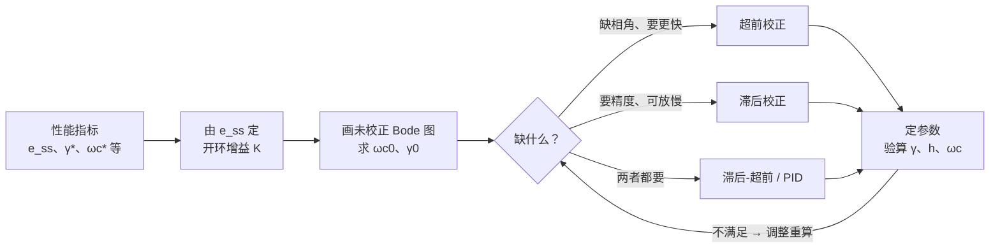

---
create: 2026-07-25
modify: 2026-08-14
tags: [知识点, 自动控制原理, 公式速查]
---

> 返回：[[06 第6章 线性系统的校正方法]] | 返回目录：[[自动控制原理]]

# 第 6 章（二）PID 与反馈/前馈校正

## 🔧 6.4 PID 校正

$
\boxed{G_c(s) = K_p\left(1+\frac{1}{T_is}+T_ds\right) = K_p+\frac{K_i}{s}+K_ds}

$

- **P**：加快响应、减小（不消除）稳态误差；过大降低稳定性。
- **I**：消除稳态误差（提高型别）；引入 $-90°$ 相角滞后，降低稳定性。
- **D**：反映误差变化率，增加阻尼、抑制超调；放大高频噪声。
- 实际微分常用 $\dfrac{T_ds}{1+T_fs}$（惯性滤波）。

**齐格勒–尼科尔斯（临界比例度）整定**：纯比例下增大增益至等幅振荡，记临界增益 $K_r$、振荡周期 $T_r$：

| 控制器 |   $K_p$   |   $T_i$   |   $T_d$   |
| :----: | :---------: | :---------: | :----------: |
|   P   | $0.5K_r$ |     —     |      —      |
|   PI   | $0.45K_r$ | $T_r/1.2$ |      —      |
|  PID  | $0.6K_r$ | $0.5T_r$ | $0.125T_r$ |

---

## 🔧 6.5 反馈校正

用局部反馈 $G_c$ 包围被校正环节 $G_2$：

$
\boxed{\frac{G_2}{1+G_2G_c}\ \xrightarrow{\ \lvert G_2G_c\rvert\gg1\ }\ \frac{1}{G_c}}

$

深度负反馈下该段特性主要由反馈通道决定，可**削弱参数波动、非线性与内部扰动的影响**；常用测速反馈增大阻尼。

---

## 🔧 6.6 前馈（复合）校正

- **按扰动补偿**：测量扰动，经前馈通道抵消其对输出的影响（对扰动的不变性）。
- **按输入补偿**：前馈通道 + 反馈，理论上可实现输出完全复现输入（误差全补偿）。
- 全补偿条件由结构图令 $E(s)\equiv0$ 求得；工程上常用部分补偿。前馈不改变闭环特征方程，**不影响稳定性**。
- **前置滤波器**（教材 6-5 节）：串联校正（如 PI）会给闭环引入新零点、加大超调，可在输入端串接前置滤波器（如 $G_p(s)=\dfrac{z}{s+z}$ 对消闭环零点 $-z$）；前置滤波器在闭环外，不影响闭环极点。

**按扰动补偿的全补偿条件**（常考推导，教材式 6-42~6-44）：

设被控对象分为 $G_1(s)$（扰动作用点前）和 $G_2(s)$（扰动作用点后），扰动 $N(s)$ 作用于 $G_1(s)$、$G_2(s)$ 之间，另设扰动补偿器 $G_c(s)$ 前馈进入。扰动对输出的传递函数：

$
\frac{C(s)}{N(s)} = \frac{G_2(s)\big[1 + G_c(s)G_1(s)\big]}{1 + G_1(s)G_2(s)H(s)}

$

其中 $G_c(s)$ 为扰动前馈补偿器。令 $C(s)/N(s)=0$，得**全补偿条件**：

$
\boxed{G_c(s) = -\frac{1}{G_1(s)}}

$

同理，**按输入补偿的全补偿条件**（教材式 6-49~6-61）：设输入前馈补偿器 $G_r(s)$ 置于闭环之前，令 $E(s)=R(s)-C(s)=0$ 得

$
\boxed{G_r(s) = \frac{1}{G(s)}}\qquad\text{或等价地}\qquad \text{等效开环传递函数 } G_{\text{等效}}(s)=\infty

$

工程上用部分补偿：对输入信号的主要频率分量满足 $|G_r(\mathrm{j}\omega)G(\mathrm{j}\omega)|\gg1$ 即可大幅减小误差。

---

## 📖 6.7 校正设计总流程

超前、滞后的分步设计见 6.1、6.2；验算不合格时调整 $\varphi_m$ 补偿量或更换校正方式。
