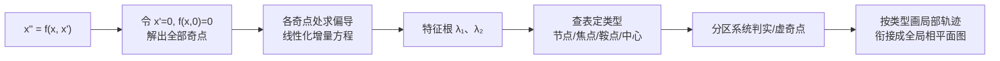
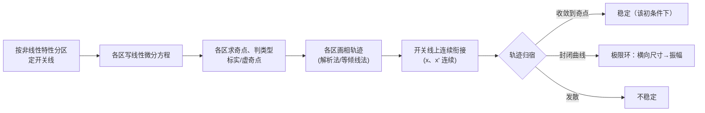
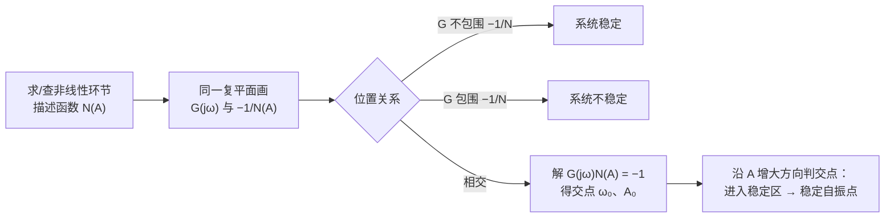

> 返回目录：[[自动控制原理]]

# 第 8 章 非线性控制系统分析

> [!abstract] 本讲定位
> 典型非线性特性、相平面法（奇点/极限环）、描述函数法判自持振荡。

## 8.1 典型非线性特性

### 常见非线性特性及其对系统的影响

| 非线性类型 | 描述 | 对系统的影响 |
|:--|:--|:--|
| **饱和** | 输入超过 ±a 时输出限幅（斜率 k → 0） | 大信号时**等效增益降低**，动态性能变差、稳态误差增大；有时可抑制超调 |
| **死区（不灵敏区）** | | 小信号丢失（稳态误差）、可能引起低速爬行；有时可滤除小幅噪声 |
| **间隙/回环** | 上升/下降行程输出不同，多值非线性 | 相位滞后（类似延迟），易引起振荡；齿轮传动中不可避免 |
| **继电特性** | 开关型（含理想继电、死区继电、滞环继电三种变体） | 常产生**自持振荡**；简单可靠，用于 Bang-Bang 控制 |
| **摩擦特性** | 静摩擦 > 动摩擦（库仑摩擦）+ 黏性摩擦 | 引起低速爬行（stick-slip）和稳态误差 |

### 非线性系统的四个运动特点（常考简答，区别于线性系统）

1. **稳定性与初始条件、输入幅值有关**：不能笼统说"系统稳定"，必须指明在多大的初始扰动/输入下稳定。
2. **可能存在自激振荡（极限环）**：一定条件下产生固定频率和幅值的持续振荡——线性系统仅在临界稳定时才有无衰减振荡，参数稍有变化即偏离。
3. **频率响应发生畸变**：正弦输入下输出含高次谐波（不再是纯正弦）→ 跳跃谐振、倍频/分频振荡。
4. **不满足叠加原理**：不能定义统一的传递函数；不同幅值输入下等效特性不同。

### 等效增益概念（分析非线性影响的统一框架）

对非线性特性 $y = f(x)$，定义**等效增益** $k = y/x$（描述函数中 $N(A)=Y_1/A$ 是其频域推广）：
- 饱和：$x$ 越大等效增益越低（$k \le k_0$ 且随幅值递减）
- 死区：$x$ 越小等效增益越低（$|x|<\Delta$ 时 $k=0$，$|x|\gg\Delta$ 时 $k\approx k_0$）
- 间隙：多值特性使等效增益还含相位滞后分量
- 理想继电：小信号时 $k\to\infty$（→ 自振），大信号时 $k$ 减小

![[非线性-典型特性.png|430]]

---

## 8.2 相平面法

二阶系统 $\ddot x = f(x,\dot x)$ 在 $(x,\dot x)$ 平面上的轨线族。**奇点**（平衡点）按线性化特征根分类：

| 特征根             | 奇点类型       |
| :-- | :-- |
| 两负实根           | 稳定节点       |
| 两正实根           | 不稳定节点     |
| 一正一负实根       | 鞍点（不稳定） |
| 共轭复根，实部为负 | 稳定焦点       |
| 共轭复根，实部为正 | 不稳定焦点     |
| 共轭纯虚根         | 中心           |

![[非线性-相平面奇点.png|430]]

**奇点的求解与判型（计算流程）**：奇点处 $\dot x=0$ 且 $\ddot x=0$，故**奇点必在相平面横轴上**。
① **求奇点**：令 $\dot x=0,\ f(x,0)=0$，解出全部平衡点 $(x_0,0)$（非线性方程可能有多个）；
② **线性化**（教材式 8-38）：$f$ 解析时在 $(x_0,0)$ 处取一次泰勒近似

$$
\begin{aligned}
\Delta\ddot x &= \left.\frac{\partial f}{\partial x}\right|_{(x_0,0)}\!\Delta x
+ \left.\frac{\partial f}{\partial \dot x}\right|_{(x_0,0)}\!\Delta\dot x\\[4pt]
&\quad\Longrightarrow\quad\lambda^2\\[4pt]
&-\left.\frac{\partial f}{\partial \dot x}\right|_0\lambda\\[4pt]
&-\left.\frac{\partial f}{\partial x}\right|_0 = 0
\end{aligned}
$$

③ **判型**：由特征根查上表定奇点类型，确定该邻域相轨迹形态；
④ **分区系统**（折线非线性，$f$ 不解析）：按非线性特性分区写线性方程，各区奇点落在本区为**实奇点**、落在区外为**虚奇点**（只给趋势、不被到达）。

> [!example] **例（教材例 8-2）**
> $\ddot x+0.5\dot x+2x+x^2=0$，即 $f(x,\dot x)=-0.5\dot x-2x-x^2$。
>
> - 求奇点：$-2x-x^2=0$ → $(0,0)$ 与 $(-2,0)$；偏导 $\dfrac{\partial f}{\partial x}=-2-2x$，$\dfrac{\partial f}{\partial \dot x}=-0.5$。
> - $(0,0)$：$\Delta\ddot x+0.5\Delta\dot x+2\Delta x=0$，$\lambda_{1,2}=-0.25\pm\mathrm{j}1.39$ → **稳定焦点**；
> - $(-2,0)$：$\dfrac{\partial f}{\partial x}\Big|_{-2}=+2$，$\Delta\ddot x+0.5\Delta\dot x-2\Delta x=0$；
>   $\lambda_1=1.19>0,\ \lambda_2=-1.69<0$ → **鞍点**。
>
> ![[非线性-相平面例8-2.png|430]]
>
> 鞍点的稳定流形构成**分隔线**（收敛域边界）：域内初态螺旋收敛到焦点，域外发散——体现"非线性系统稳定性与初始条件有关"。

**极限环**：相平面上孤立的封闭轨线，对应自持振荡；分稳定、不稳定、半稳定三类。

**极限环的内外区域划分与可观测性**（教材 §8-2.2，常考简答）：

| 类型 | 环内区域 | 环外区域 | 说明 |
|:--|:--|:--|:--|
| **稳定极限环** | 不稳定（环内轨迹发散卷向环） | 稳定（环外轨迹收敛卷向环） | 任何微小扰动后状态最终回到环，自振只与系统结构参数有关、与初始条件无关——**唯一能在实验中观测到** |
| **不稳定极限环** | 稳定（环内轨迹收敛至环内奇点） | 不稳定（环外轨迹发散至无穷） | 微小扰动不是使运动收敛于环内奇点，就是发散至无穷，实验观测不到 |
| **半稳定极限环** | 一侧收敛、一侧发散 | 与内侧相反 | 图(c)：内外均不稳定，运动最终发散至无穷；图(d)：内外均稳定，运动最终收敛至环内奇点；观测不到 |

- **双极限环**（教材图 8-26）：内环不稳定 + 外环稳定——系统工作状态不仅取决于初始条件，还取决于**扰动的方向和大小**。
- **只有稳定极限环能在实验中观察到**，不稳定与半稳定极限环均无法观测。
- 并非所有封闭曲线都是极限环：无阻尼线性二阶系统的相轨迹是一簇**连续**的封闭曲线（彼此不孤立），不是极限环；极限环**相互孤立**，是非线性系统（非守恒系统）特有的现象——周期运动的原因不是无阻尼，而是非线性特性导致的能量交替变化。

**相轨迹绘制方法**：

**① 解析法**（方程可积时首选）：消去 $t$ 得 $\dfrac{d\dot x}{dx}=\dfrac{f(x,\dot x)}{\dot x}$，可分离变量则直接积分。特别地 $f$ 不含 $\dot x$（无阻尼守恒型）时 $\dot x\,d\dot x=f(x)\,dx$，积分得

$$
\frac{\dot x^2}{2}-\frac{\dot x_0^2}{2}=\int_{x_0}^{x}f(x)\,dx
$$

（教材例 8-1 弹簧-质量系统即此法，轨迹为椭圆族。）分段线性系统在各区内多为此类可积方程，逐区积分后在开关线上衔接。

**② 等倾线法**（画概略图）：令轨迹斜率 $\dfrac{d\dot x}{dx}=\alpha$ 得等倾线方程 $\alpha\dot x=f(x,\dot x)$，在各等倾线上画斜率为 $\alpha$ 的短线场，顺短线方向连成相轨迹。

通用性质：上半平面 $\dot x>0$ → 轨迹**向右**走，下半平面向左；轨迹穿越横轴（非奇点处）时斜率无穷大，**垂直**穿过。

---

## 8.3 描述函数法

**定义来源（傅氏级数展开）**：非线性环节输入 $x=A\sin\omega t$ 时，稳态输出 $y(t)$ 是周期函数，展开为傅氏级数：

$$
y(t)=\frac{A_0}{2}+\sum_{n=1}^{\infty}\bigl(A_n\cos n\omega t+B_n\sin n\omega t\bigr)
$$

由于非线性特性一般为**奇对称**（$A_0=0$，且偶次谐波常为零），取**基波分量**（$n=1$）：

$$
y_1(t)=A_1\cos\omega t+B_1\sin\omega t = Y_1\sin(\omega t+\varphi_1)
$$

其中 $A_1=\dfrac{1}{\pi}\displaystyle\int_0^{2\pi}y(t)\cos\omega t\,d(\omega t)$、$B_1=\dfrac{1}{\pi}\int_0^{2\pi}y(t)\sin\omega t\,d(\omega t)$。
描述函数定义为基波输出对输入的复数比：

$$
\boxed{N(A) = \frac{Y_1}{A}e^{\mathrm{j}\varphi_1} = \frac{B_1+\mathrm{j}A_1}{A}}
$$

**为何只取基波**：非线性环节后的线性部分通常具有**低通滤波特性**，高次谐波被滤除，故仅基波起主要作用。

**由定义直接推导**（Word 补充 doc16，会推导更易记）：以**理想继电** $y(t)=\begin{cases}M,&x>0\\[2pt]-M,&x<0\end{cases}$ 为例，$x=A\sin\omega t$ 时输出为同频方波：
- $A_1=0$（奇对称，$\cos$ 项为零）；
- $B_1=\dfrac{1}{\pi}\int_0^{2\pi}y(t)\sin\omega t\,d(\omega t)=\dfrac{4M}{\pi}$；
  仅在 $y=+M$ 的半周期内积分 $\int_0^\pi M\sin\omega t\,d(\omega t)$ 再乘 $\dfrac{2}{\pi}$；

故 $N(A)=\dfrac{B_1}{A}=\boxed{\dfrac{4M}{\pi A}}$，与查表结果一致。死区/饱和/滞环继电同理由定义积分导出（奇对称性先消 $A_1$，再算 $B_1$ 或含虚部情形）。

**稳定性判别**（将 $-\dfrac{1}{N(A)}$ 曲线视作"广义 $(-1,\mathrm{j}0)$ 点"，设线性部分最小相位）：

- $G(\mathrm{j}\omega)$ 曲线**不包围** $-\dfrac{1}{N(A)}$ 曲线 → 系统稳定；**包围** → 不稳定；
- **相交** → 可能产生自振，交点满足 $G(\mathrm{j}\omega)N(A)=-1$，由交点定自振幅值 $A_0$ 与频率 $\omega_0$；
- 交点处沿 $A$ 增大方向，$-\dfrac{1}{N(A)}$ 曲线由不稳定区进入稳定区者为**稳定自振点**（可观测到的自持振荡）。

![[非线性-描述函数判稳.png|520]]

常用描述函数：

| 非线性特性 | $N(A)$ | 备注 |
|:--|:--|:--|
| 理想继电（幅值 $M$） | $\dfrac{4M}{\pi A}$ | 纯实数，$-\dfrac{1}{N}$ 为整条负实轴 |
| 死区继电（死区 $h$、输出 $M$） | $\dfrac{4M}{\pi A}\sqrt{1-\left(\dfrac{h}{A}\right)^2}$（$A\ge h$） | 奇对称，$-\dfrac{1}{N(A)}$ 在实轴上是**双支**：从 $-\infty$（$A\to h^+$）增至最右点 $-\dfrac{\pi h}{2M}$（$A=\sqrt2\,h$，$N$ 最大），再回折向 $-\infty$（$A\to\infty$）——判自振时两支都要与 $-\dfrac1{G(\mathrm j\omega)}$ 相交检验 |
| 滞环继电（$M$、滞环半宽 $h$） | $\dfrac{4M}{\pi A}\left[\sqrt{1-\left(\dfrac{h}{A}\right)^2}-\mathrm{j}\dfrac{h}{A}\right]$ | **含相角滞后**（$\operatorname{Im}<0$），最易产生自振 |
| 饱和（线性斜率 $k$、线性区宽 $a$） | $\dfrac{2k}{\pi}\left[\arcsin\dfrac{a}{A}+\dfrac{a}{A}\sqrt{1-\left(\dfrac{a}{A}\right)^2}\right]$（$A\ge a$） | $N(A)\le k$，大信号等效增益降低 |
| 死区（死区宽 $\Delta$、斜率 $k$） | $k-\dfrac{2k}{\pi}\left[\arcsin\dfrac{\Delta}{A}+\dfrac{\Delta}{A}\sqrt{1-\left(\dfrac{\Delta}{A}\right)^2}\right]$（$A\ge\Delta$） | $N(A)\le k$，小信号等效增益降低 |
| 死区加饱和（$h$、$a$、$k$） | 分段：$A\le h$ 时 $N=0$，$h<A<a$ 呈上升段，$A\ge a$ 为下降段 | 三个区域各有不同表达式 |
| 库仑摩擦 + 黏性摩擦 | 含常数分量和与速度成正比的线性分量 | 描述函数为纯虚数 $\mathrm{j}\!\left(\dfrac{4M}{\pi A}+B\omega\right)$（等效阻尼，无实部） |
| 间隙（宽度 $2b$、斜率 $k$） | $N(A)=\dfrac{k}{\pi}\big[\frac{\pi}{2}+\arcsin(1-\frac{2b}{A})+2(1-\frac{2b}{A})\sqrt{\frac{b}{A}(1-\frac{b}{A})}\big]-\mathrm{j}\dfrac{4kb}{\pi A}(1-\frac{b}{A})$ | 多值非线性，含虚部，相位滞后严重 |
| 死区+滞环继电（$M$、$h$、$m$） | $\dfrac{2M}{\pi A}\left[\sqrt{1-\left(\dfrac{h}{A}\right)^2}+\sqrt{1-\left(\dfrac{mh}{A}\right)^2}\right]+\mathrm{j}\dfrac{2Mh}{\pi A^2}(m-1)$（$A\ge h$） | $m=1$ 退化为死区继电、$m=-1$ 退化为滞环继电（教材式 8-76） |
| 变增益特性（$K_1$、$K_2$、$s$） | $K_2+\dfrac{2(K_1-K_2)}{\pi}\left[\arcsin\dfrac{s}{A}+\dfrac{s}{A}\sqrt{1-\left(\dfrac{s}{A}\right)^2}\right]$（$A\ge s$） | $\lvert x\rvert\le s$ 内斜率 $K_1$、$\lvert x\rvert>s$ 外斜率 $K_2$（特性连续）；$A\to\infty$ 时 $N\to K_2$、$A=s$ 时 $N=K_1$ |
| 有死区的线性特性（$K$、$M$、$\Delta$） | $K-\dfrac{2K}{\pi}\arcsin\dfrac{\Delta}{A}+\dfrac{4M-2K\Delta}{\pi A}\sqrt{1-\left(\dfrac{\Delta}{A}\right)^2}$（$A\ge\Delta$） | 死区内输出 $0$，$\pm\Delta$ 处有幅值 $M$ 的跳变，死区外输出 $K(x\mp\Delta)\pm M$（斜率 $K$） |

> [!tip] **记忆要点**
> 理想继电 $N=4M/(\pi A)$ 为基本公式；饱和/死区的描述函数可通过理想继电积分叠加推导；滞环继电 = 理想继电 × 复数因子（滞后角约 $-h/A$ rad）。前三项最为常用——求出 $N(A)$ 后立即代入 $G(\mathrm{j}\omega)N(A)=-1$

> [!example] 例：描述函数法判自持振荡（死区 $\pm2$ + 双积分线性部分）
> **原题以结构图给出**：
>
> ![[自控-死区双积分结构图.png|430]]
>
> *结构图：单位负反馈，死区非线性（半宽 $2$、斜率 $1$）+ 线性部分 $G(s)=\dfrac{1}{s^{2}}$*
>
> 单位负反馈系统：非线性环节为死区特性 $u=\begin{cases}0,&\lvert e\rvert\le2\\[2pt] e-2,&e>2\\[2pt] e+2,&e<-2\end{cases}$（死区半宽 $2$、斜率 $1$），线性部分 $G(s)=\dfrac{1}{s^{2}}$。
> 问是否存在自持振荡。
> **解（描述函数判据）**：死区描述函数
> $$
> \begin{aligned}
> N(A)&=1-\dfrac{2}{\pi}\Bigl[\arcsin\dfrac2A\\[4pt]
> &+\dfrac2A\sqrt{1-\Bigl(\dfrac2A\Bigr)^{2}}\Bigr]\ (A\ge2)
> \end{aligned}
> $$
> 从 $0$ 单调增至 $1$，故 $-\dfrac{1}{N(A)}\in(-\infty,-1]$；而
> $$
> G(\mathrm{j}\omega)=-\dfrac{1}{\omega^{2}}
> $$
> 恰是**整条负实轴**（$\omega:0\to\infty$ 时 $G:-\infty\to0^{-}$）。
> 两条轨迹**重合**：对每个 $A\ge2$ 都存在 $\omega=\sqrt{N(A)}$ 使 $G(\mathrm{j}\omega)N(A)=-1$——交点无穷多且**非横截**（判据退化），预示**一族等幅振荡，振幅与频率由初始条件决定**。
> **相平面验证**（$r=0$ 时 $e=-c$，由 $c''=u$ 得 $\ddot e=-u$）：
> - 区 I（$\lvert e\rvert\le2$）：$\ddot e=0$ ⟹ $\dot e=$ 常数，相轨迹为**水平直线**；
> - 区 II（$e>2$）：$\ddot e+(e-2)=0$，奇点 $(2,0)$ 是**中心**（$\lambda^{2}+1=0$），相轨迹为以 $(2,0)$ 为圆心的圆，等幅振荡；
> - 区 III（$e<-2$）：$\ddot e+(e+2)=0$，奇点 $(-2,0)$ 亦为中心。
> 拼接得**一族操场形闭轨**（II/III 区半圆 + I 区两段直线），任一初速度 $v>0$ 对应一条闭轨 ⟹ 存在**振幅不定的等幅振荡**（保守系统，无唯一稳定极限环；
> $v$ 小时频率 $\omega\to0$、$v$ 大时 $\omega\to1$，与 $\omega=\sqrt{N(A)}$ 吻合）。

![[自控-死区双积分操场形闭轨.png|430]]
*操场形闭轨族：两端半圆（中心 $(2,0)$、$(-2,0)$）+ 死区内两段水平直线拼接，$v$ 越大跑道越大；$e$ 轴 $[-2,2]$ 段（绿）是连续平衡点*

**非线性系统简化方法**（多个非线性环节的处理）：

1. **并联**：$N(A) = N_1(A) + N_2(A)$（描述函数直接相加）——相互位置可互换。
2. **串联**：两个非线性环节串联 → 先画出串联后的总静特性 $z = f_2(f_1(x))$ 曲线，再对该总特性求描述函数 $N(A)$。**一般 $N(A)\neq N_1(A)N_2(A)$**，必须先合并再求 $N$。
3. **线性部分的等效变换**：将结构图化为 $G(\mathrm{j}\omega)$ 在前、非线性 $N(A)$ 在反馈（或串联）的标准形式——线性环节按结构图等效变换规则处理（串/并/反馈/比较点移动），非线性环节保持不动（不可穿越相加点和分支点）。

**改善非线性系统的措施**：调整线性部分（增益、校正装置）；用负反馈包围非线性环节削弱其影响；引入高频颤振信号补偿死区、间隙。

---

## 8.4 解题套路

**① 相平面法（分区衔接法）**：

1. 按非线性特性分段，写出各区域的线性微分方程，确定**开关线**（区域分界线）；
2. 每区令各导数为零求**奇点**，由该区特征根判奇点类型（查 8.2 表）；
3. 检查奇点是否落在本区域内——不在本区内的为**虚奇点**，只提供趋势不被到达；
4. 各区按对应线性系统画相轨迹，在开关线上**连续衔接**（位置、速度连续）；
5. 若轨迹收敛到封闭曲线 → 存在**极限环**（自振），由环的横向尺寸估振幅、绕行时间估周期。

**② 描述函数法**：

自振求解模板（理想继电 + 最小相位 $G$）：

- $-\dfrac{1}{N(A)}=-\dfrac{\pi A}{4M}$，轨迹为整条负实轴（$A:0\to\infty$ 对应 $0\to-\infty$）；
- 由 $\varphi(\omega_0)=-180°$（或 $\operatorname{Im}\,G(\mathrm{j}\omega_0)=0$）解出**自振频率** $\omega_0$；
- 由幅值条件 $\lvert G(\mathrm{j}\omega_0)\rvert=\dfrac{\pi A_0}{4M}$ 解出**自振振幅**：

$$
\boxed{A_0=\frac{4M}{\pi}\lvert G(\mathrm{j}\omega_0)\rvert}
$$

- 其他非线性环节同理：把 $-\dfrac{1}{N(A)}$ 的表达式与 $G(\mathrm{j}\omega_0)$ 的实部相等联立求解。

