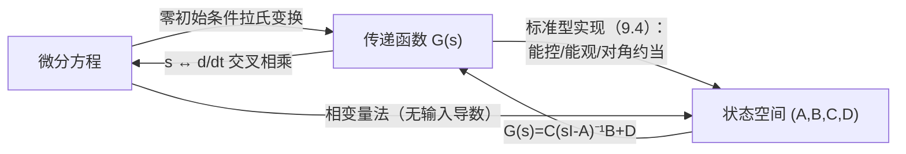
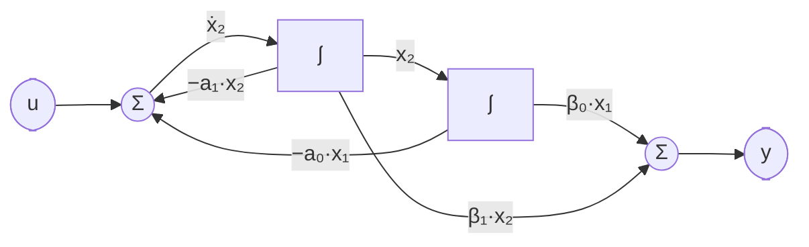
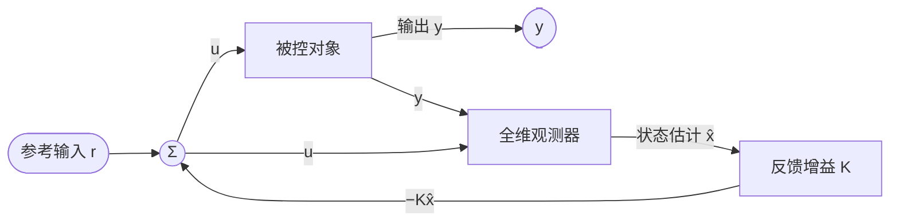

> 返回目录：[[自动控制原理]]
> 
> **按刘豹《现代控制理论》分章节阅读**：
> - [[现代控制理论/01 绪论]] — 两类模型对比，状态空间法概述
> - [[现代控制理论/02 状态空间表达式]] — 建模、标准型、线性变换、状态变量图
> - [[现代控制理论/03 状态方程的解]] — $e^{At}$ 三种求法、时变系统、格拉姆判据
> - [[现代控制理论/04 能控性和能观测性]] — 秩判据、对偶、结构分解、最小实现
> - [[现代控制理论/05 系统综合]] — 极点配置、观测器、分离原理、李雅普诺夫、离散系统、内模控制
>
> 以下为合并版全文（第 9 章原笔记，内容与上述分章文件一致，可按需查阅）。

# 第 9 章 线性系统的状态空间分析与综合

## 📖 9.1 状态空间描述

$$\boxed{\dot x = A x + B u,\qquad y = C x + D u}$$

![[自控-状态空间结构图.png|620]]
*状态空间结构图：积分器输出为状态 $x$，$A$ 反馈、$B$ 输入、$C$ 输出、$D$ 直通*

传递函数矩阵：$G(s) = C(sI-A)^{-1}B + D$。
特征方程 $\det(sI-A)=0$；特征值即系统极点；**无零极点对消 ⇔ 最小实现（既能控又能观）**。

**微分方程 ↔ 传递函数 ↔ 状态空间：转换总览**

- **微分方程（不含输入导数）→ 状态空间（相变量法）**：对 $y^{(n)}+a_{n-1}y^{(n-1)}+\cdots+a_0y=b_0u$，取 $x_1=y,\ x_2=\dot y,\ \dots,\ x_n=y^{(n-1)}$，得

$$
\dot x=\begin{bmatrix}0&1&&\\&\ddots&\ddots&\\&&0&1\\-a_0&-a_1&\cdots&-a_{n-1}\end{bmatrix}x+\begin{bmatrix}0\\ \vdots\\0\\b_0\end{bmatrix}u,\qquad y=[1\ 0\ \cdots\ 0]\,x
$$

（$A$ 为友矩阵，结构同能控标准型。）

- **含输入导数的微分方程**：先化成传递函数 $G(s)$，再按 9.4 **直读能控标准型**（分母定 $A_c$ 末行、分子定 $C_c$），或部分分式展开取对角型。$m=n$ 时先长除分离出 $D$。
- **状态空间 → 传递函数**：$G(s)=C(sI-A)^{-1}B+D$——结果**唯一**（与状态变量选法无关）；再交叉相乘、$s\leftrightarrow \dfrac{d}{dt}$ 即得微分方程。
- 一个 $G(s)$ 对应**无穷多**状态空间实现（相差一个线性变换）；阶数最低的即最小实现。

**由结构图直接建立状态空间表达式**（考试高频，比先求总传函更快）：

1. 把结构图整理成只含**积分环节 $\dfrac{k}{s}$、惯性环节 $\dfrac{k}{Ts+1}$** 的形式，**每个含 $s$ 环节的输出设为一个状态变量** $x_i$；
2. 对每个环节按"传函交叉相乘"写一阶微分方程：$\dfrac{k}{Ts+1}$（输入 $v$）→ $T\dot x+x=kv$；$\dfrac{k}{s}$ → $\dot x=kv$；其中 $v$ 用结构图上的信号（$u$、其他 $x_j$、反馈差）代入；
3. 含零点环节 $\dfrac{bs+c}{s+a}$ 不能直接设状态——先**长除拆分** $\dfrac{bs+c}{s+a}=b+\dfrac{c-ab}{s+a}$，对惯性部分设状态；
4. 由输出所在位置写 $y=Cx$。

例：前向通路 $\dfrac{1}{s+1}\to\dfrac{1}{s}$、单位负反馈。设 $x_1$=积分器输出（$=y$）、$x_2$=惯性环节输出：$\dot x_1=x_2$；$(s+1)x_2=u-x_1\Rightarrow\dot x_2=-x_1-x_2+u$，即 $A=\begin{bmatrix}0&1\\-1&-1\end{bmatrix},\ b=\begin{bmatrix}0\\1\end{bmatrix},\ c=[1\ \ 0]$。

**电路建模选状态变量**：取**独立储能元件**的变量——电容电压 $u_C$、电感电流 $i_L$，按 KCL/KVL（$C\dot u_C=i_C$，$L\dot i_L=u_L$）列写即可。

例：R-L-C 串联接电压源 $u$，输出取电容电压。取 $x_1=i_L,\ x_2=u_C$：回路 KVL 给 $L\dot x_1=u-Rx_1-x_2$，电容方程给 $C\dot x_2=x_1$，故

$$
\dot x=\begin{bmatrix}-\dfrac{R}{L} & -\dfrac{1}{L}\\[2pt] \dfrac{1}{C} & 0\end{bmatrix}x+\begin{bmatrix}\dfrac{1}{L}\\ 0\end{bmatrix}u,\qquad
y=[\,0\ \ 1\,]\,x
$$

（验证：$G(s)=c(sI-A)^{-1}b=\dfrac{1}{LCs^2+RCs+1}$，与第 2 章复阻抗分压结果一致。）电容并联电压源或电感串联电流源时储能元件**不独立**，状态数相应减少。

**状态变量图（模拟结构图）**（教材图 9-5～9-12，习题常要求"画出状态变量图"或由图写方程）：用**积分器 $\int$、加法器、比例器**三种元件把动态方程画成结构图。画法三步：

① 每个状态变量配一个积分器：积分器**输出 = $x_i$**、**输入 = $\dot x_i$**；
② 按每个状态方程 $\dot x_i=\sum_j a_{ij}x_j+b_iu$，在该积分器输入端设加法器，把各 $x_j$ 经比例器 $a_{ij}$、$u$ 经 $b_i$ 引到加法器；
③ 按输出方程 $y=\sum_i c_ix_i$ 用加法器合成输出。

三种标准型的图形特征（认形写方程、由方程画形都靠它）：

| 标准型 | 图形特征 |
| :-- | :-- |
| 能控标准型（相变量法同构） | $n$ 个积分器**串联成链**；各 $-a_i$ 从状态反馈到链首加法器；分子系数 $\beta_i$ 从各状态**前馈**到输出加法器 |
| 对角型 | $n$ 条一阶支路**并联**，每条支路自反馈 $\lambda_i$（互相独立 → 模态解耦） |
| 约当型 | 同一约当块内积分器**串联**且共用自反馈 $\lambda_1$（前一状态馈入后一积分器），块与块之间并联 |

二阶能控标准型 $G(s)=\dfrac{\beta_1s+\beta_0}{s^2+a_1s+a_0}$ 的状态变量图：

**线性（相似）变换**：取非奇异 $P$，令 $x = P\bar x$，则

$$
\bar A = P^{-1}AP,\qquad \bar B = P^{-1}B,\qquad \bar C = CP,\qquad \bar D=D
$$

特征值（特征多项式）、传递函数、可控性、可观测性、稳定性均**不变**（等价变换）。常用构造：

| 目标 | 变换阵构造 |
| ---- | ---------- |
| **化对角型**（$\lambda_i$ 互异） | $P=[p_1\ p_2\ \cdots\ p_n]$，列为特征向量：$Ap_i=\lambda_ip_i$ |
| $A$ 为友矩阵时化对角 | $P$ 取**范德蒙德阵**：第 $i$ 列 $[1,\ \lambda_i,\ \lambda_i^2,\dots,\lambda_i^{n-1}]^T$ |
| **化约当型**（$\lambda_1$ 为 $m$ 重根且独立特征向量只有 1 个） | 广义特征向量链：$Ap_1=\lambda_1p_1$，$Ap_2=\lambda_1p_2+p_1$，$Ap_3=\lambda_1p_3+p_2,\dots$，$P=[p_1\cdots p_m\ p_{m+1}\cdots p_n]$ |
| **化能控标准型**（$\operatorname{rank}Q_c=n$） | $p_1=[0\ \cdots\ 0\ 1]\,Q_c^{-1}$（$Q_c$ 逆的**末行**），$T=\begin{bmatrix}p_1\\ p_1A\\ \vdots\\ p_1A^{n-1}\end{bmatrix}$，则 $z=Tx$ 下 $TAT^{-1}=A_c$，$Tb=[0\cdots0\ 1]^T$ |
| **化能观标准型**（对偶） | $t_1=Q_o^{-1}[0\ \cdots\ 0\ 1]^T$（$Q_o$ 逆的**末列**），$T=[t_1\ At_1\ \cdots\ A^{n-1}t_1]$，则 $x=T\bar x$ 下化为能观标准型 |

> [!warning] ⚠️ 变换记号
> 教材里 $\bar x=Px$ 与 $x=P\bar x$ 两种写法并存（对应 $\bar A=PAP^{-1}$ 或 $P^{-1}AP$）。做题时代入 $\dot{\bar x}$ 推一行验证方向，别背反了。

---

## 🔍 9.2 状态转移矩阵与运动分析

$$\boxed{\Phi(t) = e^{At} = \mathcal{L}^{-1}\left[(sI-A)^{-1}\right]}$$

$$\boxed{x(t) = e^{At}x(0) + \int_0^t e^{A(t-\tau)}B u(\tau)\, d\tau}$$

性质：$\Phi(0)=I$，$\Phi^{-1}(t)=\Phi(-t)$，$\Phi(t_1+t_2)=\Phi(t_1)\Phi(t_2)$，$\dot\Phi(t)=A\Phi(t)$。

**判定与反求（常考小题）**：矩阵函数 $\Phi(t)$ 能作为状态转移矩阵 ⇔ $\Phi(0)=I$ 且 $\dot\Phi(t)=A\Phi(t)$（$A$ 为常阵）；已知 $\Phi(t)$ 反求系统矩阵：

$$
A=\dot\Phi(t)\big|_{t=0}
$$

（验证 $\Phi(0)\ne I$ 即可否掉一个候选；求逆用 $\Phi^{-1}(t)=\Phi(-t)$ 而不必真求逆。）
**$e^{At}$ 的三种求法**：

1. **拉氏反变换法**（最常用）：$(sI-A)^{-1}=\dfrac{\operatorname{adj}(sI-A)}{\det(sI-A)}$ → 每个元素部分分式展开 → 逐项反变换。
2. **对角化法**：特征值互异时 $e^{At}=Pe^{\Lambda t}P^{-1}$，$\Lambda=\operatorname{diag}(\lambda_i)$，$P$ 由特征向量排成；重根用约当块，$m$ 重根约当块的矩阵指数为

$$
e^{Jt}=e^{\lambda t}
\begin{bmatrix}
1 & t & \dfrac{t^2}{2!} & \cdots & \dfrac{t^{m-1}}{(m-1)!}\\
 & 1 & t & \ddots & \vdots\\
 & & \ddots & \ddots & \dfrac{t^2}{2!}\\
 & & & 1 & t\\
 & & & & 1
\end{bmatrix}
$$
3. **凯莱–哈密顿法**：$e^{At}=\alpha_0(t)I+\alpha_1(t)A+\cdots+\alpha_{n-1}(t)A^{n-1}$，系数由每个特征值的方程

$$
e^{\lambda_it}=\alpha_0+\alpha_1\lambda_i+\cdots+\alpha_{n-1}\lambda_i^{n-1}
$$

解出；重根时对 $\lambda$ 求导补方程（二重根补 $te^{\lambda t}=\alpha_1+2\alpha_2\lambda+\cdots$）。
二阶常用结果（$\lambda_1\ne\lambda_2$）：$\alpha_1=\dfrac{e^{\lambda_1t}-e^{\lambda_2t}}{\lambda_1-\lambda_2}$，$\alpha_0=e^{\lambda_1t}-\alpha_1\lambda_1$。

### 9.2.1 时变系统的状态方程解（刘豹 §3-4，常考概念题）

与定常系统不同，时变系统 $\dot x = A(t)x + B(t)u$ 的 $A(t), B(t)$ 随时间变化，解的结构为：

$$
x(t) = \Phi(t,t_0)x(t_0) + \int_{t_0}^t \Phi(t,\tau)B(\tau)u(\tau)\,d\tau
$$

其中 $\Phi(t,t_0)$ 为**状态转移矩阵**（传递函数概念在时变系统中不能直接套用，因为拉氏变换对时变系数失效）。

**时变 vs 定常的关键区别**：

| 性质 | 定常系统 $\Phi(t)=e^{A(t-t_0)}$ | 时变系统 $\Phi(t,t_0)$ |
|:--|:--|:--|
| 仅取决于时间差？ | ✓ $\Phi(t-t_0)$ | ✗ 取决于两个独立的 $t$ 和 $t_0$ |
| 与 $A$ 的交换性 | $Ae^{At}=e^{At}A$ | **不一定**：$\Phi(t,t_0)A(t_0)\ne A(t)\Phi(t,t_0)$ 一般成立 |
| $\Phi(t_2,t_0)$ 的组合 | $=e^{A(t_2-t_1)}e^{A(t_1-t_0)}$ | $=\Phi(t_2,t_1)\Phi(t_1,t_0)$（成立） |
| 矩阵指数形式 | $\Phi(t)=e^{At}$ 闭式表达 | **一般无闭式**（只有特例——$A(t)$ 与自身积分交换时 $\Phi=\exp\int A\,d\tau$） |

>[!info] ℹ️ **特例**
> 当 $A(t)$ 满足 $\big[A(t),\ \int_{t_0}^t A(\tau)d\tau\big]=0$（即可交换）时，才有 $\Phi(t,t_0)=\exp\big(\int_{t_0}^t A(\tau)d\tau\big)$。最常见满足条件的是**对角时变阵** $A(t)=\operatorname{diag}[a_1(t),\dots,a_n(t)]$。

**可控可观性的时变版本**（格拉姆判据，刘豹 §3-5）：时变系统 $(A(t),B(t))$ 在 $[t_0,t_f]$ 上完全可控 ⇔

$$
W_c(t_0,t_f)=\int_{t_0}^{t_f}\Phi(t_0,\tau)B(\tau)B^T(\tau)\Phi^T(t_0,\tau)\,d\tau \quad\text{非奇异}
$$

>[!info] ℹ️ **格拉姆判据的适用性**
> 格拉姆判据在定常系统中已出现（9.3），但它对时变系统**不可替代**——$Q_c=[B\ AB\ \cdots]$ 秩判据只在定常时成立，时变不适用。时变系统可控可观的判定通常从格拉姆矩阵出发。

---

## ⚖️ 9.3 可控性与可观测性

**可控性矩阵**（教材记 $S$）：

$$\boxed{
Q_c = [B\ \ AB\ \ A^2B\ \ \cdots\ \ A^{n-1}B],\qquad
完全可控 \Leftrightarrow \operatorname{rank}Q_c = n
}$$

**可观测性矩阵**：

$$\boxed{
Q_o = \begin{bmatrix} C \\ CA \\ \vdots \\ CA^{n-1} \end{bmatrix},\qquad
完全可观测 \Leftrightarrow \operatorname{rank}Q_o = n
}$$

- PBH 判据：$\operatorname{rank}[\lambda I-A\ \ B]=n$（对所有特征值 $\lambda$）⇔ 可控；$\operatorname{rank}\begin{bmatrix}\lambda I-A\\ C\end{bmatrix}=n$ ⇔ 可观测。
- **格拉姆矩阵判据**（定义式判据，多用于理论与时变系统；刘豹 3.2）：$W_c=\displaystyle\int_0^{t_1}e^{At}BB^Te^{A^Tt}\,dt$ 非奇异 ⇔ 完全可控（可观测对偶：$W_o=\displaystyle\int_0^{t_1}e^{A^Tt}C^TCe^{At}\,dt$ 非奇异）。
- **输出能控性**（刘豹 3.2）：$\operatorname{rank}[\,CB\ \ CAB\ \cdots\ CA^{n-1}B\ \ D\,]=q$（输出维数）⇔ 输出完全能控；与**状态**能控性无必然联系（状态能控未必输出能控，反之亦然）。
- **对偶原理**：$(A,B,C)$ 可控 ⇔ $(A^T,C^T,B^T)$ 可观测。
- **零极点对消与能控能观的对应**（刘豹 3.10）：SISO 系统传函**发生对消 ⇔ 实现非最小**（不完全可控或不完全可观）；具体丢的是哪一个取决于实现方式——**能控标准型实现必可控**，对消体现为不可观测；**能观标准型实现必可观**，对消体现为不可控；对角型实现看 $B$、$C$ 对应元素哪个为零。

**结构分解（能控能观分解）**——把不完全可控/可观的系统用线性变换化成块三角标准构造，分离出可控（可观）子系统。

**① 按可控性分解**（$\operatorname{rank}Q_c=r<n$）：从 $Q_c$ 中选 $r$ 个线性无关**列** $s_1,\dots,s_r$，再任补 $n-r$ 个尽量简单的列向量（如单位向量）使矩阵非奇异，排成

$$
P^{-1}=[\,s_1\ \cdots\ s_r\ \mid\ s_{r+1}\ \cdots\ s_n\,],\qquad
x=P^{-1}\bar x\ \big(\bar x=Px\big)
$$

$$
\bar A=PAP^{-1}=\begin{bmatrix}\bar A_{11} & \bar A_{12}\\ 0 & \bar A_{22}\end{bmatrix}
\begin{matrix}\}r\\ \}n-r\end{matrix},\qquad
\bar B=PB=\begin{bmatrix}\bar B_1\\ 0\end{bmatrix},\qquad
\bar C=CP^{-1}=[\bar C_1\ \ \bar C_2]
$$

$\bar x=\begin{bmatrix}x_c\\ x_{\bar c}\end{bmatrix}$：$x_c$ 为 $r$ 维**可控**子状态，$x_{\bar c}$ 不受 $u$ 影响。特性：

1. 传递函数矩阵 = 可控子系统 $(\bar A_{11},\bar B_1,\bar C_1)$ 的传递函数——**不可控部分在传函中不出现**（呼应"最小实现"）；
2. 但不可控子系统影响整体稳定性与输出响应：要求 $\bar A_{22}$ 特征值全稳定；
3. 分解**不唯一**（选列、补列自由），块结构唯一；
4. $\det(sI-A)=\det(sI-\bar A_{11})\det(sI-\bar A_{22})$：特征值分成**可控因子**与**不可控因子**两组。

**② 按可观测性分解**（对偶，$\operatorname{rank}Q_o=l<n$）：从 $Q_o$ 中选 $l$ 个线性无关**行** $t_1,\dots,t_l$，补 $n-l$ 个行成非奇异阵

$$
P=\begin{bmatrix}t_1\\ \vdots\\ t_l\\ \hline t_{l+1}\\ \vdots\\ t_n\end{bmatrix},\quad \bar x=Px:\qquad
\bar A=\begin{bmatrix}\bar A_{11} & 0\\ \bar A_{21} & \bar A_{22}\end{bmatrix}
\begin{matrix}\}l\\ \}n-l\end{matrix},\quad
\bar B=\begin{bmatrix}\bar B_1\\ \bar B_2\end{bmatrix},\quad
\bar C=[\bar C_1\ \ 0]
$$

$\bar x=[x_o;\ x_{\bar o}]$，传递函数 = 可观子系统 $(\bar A_{11},\bar B_1,\bar C_1)$ 的传递函数。

**③ 卡尔曼（Kalman）四分解**：先按可控性分解，再对两个子系统分别按可观测性分解（次序可反），状态分为四类：

$$
\bar x=\begin{bmatrix}x_{co}\\ x_{c\bar o}\\ x_{\bar co}\\ x_{\bar c\bar o}\end{bmatrix}
\quad(可控可观\ /\ 可控不可观\ /\ 不可控可观\ /\ 不可控不可观)
$$

**传递函数只反映"可控且可观"子系统** $G(s)=\bar C_{co}(sI-\bar A_{co})^{-1}\bar B_{co}$——这就是"传函描述不完全"的根源。

**考试步骤**：① 算 $\operatorname{rank}Q_c$（或 $Q_o$）得 $r$；② 从 $Q_c$ 挑 $r$ 个无关列 + 补单位向量 → 写 $P^{-1}$（可观分解则挑 $Q_o$ 的行写 $P$）；③ 求 $P$（或 $P^{-1}$），算 $PAP^{-1}$、$PB$、$CP^{-1}$；④ 按块读出可控（可观）子系统。

### 9.3.1 最小实现（刘豹 §4-8，常考概念+计算题）

**定义**：给定传递函数 $G(s)$，在所有能实现 $G(s)$ 的状态空间实现 $(A,B,C,D)$ 中，**阶数最低**的那个称为**最小实现**。

**核心判据**：一个实现 $(A,B,C)$ 是最小实现 ⇔ **既能控又能观**。能控不可观或可观不可控的实现阶数比最小实现高（含不可控/不可观的"多余"状态）。

**传递函数阶次与最小实现的阶数**（SISO 系统）：$G(s)$ 的**分母不可约阶数**（无对消的阶次）= 最小实现的阶数。

>[!example] ✏️ **例**
> $G(s)=\dfrac{s+1}{(s+1)(s+2)}=\dfrac{1}{s+2}$，虽然分子分母写成二阶（发生对消），但无对消后实际为一阶，因此最小实现是一阶。

**求最小实现的方法**（给定 $G(s)$）：

1. **先约简**：把 $G(s)$ 的分子分母约去公因子，得不可约传递函数 $\tilde G(s)$；
2. **对 $\tilde G(s)$ 写能控标准型实现**（或能观标准型）：既已消去对消，所得实现必既能控又能观 → 直接就是最小实现；
3. **维度**：最小实现阶数 = 不可约分母的次数。

**从高阶实现求最小实现**（给定 $(A,B,C)$，要降阶）：

1. 算 $\operatorname{rank}Q_c$——若 $=r<n$，提取可控子系统 $(\bar A_{11},\bar B_1,\bar C_1)$；
2. 对 $(\bar A_{11},\bar B_1,\bar C_1)$ 再验 $\operatorname{rank}\bar Q_o$，提取"可控且可观"的子系统；
3. 该子系统的维数 ≤ $\operatorname{rank}Q_c$ 和 $Q_o$ 的较小者，传递函数完全相同。

>[!tip] 💡 **考试要点**
> 题目给一个二阶或三阶实现 $A,B,C$，先验能控能观——若有一者不满秩，求其最小实现（做结构分解取可控可观子系统）。最小实现的传函 $G(s)=C_{co}(sI-A_{co})^{-1}B_{co}$ 与原始实现等价但阶数更低。

---

## 📝 9.4 能控标准型与能观标准型（SISO）

设特征多项式 $\det(sI-A)=s^n+a_{n-1}s^{n-1}+\cdots+a_0$：

$$
A_c = \begin{bmatrix}
0 & 1 & & \\
 & \ddots & \ddots & \\
 & & 0 & 1 \\
-a_0 & -a_1 & \cdots & -a_{n-1}
\end{bmatrix},\quad
B_c = \begin{bmatrix}0\\ \vdots \\0\\1\end{bmatrix}
$$

能观标准型与之**对偶**：$A_o = A_c^T$，$C_o = B_c^T = [0\ \cdots\ 0\ 1]$。

**对角（约当）规范型实现**：将 $G(s)$ 部分分式展开为 $\sum_i\dfrac{c_i}{s-\lambda_i}$（极点互异），取 $A=\operatorname{diag}(\lambda_i)$，$B=[1\ \cdots\ 1]^T$，$C=[c_1\ \cdots\ c_n]$——各模态解耦，能直观判断可控可观（$B$ 中对应元素非零 ⇔ 该模态可控，$C$ 中非零 ⇔ 可观测）。

**由传递函数写能控标准型实现**（含零点）：设

$$
G(s)=\frac{\beta_{n-1}s^{n-1}+\cdots+\beta_1s+\beta_0}{s^n+a_{n-1}s^{n-1}+\cdots+a_1s+a_0}
$$

则 $A_c$、$B_c$ 取上面的能控标准型，输出阵

$$
C_c=[\beta_0\ \ \beta_1\ \ \cdots\ \ \beta_{n-1}],\qquad D=0
$$

（分子分母同阶时先长除分离出 $D$，余式再按上式写 $C_c$。）

---

## 🔧 9.5 状态反馈与极点配置

控制律 $u = -Kx + r$，闭环 $\dot x = (A-BK)x + Br$。
**极点可任意配置 ⇔ 系统完全可控。**
求 $K$：化能控标准型比较系数，或**阿克曼公式**：

$$\boxed{K = [0\ \cdots\ 0\ 1]\ Q_c^{-1}\ \alpha(A)}$$

其中 $\alpha(s)$ 为期望闭环特征多项式，$\alpha(A) = A^n + \alpha_{n-1}A^{n-1} + \cdots + \alpha_0 I$。
（状态反馈不改变系统可控性与**闭环零点**，但可能改变可观测性；不可控模态无法移动。）

**输出反馈的两种形式**（教材 9-4）：

| 形式 | 闭环系统矩阵 | 极点配置能力 |
| :-- | :-- | :-- |
| 输出反馈至**输入端**：$u=-Fy+r$ | $A-BFC$ | 一般**不能**任意配置（相当于受约束的状态反馈 $K=FC$）；不改变可控性与可观测性 |
| 输出反馈至**状态微分**：$\dot x=Ax+Bu-Hy$ | $A-HC$ | 系统**可观测 ⇔ 可任意配置**（与状态反馈对偶）——正是全维观测器 9.6 的结构来源 |

**镇定问题**（教材 9-4）：只要求闭环**渐近稳定**、不指定极点位置的弱化配置。**状态反馈可镇定 ⇔ 不可控子系统渐近稳定**（可控部分极点任意配，不可控部分动不了、必须自身稳定——对应 9.3 结构分解中 $\bar A_{22}$ 稳定的要求）；完全可控系统必可镇定。

**解耦控制**（刘豹 5.4，胡寿松第八版未列）：$m$ 输入 $m$ 输出系统用状态反馈 $u=-Kx+Fr$ 使闭环传递函数阵**对角化**——第 $i$ 个输出只受第 $i$ 个参考输入控制。积分型解耦三步：

① 对每个输出求"相对阶" $d_i$：使 $c_iA^{j-1}B\ne0$ 成立的**最小** $j$（$c_i$ 为 $C$ 的第 $i$ 行）；
② 组成可解耦性判别阵，**能用状态反馈解耦 ⇔ $E$ 非奇异**：

$$
E=\begin{bmatrix}c_1A^{d_1-1}B\\ \vdots\\ c_mA^{d_m-1}B\end{bmatrix}
$$

③ 取 $F=E^{-1}$，$K=E^{-1}\begin{bmatrix}c_1A^{d_1}\\ \vdots\\ c_mA^{d_m}\end{bmatrix}$，闭环化为积分器组 $G(s)=\operatorname{diag}\big(s^{-d_1},\dots,s^{-d_m}\big)$，各通道再单独配极点。

**低阶系统求 $K$ 的通用套路（比较系数法，考试主力）**：

1. 验证 $\operatorname{rank}Q_c=n$（可控才能任意配置）；
2. 设 $K=[k_1\ k_2\ \cdots\ k_n]$，展开 $\det[sI-(A-BK)]$ 得含 $k_i$ 的多项式；
3. 由期望极点写 $\alpha^*(s)=\prod_i(s-s_i^*)$ 并展开；
4. 逐次幂**比较系数**，解线性方程组得 $k_i$。
   （求观测器 $L$ 完全对偶：设 $L=[l_1\ \cdots\ l_n]^T$，展开 $\det[sI-(A-LC)]$ 与观测器期望多项式比较。）

---

## 🔧 9.6 状态观测器

**全维观测器**（增益阵教材记 $H$，此处用 $L$）：

$$\boxed{\dot{\hat x} = (A-LC)\hat x + B u + L y}$$

估计误差 $\tilde x = x-\hat x$ 满足 $\dot{\tilde x} = (A-LC)\tilde x$。
**观测器极点可任意配置 ⇔ 系统完全可观测。** 由对偶性：

$$
L = \alpha(A)\ Q_o^{-1}\ [0\ \cdots\ 0\ 1]^T
$$

带观测器的状态反馈结构：

**分离原理**：状态反馈与观测器可**独立设计**；闭环极点 = 状态反馈配置极点 ∪ 观测器极点（观测器极点一般取快 2~5 倍）。带观测器的状态反馈系统为 $2n$ 阶，取增广状态 $[\,x;\ \tilde x\,]$（$\tilde x=x-\hat x$）时呈**块三角**形式：

$$\boxed{
\frac{d}{dt}\begin{bmatrix}x\\ \tilde x\end{bmatrix}=
\begin{bmatrix}A-BK & BK\\ 0 & A-LC\end{bmatrix}
\begin{bmatrix}x\\ \tilde x\end{bmatrix}+\begin{bmatrix}B\\ 0\end{bmatrix}r
}$$

特征值集合 $=\lambda(A-BK)\cup\lambda(A-LC)$ 一目了然；其输入-输出传递函数与直接状态反馈时**相同**（观测器误差模态不可控，不出现在传递函数中）。

>[!info] ℹ️ **分离原理的推导**（教材 9-4.2，定理 9-4）
> 控制律 $u=-K\hat x+r = -Kx+K\tilde x+r$，与原状态方程和观测器误差方程联立得块三角结构——**状态反馈和观测器的设计完全解耦**，可各自独立进行；整体闭环极点为两者极点之并集；且观测器误差 $\tilde x$ 从 $r$ 不可控（$[\;0\;]^T$），故传函同于状态反馈。

>[!warning] ⚠️ **分离原理的注意事项**
> 当系统含未建模动态或参数摄动较大时，观测器趋于无穷快 → 估计误差趋于零 → 分离原理仅**渐近**成立。工程上观测器极点取反馈极点的 2~5 倍（不能过快，否则放大噪声）。

**降维观测器**（$(n-q)$ 维；补充自刘豹《现代控制理论》5.5.5，胡寿松第八版未列）：输出 $y=Cx$（$\operatorname{rank}C=q$）已直接测得 $q$ 个独立的状态组合，只需重构其余 $n-q$ 个分量——观测器阶数可降为 $n-q$。

**第一步：按输出分块。** 任取 $(n-q)\times n$ 阵 $C_0$ 使 $T^{-1}=\begin{bmatrix}C_0\\ C\end{bmatrix}$ 非奇异，令 $x=T\bar x$：

$$
\bar A=T^{-1}AT=\begin{bmatrix}\bar A_{11} & \bar A_{12}\\ \bar A_{21} & \bar A_{22}\end{bmatrix}
\begin{matrix}\}n-q\\ \}q\end{matrix},\qquad
\bar B=T^{-1}B=\begin{bmatrix}\bar B_1\\ \bar B_2\end{bmatrix},\qquad
CT=[\,0\ \ I_q\,]
$$

于是 $\bar x=\begin{bmatrix}\bar x_1\\ \bar x_2\end{bmatrix}$ 中 $\bar x_2=y$ **直接可测（无估计误差）**，只需估计 $n-q$ 维的 $\bar x_1$。

**第二步：对 $\bar x_1$ 子系统仿全维观测器。** 展开分块方程并"重新认领"输入输出：

$$
\dot{\bar x}_1=\bar A_{11}\bar x_1+\underbrace{(\bar A_{12}\,y+\bar B_1u)}_{已知“输入”},\qquad
z \triangleq \dot y-\bar A_{22}\,y-\bar B_2u = \bar A_{21}\bar x_1\quad(等效“输出”，输出阵\ \bar A_{21})
$$

仿全维观测器取增益 $\bar L$（$(n-q)\times q$）：$\dot{\hat{\bar x}}_1=(\bar A_{11}-\bar L\bar A_{21})\hat{\bar x}_1+\bar A_{12}y+\bar B_1u+\bar Lz$。其中 $z$ 含 $\dot y$ 难实现，令 $w=\hat{\bar x}_1-\bar Ly$ 消去：

$$
\dot w=(\bar A_{11}-\bar L\bar A_{21})\,w+\big[(\bar A_{11}-\bar L\bar A_{21})\bar L+(\bar A_{12}-\bar L\bar A_{22})\big]y+(\bar B_1-\bar L\bar B_2)\,u
$$

$$
\hat{\bar x}_1=w+\bar Ly,\qquad
\hat x=T\begin{bmatrix}\hat{\bar x}_1\\ y\end{bmatrix}
$$

估计误差 $\tilde x_1=\bar x_1-\hat{\bar x}_1$ 满足 $\dot{\tilde x}_1=(\bar A_{11}-\bar L\bar A_{21})\tilde x_1$；系统能观 ⇒ $(\bar A_{11},\bar A_{21})$ 能观 ⇒ **极点可任意配置**。

**设计步骤**：① 验能观、定 $q=\operatorname{rank}C$；② 构造 $T^{-1}=[C_0;C]$，求 $T$ 与各分块；③ 设 $\bar L$，展开 $\det[\lambda I-(\bar A_{11}-\bar L\bar A_{21})]$ 与 $n-q$ 阶期望多项式**比较系数**求 $\bar L$；④ 写出 $w$ 方程与 $\hat x$。

对比全维观测器：少用 $q$ 个积分器、结构简单；缺点是 $y$ 的量测噪声**不经滤波**直接进入 $\hat x_2=y$（全维观测器对 $y$ 有低通平滑作用）。

---

## ⚖️ 9.7 李雅普诺夫稳定性

- **第一方法**（间接法）：平衡点处线性化，若 $A$ 的特征值均具负实部则渐近稳定；有正实部则不稳定；临界情形不能下结论。
- **第二方法**（直接法）：构造 $V(x)$ 正定且 $\dot V(x)$ 负定 → 渐近稳定（$\dot V$ 半负定且不恒为零沿非零轨线 → 仍渐近稳定）。
- 线性定常系统：任给正定对称 $Q$，**李雅普诺夫方程**

$$\boxed{A^TP + PA = -Q}$$

存在唯一正定对称解 $P$ ⇔ 系统渐近稳定；此时 $V(x)=x^TPx$，$\dot V = -x^TQx$。

- **离散系统版本**（$x(k+1)=Gx(k)$，教材式 9-226、定理 9-6）：任给正定对称 $Q$，**离散李雅普诺夫方程**

$$
G^TPG - P = -Q
$$

存在唯一正定对称解 $P$ ⇔ 渐近稳定；此时 $V=x^TPx$，$\Delta V=-x^TQx$。通常取 $Q=I$；若 $\Delta V$ 沿任一解序列不恒为零，$Q$ 可放宽为半正定。

判 $P$ 正定——**塞尔维斯特判据**：各阶顺序主子式全为正（$\Delta_1>0,\ \Delta_2>0,\ \dots$）；负定则奇数阶 $<0$、偶数阶 $>0$。

**解题步骤**：取 $Q=I$ → 设对称 $P$（$n=2$ 时 $P=\begin{bmatrix}p_{11}&p_{12}\\p_{12}&p_{22}\end{bmatrix}$，3 个未知量）→ 代入 $A^TP+PA=-I$ 列线性方程组解出 → 塞尔维斯特验正定 ⇒ 渐近稳定。

---

## 📝 9.8 线性离散系统的状态空间

$$\boxed{x(k+1) = G x(k) + H u(k),\qquad y(k) = Cx(k) + Du(k)}$$

$$\boxed{x(k) = G^k x(0) + \sum_{i=0}^{k-1} G^{k-1-i} H u(i)}$$

**$G^k$ 的三种求法**（与 $e^{At}$ 完全平行）：① **z 变换法**：$G^k=\mathcal{Z}^{-1}\big[(zI-G)^{-1}z\big]$；② **凯莱–哈密顿法**：$G^k=\alpha_0I+\alpha_1G+\cdots+\alpha_{n-1}G^{n-1}$，系数由 $\lambda_i^k=\alpha_0+\alpha_1\lambda_i+\cdots+\alpha_{n-1}\lambda_i^{n-1}$ 解出（重根对 $\lambda$ 求导补方程）；③ **对角化法**：$G^k=P\Lambda^kP^{-1}$。

- 稳定性：$\lvert\lambda_i(G)\rvert<1$（特征值均在单位圆内）；也可用离散李雅普诺夫方程 $G^TPG-P=-Q$ 判稳（见 9.7）。
- 可控性矩阵 $[H\ \ GH\ \cdots\ G^{n-1}H]$ 满秩 ⇔ 可控；可观测性矩阵同连续情形（$G$ 代 $A$）。
- 连续系统离散化（采样周期 $T$，零阶保持）：$G = e^{AT}$，$H = \int_0^T e^{At}\,dt\, B$；$T$ 足够小时可用**近似（欧拉）离散化** $G\approx I+AT$，$H\approx BT$。

---

## 💡 9.9 题型速查

| 题型 | 方法入口 |
| :-- | :-- |
| 由结构图/电路建状态方程 | 9.1：每个含 $s$ 环节（储能元件）输出设状态；含零点环节先长除拆分 |
| $\Phi(t)$ 判定 / 反求 $A$ | 9.2：验 $\Phi(0)=I$；$A=\dot\Phi(0)$；$\Phi^{-1}(t)=\Phi(-t)$ |
| 求$e^{At}$、$x(t)$ | 9.2 三种求法 + 全解公式                                           |
| **时变系统解** | 9.2.1：$\Phi(t,t_0)$ 一般无闭式；对角时变阵用指数积分；可控可观用格拉姆判据 |
| 传函 ↔ 状态空间互求   | $G(s)=C(sI-A)^{-1}B+D$；实现方法见 9.4；转换路线图见 9.1                          |
| 化标准型的变换阵       | 9.1 表：对角（特征向量列）/ 约当（广义向量链）/ 能控标准型（$p_1=Q_c^{-1}$ 末行） |
| 画状态变量图           | 9.1：一状态一积分器；串联链=能控标准型、并联支路=对角型、块内串联=约当型 |
| 判可控 / 可观          | $Q_c$、$Q_o$ 秩判据；对角型直接看 $B$、$C$ 元素；PBH 备用 |
| 结构分解               | 9.3：挑 $Q_c$ 无关列（$Q_o$ 无关行）+ 补齐 → 块三角化；传函=可控可观子系统 |
| **最小实现** | 9.3.1：约去 $G(s)$ 公因子后写能控标准型；或从实现做 Kalman 分解取可控可观子系统 |
| 求状态反馈$K$        | 比较系数法（9.5），高阶用阿克曼公式                               |
| 输出反馈 / 镇定        | 9.5：$A-BFC$ 一般不能任意配置、$A-HC$ 可观即可；可镇定⇔不可控子系统稳定 |
| 求观测器$L$          | 对偶比较系数法（9.6）                                             |
| 降维观测器             | 9.6：$T^{-1}=[C_0;C]$ 分块 → 对 $\bar x_1$ 比较系数求 $\bar L$ → $w=\hat{\bar x}_1-\bar Ly$ 消 $\dot y$ |
| 李雅普诺夫判稳         | 9.7 步骤：$Q=I$ → 解 $P$ → 塞尔维斯特验正定（离散用 $G^TPG-P=-Q$） |
| 解耦控制               | 9.5：求相对阶 $d_i$ → $E$ 非奇异判可解耦 → $F=E^{-1}$、$K=E^{-1}[c_iA^{d_i}]$ |
| 内模控制器             | 9.10：嵌入参考输入动力学模型 → 增广系统 → 对增广系统极点配置 |
| 求 $G^k$ / 离散响应    | 9.8：z 变换法 $\mathcal{Z}^{-1}[(zI-G)^{-1}z]$ 或凯莱–哈密顿      |
| 离散系统               | $G=e^{AT}$ 离散化；稳定看 $\lvert\lambda_i(G)\rvert<1$（9.8） |

**综合大题全流程**（压轴题标准链条：给 $G(s)$ 或 $(A,b,c)$，要求极点配置 + 观测器）：

$$
G(s)\xrightarrow{9.4\ 实现}(A,b,c)
\xrightarrow{9.3\ 验\operatorname{rank}Q_c,\ Q_o}
\xrightarrow{9.5\ 比较系数}K
\xrightarrow{9.6\ 对偶比较系数}L
\xrightarrow{分离原理}闭环=\lambda(A\!-\!bK)\cup\lambda(A\!-\!Lc)
$$

**综合例**：$A=\begin{bmatrix}0&1\\-2&-3\end{bmatrix}$，$b=\begin{bmatrix}0\\1\end{bmatrix}$，$c=[1\ \ 0]$；要求闭环极点 $-2\pm\mathrm{j}2$，观测器极点 $-10,-10$。

1. **验能控能观**：$Q_c=[b\ \ Ab]=\begin{bmatrix}0&1\\1&-3\end{bmatrix}$（$\det=-1\ne0$）✓；$Q_o=\begin{bmatrix}c\\ cA\end{bmatrix}=I$ ✓。
2. **求 $K$**：设 $K=[k_1\ \ k_2]$，$\det[sI-(A-bK)]=s^2+(3+k_2)s+(2+k_1)$；期望 $(s+2)^2+4=s^2+4s+8$ → 比较系数得 $k_2=1$、$k_1=6$，$K=[6\ \ 1]$。
3. **求 $L$**：设 $L=[l_1\ \ l_2]^T$，$\det[sI-(A-Lc)]=s^2+(3+l_1)s+(3l_1+2+l_2)$；期望 $(s+10)^2=s^2+20s+100$ → $l_1=17$、$l_2=47$（观测器极点取反馈主导极点实部的 5 倍，符合 2~5 倍准则）。
4. **写复合系统**：观测器 $\dot{\hat x}=(A-Lc)\hat x+bu+Ly$，控制 $u=-K\hat x+r$；闭环特征值 $\{-2\pm\mathrm{j}2\}\cup\{-10,-10\}$，输入-输出传函与直接状态反馈相同。

---

## 🔧 9.10 内模控制器（教材 §9-5，常考设计题）

**内模原理**：为了对某一参考输入实现**零稳态误差渐近跟踪**，必须在控制器中嵌入该参考输入的**动力学模型（内模）**。经典控制中 I 型系统阶跃无静差即为其特例——内模=积分器 $1/s$。

**设计步骤**（以阶跃输入 $r(t)=R\cdot1(t)$ 为例）：

1. 写出误差 $e = r - y = r - Cx$；
2. 将参考输入模型引入误差动态——阶跃输入的内模为 $\dot x_r = 0$（$r$ 为常值），跟踪误差 $e$ 经过**积分器** $1/s$ 生成扩张状态 $x_I$：
   $$
   \dot x_I = e = r - Cx
   $$
3. 写出增广系统：
   $$
   \begin{bmatrix}\dot x\\ \dot x_I\end{bmatrix}=
   \begin{bmatrix}A & 0\\ -C & 0\end{bmatrix}
   \begin{bmatrix}x\\ x_I\end{bmatrix}+
   \begin{bmatrix}B\\ 0\end{bmatrix}u+
   \begin{bmatrix}0\\ 1\end{bmatrix}r
   $$
4. 对增广系统设计状态反馈 $u = -[K\; -K_I]\begin{bmatrix}x\\ x_I\end{bmatrix}$，要求 $(A,B)$ 可控且 $\begin{bmatrix}A&0\\-C&0\end{bmatrix}$ 可控。
5. 闭环为 $2n+1$ 阶系统，按期望极点（满足跟踪要求的快速性）配置；积分器保证了阶跃输入下 $e(\infty)=0$。

>[!info] ℹ️ **推广**
> 斜坡输入 → 内模需要双重积分器 $1/s^2$（$\dot x_{I1}=e,\ \dot x_{I2}=x_{I1}$）；正弦输入 $\sin\omega_0 t$ → 内模为谐振器 $1/(s^2+\omega_0^2)$。含扰动的系统还可设计**扰动内模控制器**使扰动对输出的稳态影响为零。
