# 📡 自动控制原理公式笔记

>[!note]
> **参照教材**：胡寿松《自动控制原理（第八版）》，章节编号与教材一致
> **关联笔记**：[[数学]]
> **说明**：阻尼比统一用 $\zeta$；各章末附「解题套路」小节；配图在 `附件/`；已按章拆分至 `自动控制原理/` 文件夹

## 目录

- 🔢 [[自动控制原理/00 拉普拉斯变换（数学基础）|拉普拉斯变换（数学基础）]] — 变换对、性质定理、部分分式反变换、解微分方程
- 📖 [[自动控制原理/01 第1章 自动控制的一般概念|第1章 自动控制的一般概念]] — 反馈原理、基本要求(稳准快)、系统分类
- 📐 [[自动控制原理/02 第2章 控制系统的数学模型|第2章 控制系统的数学模型]] — 传递函数、典型环节、结构图化简、梅森公式
- ⏱️ [[自动控制原理/03 第3章 线性系统的时域分析法|第3章 线性系统的时域分析法]] — 一/二阶系统指标、劳斯判据、稳态误差
- 📌 [[自动控制原理/03-1 一阶与二阶系统的时域响应|3.1–3.3 一阶与二阶系统（专题）]] — 一阶响应、二阶标准式与动态指标
- 📌 [[自动控制原理/03-2 高阶系统、稳定性与稳态误差|3.4–3.7 高阶系统与稳定性（专题）]] — 主导极点、劳斯判据、稳态误差表
- 📌 [[自动控制原理/03-3 解题套路与典型题型|3.8–3.10 解题套路（专题）]] — 题型速查、教材例题详解
- 🌿 [[自动控制原理/04 第4章 线性系统的根轨迹法|第4章 线性系统的根轨迹法]] — 绘制法则、常见形状、零度/参数根轨迹、性能估算
- 📊 [[自动控制原理/05 第5章 线性系统的频域分析法|第5章 线性系统的频域分析法]] — 频率特性、Bode/奈氏绘制与几何技巧、奈氏判据、稳定裕度
- 🔧 [[自动控制原理/06 第6章 线性系统的校正方法|第6章 线性系统的校正方法]] — 超前/滞后/滞后-超前(A—B—C—D 图解)、PID、复合校正
- 💻 [[自动控制原理/07 第7章 线性离散系统的分析与校正|第7章 线性离散系统的分析与校正]] — 采样与 z 变换、差分方程、脉冲传函、朱利判据、最少拍(含无纹波)
- 🔄 [[自动控制原理/08 第8章 非线性控制系统分析|第8章 非线性控制系统分析]] — 典型非线性、相平面法(奇点/极限环)、描述函数法
- 🚀 [[自动控制原理/09 第9章 线性系统的状态空间分析与综合|第9章 线性系统的状态空间分析与综合]] — 状态空间建模与变换、能控能观与分解、极点配置、观测器(全维/降维)、李雅普诺夫
- 📚 [[自动控制原理/现代控制理论/01 绪论|现代控制理论 01 绪论]] — 状态空间引论
- 📚 [[自动控制原理/现代控制理论/02 状态空间表达式|现代控制理论 02 状态空间表达式]] — 三种标准型、线性变换
- 📚 [[自动控制原理/现代控制理论/03 状态方程的解|现代控制理论 03 状态方程的解]] — 状态转移矩阵、时变系统
- 📚 [[自动控制原理/现代控制理论/04 能控性和能观测性|现代控制理论 04 能控性和能观测性]] — 秩判据、结构分解、最小实现
- 📚 [[自动控制原理/现代控制理论/05 系统综合|现代控制理论 05 系统综合]] — 极点配置、观测器、李雅普诺夫、离散化
- 📎 [[自动控制原理/10 附录 常用数学补充|附录 常用数学补充]] — 欧拉公式、分贝换算、相角计算
- 🖥️ [[自动控制原理/11 MATLAB 基础速查|MATLAB 基础速查]] — 建模/连接/分章分析命令(教材附录 B)
- 📚 [[自动控制原理/12 资料索引（OneDrive）|资料索引（OneDrive）]] — 教材 PDF、按章 PPT（控制88-01~40）、Word 补充文档位置一览

## 全书主线

```mermaid
flowchart LR
    A["建模<br/>第2章"] --> B["时域<br/>第3章"]
    A --> C["根轨迹<br/>第4章"]
    A --> D["频域<br/>第5章"]
    B & C & D --> E["校正<br/>第6章"]
    E --> F["离散<br/>第7章"]
    E --> G["非线性<br/>第8章"]
    A --> H["状态空间<br/>第9章"]
```

