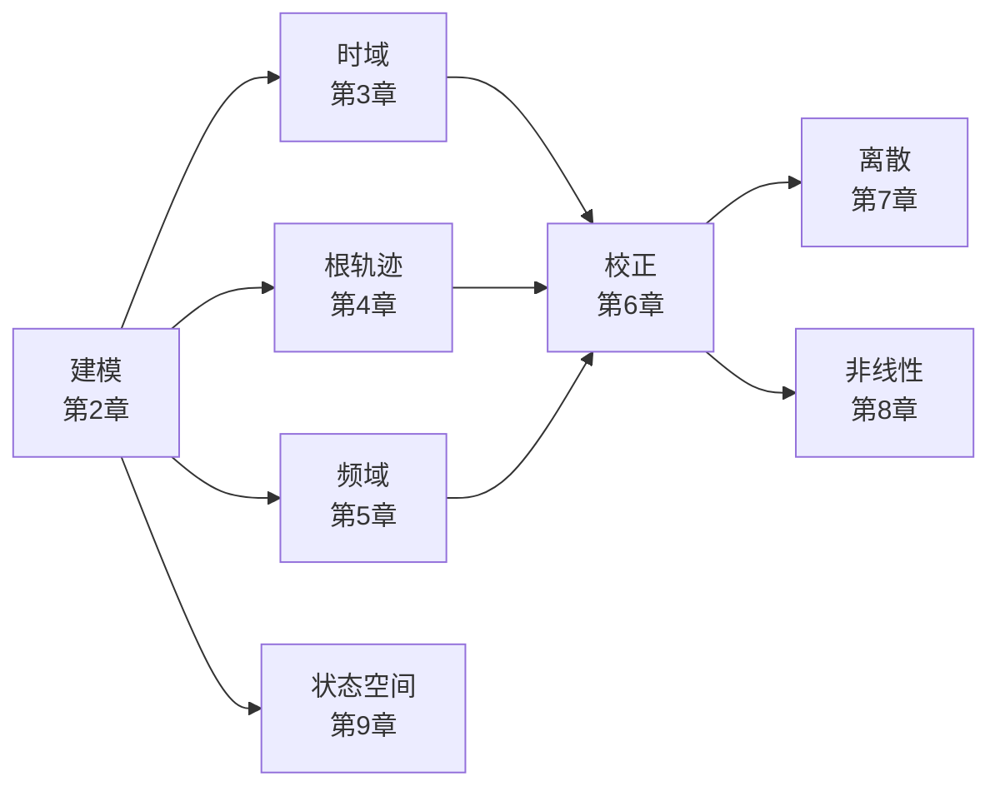

# 自动控制原理公式笔记

> [!note]
> **参照教材**：胡寿松《自动控制原理（第八版）》，章节编号与教材一致
> **关联笔记**：[[数学]]
> **说明**：阻尼比统一用 $\zeta$；各章末附「解题套路」小节；配图在 `附件/`；已按章拆分至 `自动控制原理/` 文件夹

## 目录

> [!note]- 📂 第 0–1 章 基础与绪论
> -  [[自动控制原理/00 拉普拉斯变换（数学基础）|拉普拉斯变换（数学基础）]] — 变换对、性质定理、部分分式反变换、解微分方程
> -  [[自动控制原理/01 第1章 自动控制的一般概念|第1章 自动控制的一般概念]] — 反馈原理、基本要求(稳准快)、系统分类

> [!note]- 📂 第 2 章 控制系统的数学模型
> -  [[自动控制原理/02 第2章 控制系统的数学模型|第2章 控制系统的数学模型]] — 传递函数、典型环节、结构图化简、梅森公式
> -  [[自动控制原理/02-1 传递函数与系统的线性化|2.1 传递函数与线性化（专题）]] — 传函性质、标准形式、零极点、小偏差线性化
> -  [[自动控制原理/02-2 元部件、电路与机械建模|2.1 元部件与建模（专题）]] — 电动机三方程、机械系统、电路建模(KVL/KCL/复阻抗/运放)、负载效应
> -  [[自动控制原理/02-3 典型环节与结构图等效变换|2.2–2.3 典型环节与结构图（专题）]] — 七类环节、结构图等效变换
> -  [[自动控制原理/02-4 梅森公式·信号流图与闭环传递函数|2.4–2.6 梅森/信号流图/闭环传函（专题）]] — 梅森公式、信号流图、闭环传函与叠加原理
> -  [[自动控制原理/02-5 第2章解题套路|2.7 第2章解题套路（专题）]] — 四类题型、MATLAB 表示传函

> [!note]- 📂 第 3 章 线性系统的时域分析法
> -  [[自动控制原理/03 第3章 线性系统的时域分析法|第3章 线性系统的时域分析法]] — 一/二阶系统指标、劳斯判据、稳态误差
> -  [[自动控制原理/03-1 一阶与二阶系统的时域响应|3.1–3.3 一阶与二阶系统（专题）]] — 一阶响应、二阶标准式与动态指标
> -  [[自动控制原理/03-2 高阶系统、稳定性与稳态误差|3.4–3.7 高阶系统与稳定性（专题）]] — 主导极点、劳斯判据、稳态误差表
> -  [[自动控制原理/03-3 解题套路与典型题型|3.8–3.10 解题套路（专题）]] — 题型速查、教材例题详解

> [!note]- 📂 第 4 章 线性系统的根轨迹法
> -  [[自动控制原理/04 第4章 线性系统的根轨迹法|第4章 线性系统的根轨迹法]] — 绘制法则、常见形状、零度/参数根轨迹、性能估算

> [!note]- 📂 第 5 章 线性系统的频域分析法
> -  [[自动控制原理/05 第5章 线性系统的频域分析法|第5章 线性系统的频域分析法]] — 频率特性、伯德/奈氏绘制与几何技巧、奈氏判据、稳定裕度
> -  [[自动控制原理/05-1 频率特性与典型环节伯德图|5.1–5.2 频率特性与伯德图（专题）]] — 频率特性、典型环节 伯德/奈氏
> -  [[自动控制原理/05-2 奈氏判据与稳定裕度|5.3–5.4 奈氏判据与裕度（专题）]] — 奈氏判据、补弧穿越计数、稳定裕度
> -  [[自动控制原理/05-3 闭环频域指标·解题套路与综合题型|5.5–5.7 频域指标与综合题（专题）]] — 三频段、反求系统、校正衔接

> [!note]- 📂 第 6 章 线性系统的校正方法
> -  [[自动控制原理/06 第6章 线性系统的校正方法|第6章 线性系统的校正方法]] — 超前/滞后/滞后-超前(A—B—C—D 图解)、PID、复合校正
> -  [[自动控制原理/06-1 串联校正（超前·滞后·滞后-超前）|6.1–6.3 串联校正（专题）]] — 超前/滞后/滞后-超前校正设计与验证
> -  [[自动控制原理/06-2 PID与反馈前馈校正|6.4–6.5 PID 与复合校正（专题）]] — PID 整定、反馈/前馈/复合校正

> [!note]- 📂 第 7 章 线性离散系统的分析与校正
> -  [[自动控制原理/07 第7章 线性离散系统的分析与校正|第7章 线性离散系统的分析与校正]] — 采样与 z 变换、差分方程、脉冲传函、朱利判据、最少拍(含无纹波)
> -  [[自动控制原理/07-1 采样与z变换|7.1–7.3 采样与 z 变换（专题）]] — 采样保持、z 变换与反变换
> -  [[自动控制原理/07-2 差分方程与系统稳定性|7.4–7.5 差分方程与稳定性（专题）]] — 脉冲传函、w 变换劳斯、朱利判据
> -  [[自动控制原理/07-3 稳态误差与数字控制|7.6–7.9 稳态误差与数字控制（专题）]] — 稳态误差、数字 PID、最少拍

> [!note]- 📂 第 8 章 非线性控制系统分析
> -  [[自动控制原理/08 第8章 非线性控制系统分析|第8章 非线性控制系统分析]] — 典型非线性、相平面法(奇点/极限环)、描述函数法

> [!note]- 📂 第 9 章 状态空间（含现代控制理论）
> -  [[自动控制原理/09 第9章 线性系统的状态空间分析与综合|第9章 线性系统的状态空间分析与综合]] — 状态空间建模与变换、能控能观与分解、极点配置、观测器(全维/降维)、李雅普诺夫
> -  [[自动控制原理/现代控制理论/01 绪论|现代控制理论 01 绪论]] — 状态空间引论
> -  [[自动控制原理/现代控制理论/02 状态空间表达式|现代控制理论 02 状态空间表达式]] — 三种标准型、线性变换
> -  [[自动控制原理/现代控制理论/03 状态方程的解|现代控制理论 03 状态方程的解]] — 状态转移矩阵、时变系统
> -  [[自动控制原理/现代控制理论/04 能控性和能观测性|现代控制理论 04 能控性和能观测性]] — 秩判据、结构分解、最小实现
> -  [[自动控制原理/现代控制理论/05 系统综合|现代控制理论 05 系统综合]] — 极点配置、观测器、李雅普诺夫、离散化

> [!note]- 📂 附录与工具
> -  [[自动控制原理/10 附录 常用数学补充|附录 常用数学补充]] — 欧拉公式、分贝换算、相角计算
> -  [[自动控制原理/11 MATLAB 基础速查|MATLAB 基础速查]] — 建模/连接/分章分析命令(教材附录 B)
> -  [[自动控制原理/12 资料索引（OneDrive）|资料索引（OneDrive）]] — 教材 PDF、按章 PPT（控制88-01~40）、Word 补充文档位置一览

## 全书主线

